# Git Pro & Architecture

## Objective
Stop treating Git as a ‘save game’ and start thinking of it as an object database.

### The Git triad
In the hidden .git/objects directory, Git stores the entire history using a key-value storage system. The ‘key’ is a 40-character SHA-1 hash, and the ‘value’ is the object itself.

The **Blob** is the simplest unit in Git. It stores only the contents of a file, completely ignoring the name, permissions or creation date. It represents the data of a file at a given point in time. If there are two files with similar names but identical content, Git will only store a single Blob. If one of these files is modified and committed, Git will create a completely new Blob.

If a Blob is the content, a **Tree** is the container. It represents the structure of a directory (folder hierarchy). A Tree object contains a list of entries linking SHA-1 hashes to filenames and permissions. A Tree can point to Blobs (files) or to other Trees (subdirectories). It is responsible for providing context to the content. Thanks to the Tree, Git knows that the Blob abc123... is actually called index.html.

The **Commit** object is what brings all the above information together and adds human and temporal context. By pointing to a Tree, the Commit captures the exact state of the entire repository. It consists of:
* *Pointer to the root Tree*: Indicates what the entire project looks like at that moment.
* *Author and Committer*: Who made the changes and when.
* *Message*: The ‘why’ behind the changes.
* *Parent*: The hash of the previous commit. This is what forms the history chain.

The Git process when making a commit:
1. Git takes your modified files and creates Blobs for each one.
2. It generates a Tree that organises those Blobs with their respective filenames.
3. It creates a Commit object that points to that Tree and records that you are the author.

### GitFlow vs Trunk-Based
**GitFlow** is a branch-based workflow (branching model) designed for projects with a structured and scheduled release cycle. It should be used for software released in versions, teams with extensive manual QA processes, or when you need to maintain multiple versions of the software simultaneously:
* *Advantage*: Extreme organisation and complete isolation of development features.
* *Disadvantage*: Conflicts during integration and slow delivery cycles.

In contrast, in the **Trunk-Based model*, all developers integrate their changes into a main branch (trunk or main). This enables true continuous integration. It is used in high-performance teams with a DevOps culture, SaaS (Software as a Service) with continuous deployment, when the objective is CI/CD (Continuous Integration / Continuous Deployment). There are certain control mechanisms to ensure this system works:
- **Feature Flags**: These allow code to be deployed to production that is ‘turned off’ for the user, preventing any breakage.
- **Branch-based abstraction**: Major changes are integrated through incremental refactoring.

- *Advantages*: Eliminates massive merge conflicts and radically accelerates time-to-market.
- *Disadvantages*: Requires an extremely robust suite of automated tests and highly disciplined senior developers.

### merge vs rebase
The `git merge` command takes the two branches and creates a new commit (called a merge commit) that merges the two timelines. This creates a ‘non-linear’ or ‘branched’ history, but does not alter the history of the feature branch (everything remains exactly as it occurred chronologically):
- *Advantages*: Maximum traceability. You know exactly when a feature was integrated and which commits were part of it.
- *Disadvantages*: In projects with many developers, the history can become difficult to read.

The `git rebase` command moves or merges a sequence of commits onto a new base commit. Essentially, it rewrites the history. Git calculates the differences between your commits, saves them, moves the branch to the end of the main branch, and applies the changes one by one. This creates a clean, linear history:
- *Advantages*: It makes the history much easier to read and helps with bug hunting (using `git bisect`).
- *Disadvantages*: It is dangerous. If you rebase commits that are already on the server (public), you can cause chaos on the team because you will be changing the commit IDs of others’ work.

### Exercise 1: Create a repository, make a commit and look inside .git/objects. Use `git cat-file -p <hash>` to see what’s inside.
In this exercise, we’re going to work with the three Git objects. To do this, we’ll create a fresh repository:

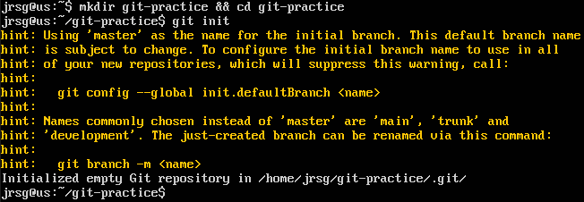

Now let’s create a file and commit the changes:

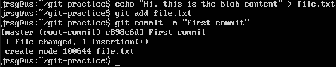

To start accessing the objects, we’ll look up the commit hash:

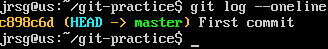

With the commit hash, we can access all the objects. First, let’s look at the commit itself:

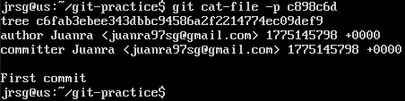

We can see that it points to a tree and we have its hash:

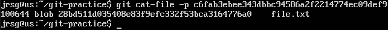

Now we have the blob’s hash. Let’s see what it contains:

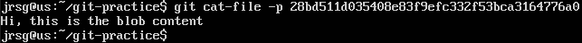

### Execise 2: Create a "testing_rebase" branch. Make four commits with placeholder messages. Use `git rebase -i HEAD~4`. Use `squash` to merge the four commits into a single one with a professional commit message.
In this exercise, we’re going to start working with rebase. To do this, we’ll create a new branch:

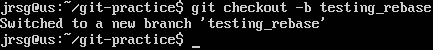

Now we’ll make a few commits containing errors so that we can rebase them:

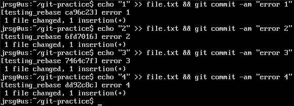

We run the command `git rebase -i HEAD~4` to start the interactive rebase, and a text editor will open showing the last four commits and their corresponding hashes:

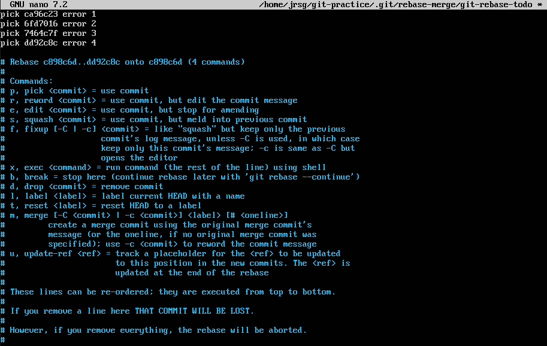

We’re going to rebase the last 3 commits and leave the first one. To do this, we’ll change the word *pick* in the commits we want to change to *s* for squash:

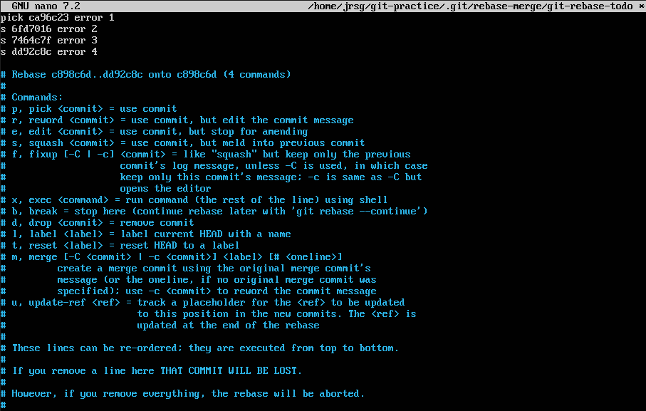

We save and close the text editor, and another one will open showing the error messages for each commit we made. We’re going to modify the messages for the commits we want to change:

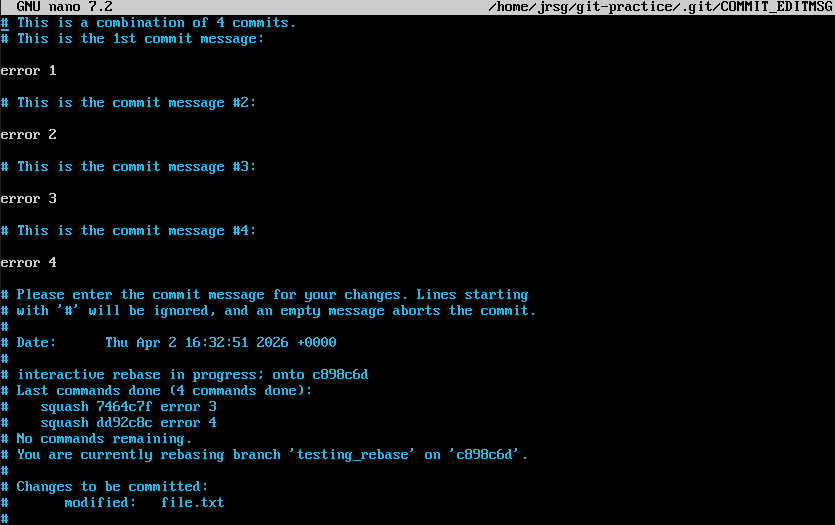

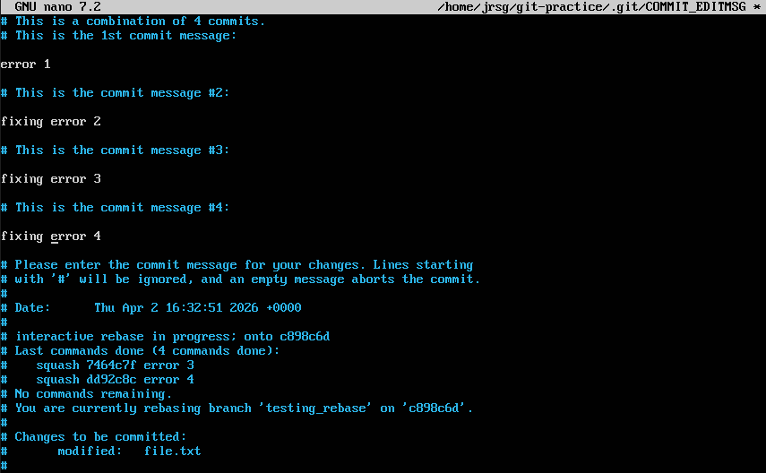

Save and close the editor, then check that the rebase has been executed correctly:

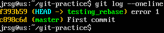

We can see that only the first error commit appears; the others have been ‘merged’ into this one. The rebase process can be aborted using the command `git rebase --abort`.