# Hardening

## Objetive
How to shut down your server.

### The principle of least privilege
This principle states that a user, programme or process should only be granted the minimum permissions necessary to perform its assigned function. This limits the scope of the impact in the event of human error or a security breach. To modify a user’s privileges, we must edit the `/etc/sudoers` file; however, the recommended practice is to use the `/etc/sudoers.d/` directory. Any file within this directory is read by the system as an extension of the sudo configuration, which offers:
* *Modularity*: You can create a file for each user or group.
* *Security during updates*: By not modifying the main file, you avoid conflicts when the operating system updates the sudo package.
* *Ease of management*: To revoke privileges, simply delete the specific file.

It is advisable to use **visudo** as the editor for these files, as it will check the syntax before saving, preventing you from being locked out of the system due to a typing error.

### SSH Hardening
The SSH service is the main gateway to a server, so its security is critical. For this reason, it is advisable to:
* *Disable root login*: In /etc/ssh/sshd_config, set `PermitRootLogin` to `no`. This forces attackers to first guess a valid username before attempting the password, and requires the administrator to use a standard user account and then escalate privileges using `sudo`.
* *Change the default port*: Changing port 22 to a random one (e.g. 2244) drastically reduces log noise caused by automated bots scanning the internet for the standard port.
* *Use of Ed25519 keys*: This is the modern standard for elliptic curve cryptography. It involves creating a pair of keys, one public and one private. The public key is sent to the server you wish to access, whilst you keep the private key on your computer. When you attempt to connect to a server, it displays the public key, which can only be decrypted using the private key.

### ufw vs firewalld
Both are interfaces for managing the kernel’s network filtering rules (iptables/nftables), but they take different approaches:
* **ufw**: Aims for extreme simplicity. It can allow or deny traffic based on ports and IP addresses. It is mainly used on Debian/Ubuntu servers and has a static state; in other words, changing rules usually requires restarting the firewall. 
* *firewalld*: Used for dynamic and complex management. It defines trust levels for different interfaces. It is used more in RHEL, CentOS and Fedora distributions, as well as in corporate environments. It has a dynamic state, meaning it allows changes to be made on the fly without breaking active connections.

### Exercise 1: Create an operator user who can only restart the nginx service without being prompted for a password.
First, we create the user using `adduser`:

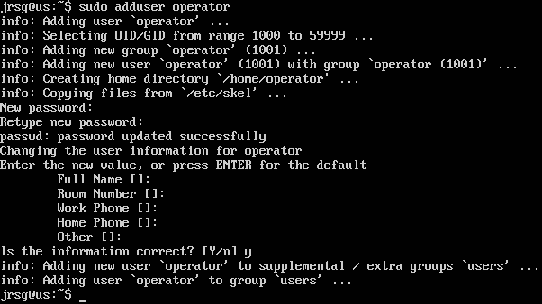

To prevent a malicious user from running fake scripts, we must specify the absolute path to the `systemctl` binary. Let’s locate it:

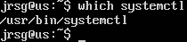

We create a blank file within the modular configuration directory `/etc/sudoers.d/` using visudo:

    * operator: The user to whom the rule applies.
    * ALL=(ALL): Allows it to be executed on any host and as any user (although here we limit it to the final command).
    * NOPASSWD:: The key to the exercise. Indicates that the user’s password will not be requested for the commands that follow.
    * /usr/bin/systemctl restart nginx: The exact and only command that is permitted.

For security reasons, files in sudoers.d must have strict permissions (440). Visudo usually takes care of this, but it doesn’t hurt to double-check:

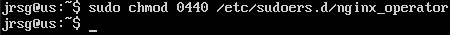

Now we switch to the operator user and try to restart the nginx service. What should happen is as follows:
* The service will restart immediately.
* You will not be asked for a password.
* If you try to do anything else (e.g. sudo systemctl stop nginx), the system will deny access because the rule is specific to restarting nginx.

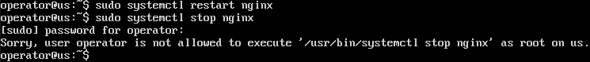

### Exercise 2: Edit /etc/ssh/sshd_config to disable password authentication.
First, we’re going to generate an ed25519 key on our physical machine and send the public key to our virtual machine:

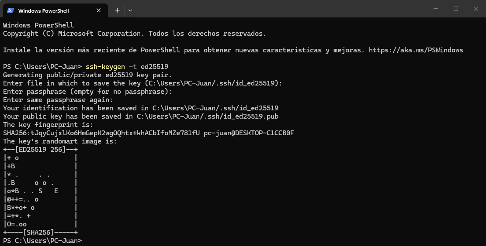

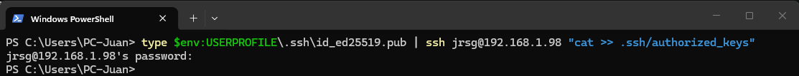

Let’s try connecting to the server from Windows. It shouldn’t ask for a password because I have the private key:

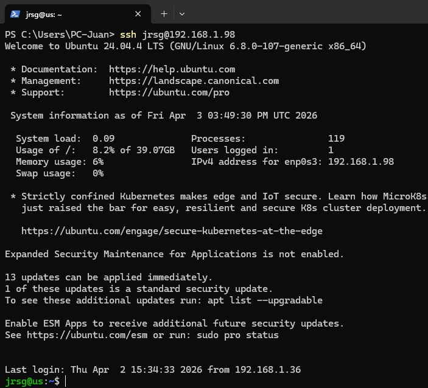

Now we’ll modify the `/etc/ssh/sshd_config` file by adding the following directives:
* `PasswordAuthentication no`: Disable passwords.
* `PubkeyAuthentication yes`: Ensure that keys are allowed (this is usually the default option).
* `PermitEmptyPasswords no`: Disable empty passwords (extra security).
* `ChallengeResponseAuthentication no`: Disable alternative methods.

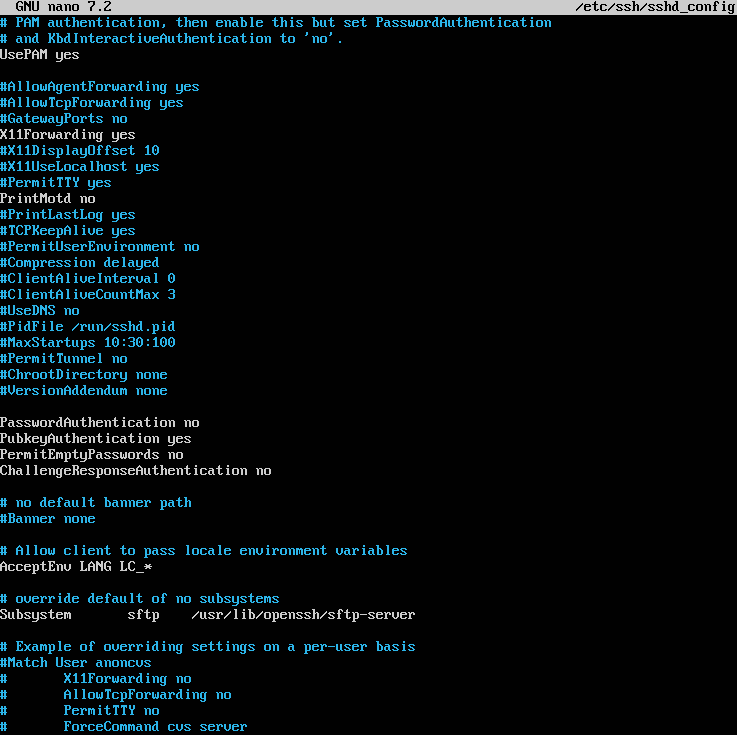

Using the command `sshd -t`, we will check that there are no errors in the configuration file. If the command returns nothing, the syntax is correct:

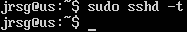

To apply the changes, we restart the service:

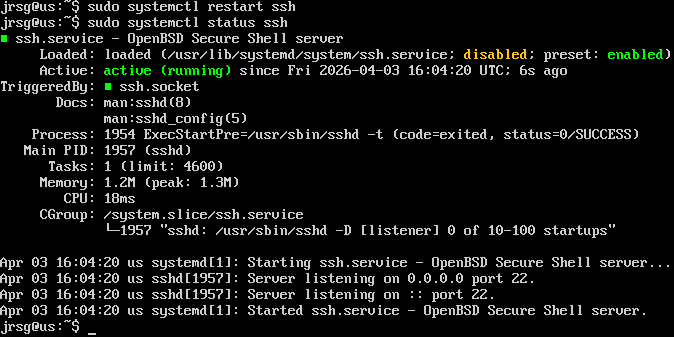

We try to connect to our own server but using a different user. The result should be a public key error:

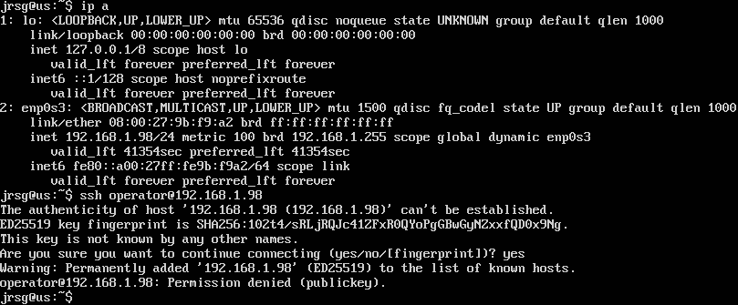

### Exercise 3: Deny everything except SSH (restricted) and HTTP/HTTPS.
First, we’ll configure our server to block any incoming connection attempts and allow all outgoing traffic:

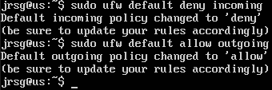

Now we’ll set up ufw to block an IP address if it attempts to connect multiple times within a short period. This helps prevent brute-force attacks:

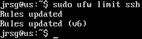

The next step will be to allow HTTP(S):

.png)

We’ll enable the firewall and check the status to see if the configuration is correct:

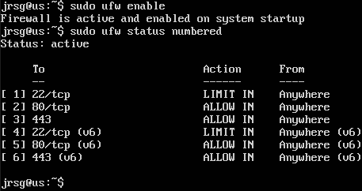

We can see that we have:
* Status: Active.
* 22/tcp LIMIT: Port 22 is the SSH port and is allowed but with restrictions.
* 80/tcp and 443/tcp ALLOW: The HTTP and HTTPS ports are open.