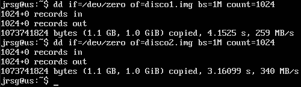
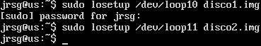
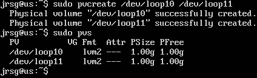
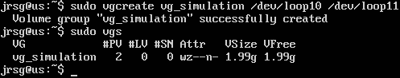
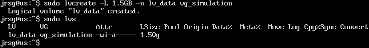
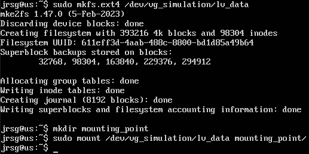
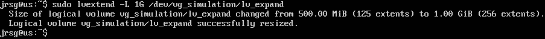
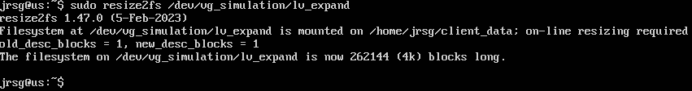
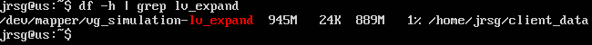

# LVM & File Systems

## Objetive
Learn how to manage storage elastically.

### LVM hierarchy
The **Logical Volume Manager** is a storage management system that adds a layer of virtualisation between the physical hardware (disks/SSDs) and the software (file systems), enabling elastic storage. There are three levels within the LVM hierarchy:
* **PV** (Physical Volume): This forms the base of the pyramid. It represents the actual hardware. It can be an entire hard drive, a partition, or a software RAID device. To make a disk a PV, LVM writes a header onto it. The PV is divided into fragments called PEs (Physical Extents), which are typically 4MB by default. Some key commands are:
    * `pvcreate ‘disk_address’`: Initialises the PV.
    * `pvdisplay` or `pvs`: Displays the status.

* **VG** (Volume Group): This is the intermediate abstraction layer. It can group one or more PVs, combining the total capacity of all assigned physical disks. It allows storage to be viewed as a single unit, ignoring the physical limits of each disk. Some key commands are:
    * `vgcreate group_name ‘disk_address’ ‘group_address’`: Creates the group.
    * `vgextend group_name ‘disk_address’`: Adds more space to the group on the fly.

* **LV** (Logical Volume): This is the top layer, where the utility resides. It is the equivalent of a ‘virtual partition’. A section of space is ‘carved out’ from the VG to create an LV. The file system is created on the LV and is subsequently mounted to a directory. The space of an LV is composed of LE (Logical Extents), which map directly to the PEs of the physical disks. Some key commands are:
    * `lvcreate -L 20G -n data ‘group_name’`: Creates a 20GB LV.
    * `lvextend -L +10G ‘data_path’`: Extends the volume.

### Inodos
It is a data structure in Unix-like file systems that stores all the information about a file or directory (file size, physical location on the disk, owner (UID) and group (GID), permissions, timestamps, file type, etc.), except for its name and the actual data. 

When a partition is formatted with a file system such as ext4, a fixed number of inodes is reserved based on the total size of the disk. Each file or folder consumes exactly one inode. Once the file system has been created, the total number of inodes cannot be easily changed.

It is possible to receive a ‘disk full’ error even though commands such as `df -h` show that you have many gigabytes of free space remaining. This happens because you have run out of metadata space (inodes). It generally occurs on systems that generate millions of extremely small files. The consequences of running out of inodes include the inability to create files, service failures and session corruption. The solution to this problem is to delete files en masse, increase the disk capacity, change the architecture or adjust the format.

### Exercise 1: Simulate an LVM using loop files with `ss` and `losetup`.
First, let’s create two 1GB files that will serve as our physical disks:

    * `if=/dev/zero`: Fills the file with zeros.
    * `of`: File name.
    * `bs=1M count=1024`: Creates a 1024MB (1GB) file.

Now we’ll tell Linux to treat these files as if they were connected disks (/dev/loop):

Now that the system thinks they are disks, we’ll prepare them for LVM:

We’re going to put those two ‘disks’ into a single shared pool called vg_simulation:

Now we’re going to ‘carve out’ a chunk of that pool to create our logical volume. We’re going to create a 1.5GB volume called lv_data:

To be able to store files, we need a file system (just like a normal partition). To do this, we format it, create a mount point and mount it:

### Exercise 2: Create a 500MB partition, format it as ext4, mount it, and then extend it to 1GB without unmounting it (lvextend + resize2fs).
First, we create the volume with a specific size of 500 megabytes:

.png)

As in the previous exercise, we need a file system, so we format it, create a mount point and mount it. In this case, we’ll also check the disk size:

.png)

Now we’re going to increase the size from 500MB to 1GB. We tell LVM to allocate more physical space to the volume:

We use resize2fs, which is the specific tool for ext4 that allows for ‘live’ expansion:

We check the size of the mounted disk again:

