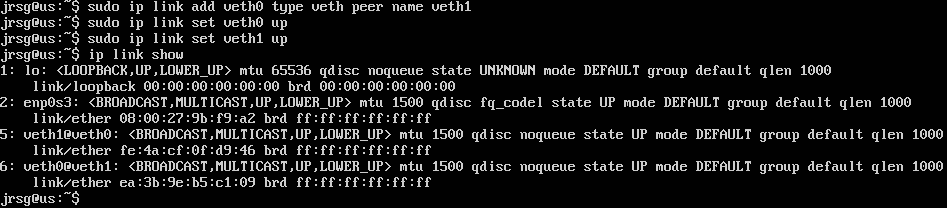
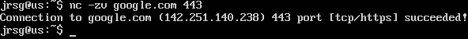
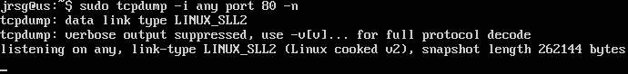

# Networking with iproute2

## Objetive
Retire `ifconfig` and understand how packets travel.

### Stack TCP/IP
It is the set of standard rules and protocols that enables communication and the exchange of data between devices on the Internet and other networks. It consists of four layers, which are:
* *Network access layer*: Responsible for converting bits into electrical or radio-frequency signals. It uses protocols such as Ethernet, Wi-Fi and ARP. Its identifier is the MAC address.
* *Internet layer*: Responsible for ensuring packets reach one network from another (routing). It uses protocols such as IPv4, IPv6 and ICMP. Its identifier is the IP address.
* *Transport layer*: Decides how data is sent. It uses protocols such as TCP and UDP. Its identifiers are ports 0 to 65535.
* *Application layer*: This is what the user sees. It uses protocols such as HTTP(S), DNS, SSH, FTP or SMTP.

When a service fails, it is always diagnosed from layer 1 to layer 4.

### iproute2
The modern suite of network commands for system administrators is *iproute2*. It is faster and handles complex networks better than its predecessor, *net-tools*. The most important iproute2 commands are:
* `ip`: Used in Linux to manage the routing table, allowing you to view, add or remove static routes and link gates. It is based on objects (addr, link, route, neigh) and commands (show, add, del, set).
* `ss`: Used to investigate sockets and network connections in Linux. Some of the most important parameters are:
    * `-t`: TCP.
    * `-u`: UDP.
    * `-l`: Listening (open ports waiting for connections).
    * `-p`: Process (tells you which programme is using the port).
    * `-n`: Numeric (does not translate IPs to names; this is faster).

### netcat & tcpdump
*Netcat* (nc or ncat) is a Layer 4 (Transport) tool whose main function is to establish manual connections or listen on ports. It is used to check whether a port is open and whether ‘someone’ is responding on the other end. It has two key commands:
* `nc -zv ‘ip_address port’`: Used to scan a port. The `-z` parameter performs a quick scan and `-v` tells you whether the connection was ‘successful’ or ‘refused’.
* `nc -l ‘port’`: Creates a temporary server by opening the selected port.

In contrast, *tcpdump* is a Layer 2/3/4 tool that captures and displays on screen the actual traffic passing through the network interface. It is typically used when the connection exists but there is an issue with the data. It allows you to view packet information: who sent it, who received it, what flags they carry (SYN, ACK) and, sometimes, the message content. The key commands are:
* `sudo tcpdump -i ‘network_interface’`: Used to view all traffic on an interface.
* `sudo tcpdump -i ‘network_interface’ host “host” and port ‘port’`: Used to view traffic from a specific IP address and port.
* `sudo tcpdump -A -i ‘network_interface’`: Used to view the contents of text packets (ASCII).

### Practice 1: Create a couple of veth interfaces (commonly used in containers) using `ip link add`.
Let’s create a virtual interface (veth) using uproute2. First, we create it (`ip link add`), then we bring it online (`ip link set ‘interface’ up`) and, finally, we check that it has been created correctly (`ip link show`):

### Practice 2: Use `nc -zv google.com 443` to check connectivity.
Let’s check whether our virtual machine can communicate with the outside world via a secure port. To do this, we’ll use netcat (`nc -zv`):

### Practice 3: Run `tcpdump -i any port 80` whilst sending a `curl` request to an HTTP website and analyse the ‘three-way handshake’.
We’re going to use tcpdump to see how two computers “greet” each other before exchanging data. To do this, we need to open two terminals; in one, we run `sudo tcpdump -i any port 80 -n`:

In the other terminal, run `curl http://neverssl.com` and return to the first terminal to view the results:

.png)

To analyse the output of this command, look for the lines containing letters in square brackets:
* [S] (SYN): Your computer says: ‘Hello, I want to synchronise with you on port 80’.
* [S.] (SYN-ACK): The server replies: “Hello! Received. I want to synchronise too.”
* [.] (ACK): Your computer replies: “Perfect, connection established. Now I’m requesting the webpage.”