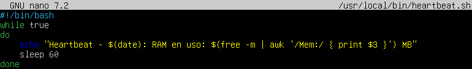
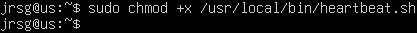
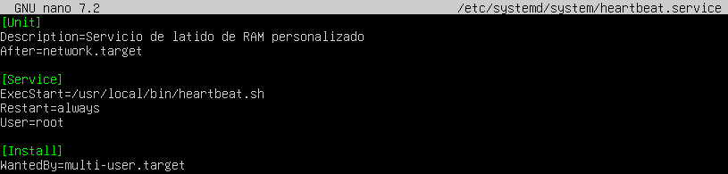
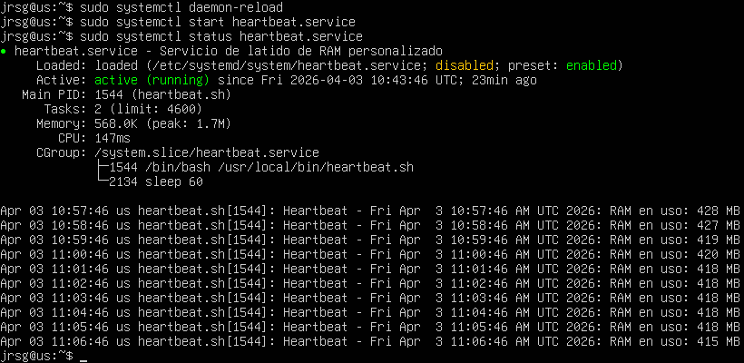
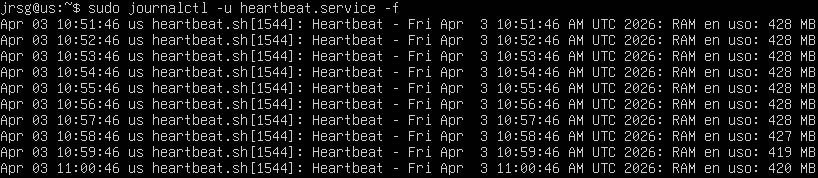

# Systemd & Logs

## Objective
Understanding how Linux manages modern processes.

### systemd units
In modern Linux ecosystems, **systemd** manages the system using ‘units’. Each unit is defined in a configuration file that tells the kernel how and when to manage a resource or process. Although there are many types, the core of automation lies in the trio: **.service**, **.timer** and **.target**.
* **.service**: Represents a process that the system can start, stop or restart. Its function is to run daemons, scripts or applications in the background. It consists of three key components:
    * *ExecStart*: The path to the binary or script to be executed.
    * *Restart*: Automatic restart policy if the process fails.
    * *User/Group*: Defines the privileges under which the process runs.

* **.timer**: These units are used to control when another unit (usually a .service) is activated. Their function is to schedule tasks based on time events or system events. A .timer does nothing on its own; it requires a .service to execute the task. It has two types of triggers:
    * *Monotonic*: Based on the time elapsed since an event.
    * *Real-time (Wall clock)*: Based on the calendar.

 **.target**: Unlike the previous ones, targets do not execute processes directly. They are synchronisation points or logical groupings whose function is to group other units to bring the system to a specific state and ensure that a particular .service runs when the other services required for its execution are ready.

### journalctl
This is the tool used to view and analyse logs on Linux operating systems that use systemd. The `journalctl` command has several parameters that you should be aware of:
* `-u`: Allows you to view only the messages generated by a specific service.
* `--since` or `--until`: Allows you to filter services running within a specific time period.
* `-p`: Allows you to filter logs by priority level (0 is emergency and 7 is debug).
* `-f`: Displays logs as they occur in real time.
* `-b`: Displays only the logs from the current session.
* `--disk-usage`: Displays the disk space occupied by the log.

### Practice: Create a script in /usr/local/bin/heartbeat.sh that displays the date and RAM usage. Create /etc/systemd/system/heartbeat.service. Configure it to restart automatically if it fails (Restart=always). Enable it and use journalctl -u heartbeat.service -f to view the logs in real time.
We’re going to create a service that prints the date and RAM usage. To do this, first we create the script in `/usr/local/bin/` and set its execution permissions:

Now let’s create the service in `/etc/systemd/system`:

With the service now created, let’s reload the configuration, start our service and check its status:

Now let’s check if the script is writing its messages:

