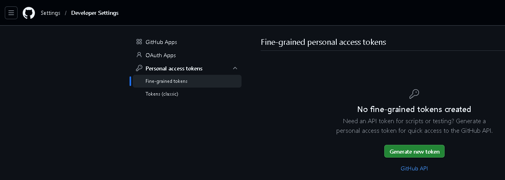
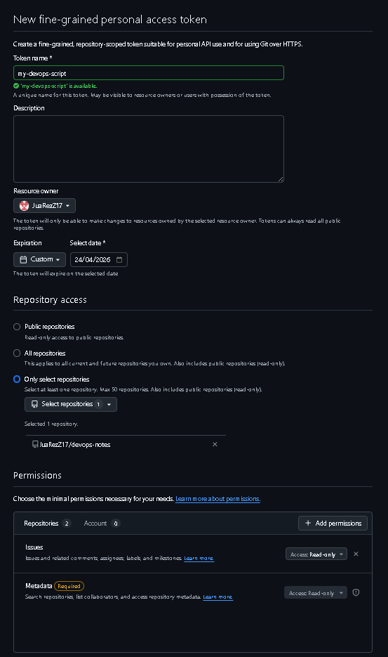
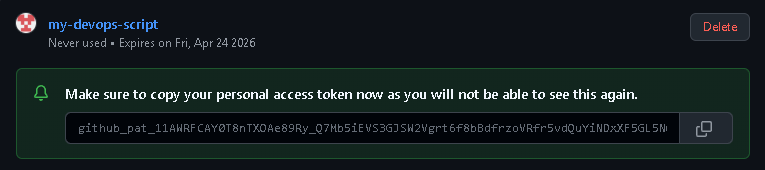
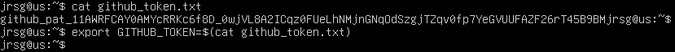
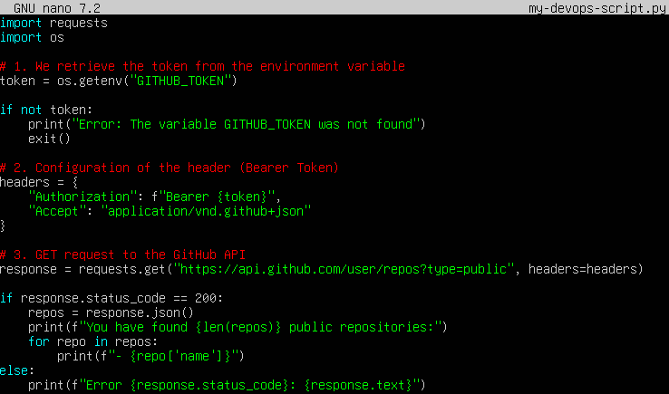
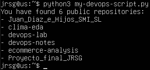
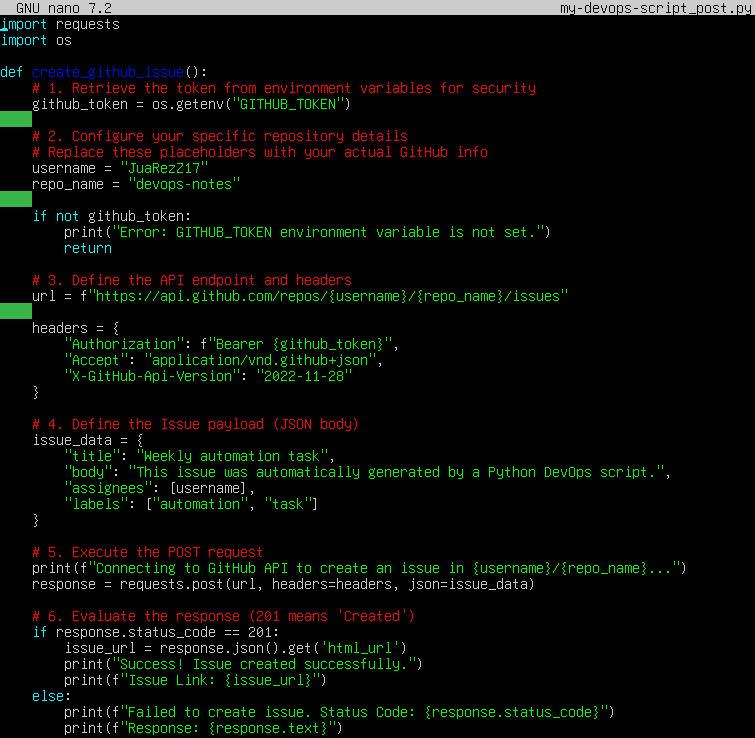
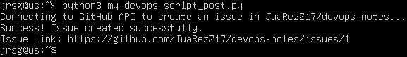
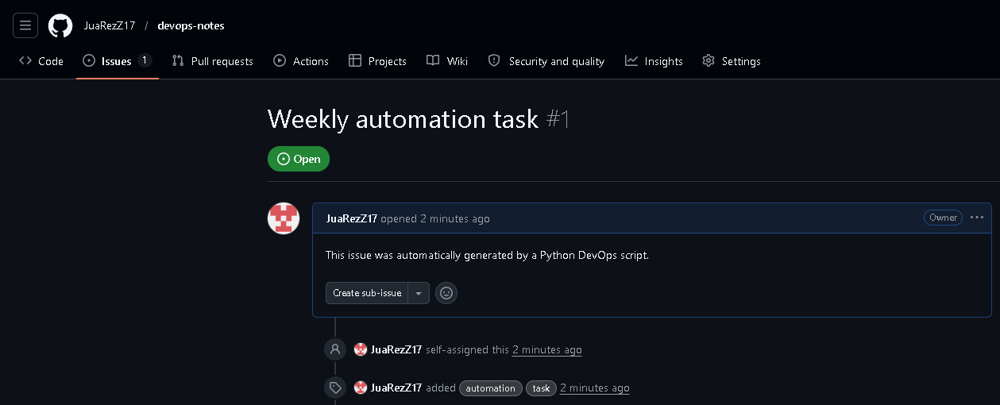

# API automation (GitHub/GitLab)

## Objetive
Interact with the outside world without using a browser.

### REST API
REST (Representational State Transfer) architecture is the communication standard for infrastructure automation. In a DevOps environment, REST APIs enable code to manage the infrastructure lifecycle. Verbs define the intent of the operation on a resource:
* **GET:** Retrieves a representation of a resource without modifying it. It can be used to:
    * Check the status of a build in Jenkins.
    * List the pods running in a Kubernetes namespace.
    * Retrieve the current configuration of an instance on AWS.
* **POST:** Creates a new resource or initiates a process. It is not idempotent (sending the same POST twice usually creates two resources).
    * Trigger a new workflow in GitHub Actions.
    * Create a new ticket in Jira following a deployment failure.
    * Deploy a new container to a cluster.
* **DELETE:** Deletes a specific resource.
    * Destroy ephemeral environments after testing is complete.
    * Remove old images from a registry (Docker Hub/ECR) to save space.
    * Delete a Git branch after performing a merge.

### Authentication
Most DevOps APIs are private and require authentication. The de facto standard is the Bearer Token. This is a ‘bearer’-based authentication scheme. The server trusts whoever holds the token. It is sent in the HTTP header as follows: ‘Authorization: Bearer <ALPHANUMERIC_TOKEN>’. The advantage is that it does not require sending a username and password with every request. The risk is that if someone intercepts or steals the token, they have full access.

Uploading a token, API key or password to a public (or even private) repository is one of the most serious mistakes in DevOps:
* There are bots patrolling GitHub 24/7. If you upload an AWS token or a Bearer Token, it will be detected and used within seconds to mine cryptocurrency or steal data.
* Even if you delete the token in a new commit, it remains in the Git history. Cleaning this up requires rewriting the history.

The solution is, instead of ‘hard-coding’ the token into the code, the code should read it from the operating system environment:
* **Locally:** .env files (which must be included in .gitignore) or the export command are commonly used.
```
export GITHUB_TOKEN="ghp_123456789"
```
* **In Code (Python):** 
```
import os
token = os.getenv(‘GITHUB_TOKEN’)
```

### Exercise 1: Generate a Personal Access Token (PAT) on GitHub with repository permissions.
To generate a PAT, go to your GitHub account > Settings > Developer settings > Personal access token > Fine-grained tokens > Generate new token.







To speed up the process and avoid having to copy the token, I’m going to save it to a file and export it to my virtual machine to run the command `export GITHUB_TOKEN="token"`, which will save the token created in the terminal:



### Exercise 2: Create a script that uses the requests library to list all your public repositories.





### Exercise 3: Have the script create an ‘Issue’ in one of your repositories with the title ‘Weekly automation task’.





