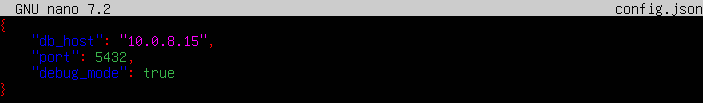
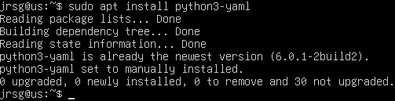
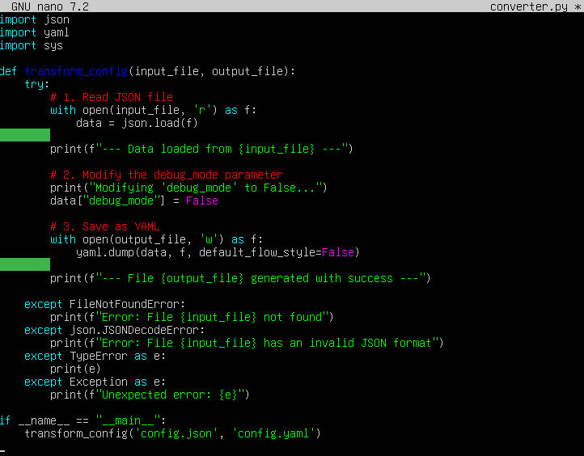
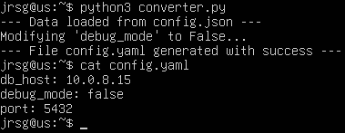
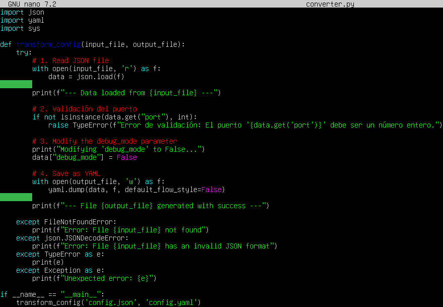
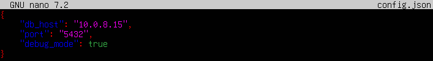
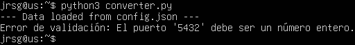

# Configuration (JSON & YAML)

## Objetive
Read and write the languages used by Kubernetes, Ansible, and Terraform.

### Serialization
This is the process of converting a Python object into a string. In DevOps, serialisation is essential for configuration persistence and communication between services (APIs, Terraform states, K8s manifests):
* **Python object:** This is a ‘live’ data structure in RAM (dictionaries, lists, classes). Python understands its methods and types, but it cannot be sent directly over a network or saved to a flat file.
* **String (JSON/YAML):** A textual (formatted) representation of that object. It is language-agnostic; a JSON string generated in Python can be read by a Go binary or a Bash script.

* **Serialisation (Dump):** Convert Object $\rightarrow$ String/File.
* **Deserialisation (Load):** Convert String/File $\rightarrow$ Python Object.

### Libary
* **JSON:** It is included in the Standard Library. It is mainly used in REST APIs and structured logs. Its main advantage is the speed at which it can be parsed, but its drawbacks are that it is difficult to read and does not allow comments.
* **YAML:** Requires installation via `pip install PyYAML`. It is mainly used in configuration files (K8s, Ansible, CI/CD). It is a slower format than JSON due to its complexity, but it is highly readable and supports comments (vital for documentation).

### Safe Load
Unlike JSON, the YAML standard allows for the instantiation of arbitrary objects. This means that a malicious YAML file could contain instructions for Python to execute commands on the operating system where the script is running. If the default loader (`yaml.load(data)`) is used, an attacker could send a YAML file containing malicious code. Therefore, you should always use `yaml.safe_load()`. This function restricts deserialisation to simple data types (strings, integers, lists, dictionaries), preventing the creation of complex objects that could compromise the system.

### Exercise 1: Create a config.json file containing the app's settings (db_host, port, debug_mode).

### Exercise 2: Create a script that reads that config.json file, sets `debug_mode` to `False`, and saves it as a config.yaml file.
First, we install YAML using `pip install PyYAML`:

We try running the script and it should create a ‘config.yaml’ file:

### Exercise 3: Add a validation check: if the port is not an integer, the script must throw a controlled exception.
Let’s modify the `converter.py` file so that it checks whether the port value is an integer:

Now we modify the `config.json` file and set the port as a string:

We run the script to see if the error occurs:

