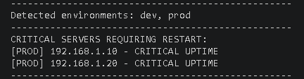

# Data Structures for Inventories

## Lists vs Sets
In DevOps, choosing the right structure saves memory and, above all, prevents logical errors in your automation scripts:
- **Lists:** A list in Python is a dynamic array that stores references to objects. It is a mutable, ordered sequence that allows access via indices. The basic operations of a list are:
    - *Creation*: `my_list = [1, ‘two’, 3.0]`.
    - *Access*: `my_list[0]` (first element), `my_list[-1]` (last).
    - *Append*: `list.append(element)` adds to the end.
    - *Insert*: `list.insert(index, element)` inserts at a specified position.
    - *Extend*: `list.extend(another_list)` adds elements from another list.
    - *Remove (pop/remove)*: `list.pop(index)` removes by index; `list.remove(element)` removes by value.

- **Sets:** These are unordered, mutable collections with no duplicate elements. They are defined using curly brackets {} or the `set()` function and are ideal for removing duplicates from sequences and performing mathematical operations such as union, intersection and difference. They do not support indexing or ordering. The most common operations with sets are:
    - *Add*: `my_set.add(element)` or `my_set.update([elem1, elem2])`.
    - *Remove*: `my_set.remove(element)` (error if it does not exist) or `my_set.discard(element)` (no error).
    - *Union*: `set1 | set2` or `set1.union(set2)`.
    - *Intersection*: `set1 & set2` or `set1.intersection(set2)`.
    - *Difference*: `set1 - set2` or `set1.difference(set2)`.

## Nested Dictionaries
A dictionary (dict) is a key-value associative map based on hash tables. A nested dictionary is a structure where the values are, in turn, other dictionaries or collections. It is the direct in-memory representation of a JSON object or a NoSQL document. The main operations with dictionaries are:
- *Creation*: `dictionary = {“key”: “value”}`.
- *Access*: `dictionary[“key”]` or `dictionary.get(“key”)`.
- *Add/Modify*: `dictionary[“new_key”] = value`.
- *Update/Extend*: `dictionary1.update(dictionary2)` to merge.
- *Delete*: `delete dictionary[“key”]`, `pop()` or `popitem()`.
- *Clear all*: `dictionary.clear()`.

## List Comprehensions
This is a syntactic construct for creating a new list based on an existing iterable. It is more efficient than a traditional for loop because the iteration takes place at the C level, avoiding the overhead of calling the .append() method in every iteration.
```
squares = [i**2 for i in range(5)]
#[0, 1, 4, 9, 16]
```

## Exercise 1: Create a script called inventory_manager.py:

### Define a list of dictionaries representing five servers with different attributes (name, IP address, environment: “prod” or “dev”, uptime).
```
servers = [
    {"name": "Server_01", "ip": "192.168.1.10", "env": "prod", "uptime": 150},
    {"name": "Server_02", "ip": "10.0.0.5", "env": "dev", "uptime": 12},
    {"name": "Server_03", "ip": "192.168.1.20", "env": "prod", "uptime": 200},
    {"name": "Server_04", "ip": "10.0.0.15", "env": "dev", "uptime": 300},
    {"name": "Server_05", "ip": "192.168.1.30", "env": "prod", "uptime": 45}
]
```

### Use a Set to uniquely identify which environments you have.
```
environments = set(s['env'] for s in servers)
```

### Use a list comprehension to generate a new list containing only the IP addresses of the “prod” servers whose uptime is greater than 100 days.
```
critical_reports = [
    f"[{s['env'].upper()}] {s['ip']} - CRITICAL UPTIME"
    for s in servers 
    if s['env'] == 'prod' and s['uptime'] > 100
]
```

### Output: Prints a formatted report of the following type: "[PROD] 192.168.1.10 - CRITICAL UPTIME".
```
print("-" * 50)
print(f"Detected environments: {', '.join(environments)}")
print("-" * 50)

if critical_reports:
    print("CRITICAL SERVERS REQUIRING RESTART:")
    for report in critical_reports:
        print(report)
else:
    print("No critical servers detected.")

print("-" * 50)
```

### Execution result

