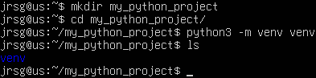
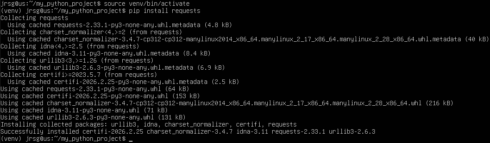
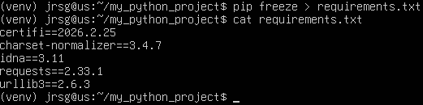

# Modularization and Environments (Virtualenv)

## Objetive
Avoid the “but it works on my machine” excuse and don't break the system's Python.

### Virtualenvs
In distributions such as Ubuntu or Debian, the operating system relies on Python to function. Critical tools such as the package manager (apt), the terminal, and network configurations use internal Python scripts. If you install libraries using `sudo pip install`, you're overwriting the libraries that the operating system needs. This leads to the dreaded “Dependency Hell”. You update a library in your project, but the update is incompatible with an Ubuntu tool, causing the desktop to stop loading or the terminal to stop working.

That's why virtual environments are used—they are isolated Python environments stored in a local folder. Anything you install there stays there and doesn't affect the rest of your computer. To create a virtual environment, use the command `python3 -m venv env`.

### requirements.txt
This is the gold standard for determining which libraries are required for a program to run. Once the virtual environment is active and the libraries are installed, run the command `pip freeze > requirements.txt`. To allow someone else to recreate your exact environment, use the command `pip install -r requirements.txt`.

### if __name__ == "__main__":
When Python runs a file, it assigns a special name to an internal variable called __name__:
* If you run the file directly (python script.py), __name__ becomes “__main__”.
* If you import the file from another script (import script), __name__ becomes the filename.

This prevents unwanted code from running when importing functions. This has two main benefits:
* **Modularity:** You can test your script individually.
* **Cleanliness:** Your code can be used as a library in other projects without triggering unnecessary prints or processes.

### Exercise 1: Create a folder for a new project and run `python3 -m venv venv`.

### Exercise 2: Enable it and install the requests library.

### Exercise 3: Create a module named utils/network.py with a function that sends an HTTP ping to a URL.

.png)

.png)

.png)

### Exercise 4: Create a `main.py` file in the root directory that imports that function and uses it.

.png)

.png)

### Exercise 5: Generate the pip freeze > requirements.txt.

