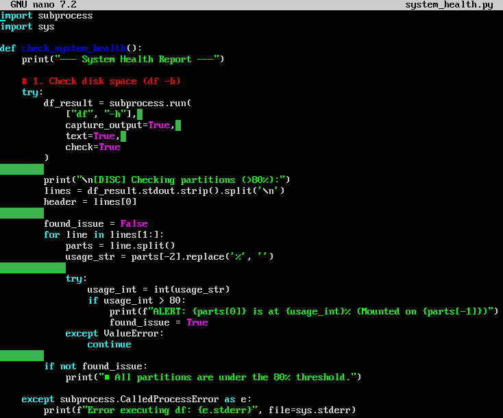
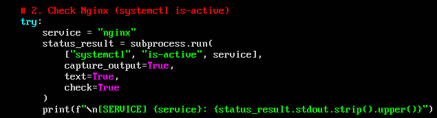
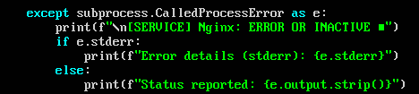
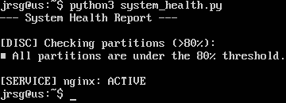

# Subprocess (The ‘Bash Killer’)

## Objetive
Run Linux commands from Python whilst handling errors professionally.

### subprocess.run
In the DevOps ecosystem, the ability to orchestrate command-line tools (such as Terraform, kubectl or Bash scripts) from Python is essential. The `subprocess` module is the standard tool for this task. It has been the recommended interface since Python 3.5. It allows you to invoke external commands, wait for them to finish, and obtain a `CompletedProcess` object containing all the execution details.

### Key attributes
For an automation script to be professional and reliable, you need to master these three parameters:
* **capture_output=True:** By default, commands print their output directly to the Python console. By setting this flag, we capture the stdout (standard output) and stderr (errors) so that we can process them logically within the script.

* **text=True:** By default, Python treats command output as bytes (b'...'). By setting this to True, Python automatically decodes the output into text strings (strings), making data manipulation easier.

* **check=True:** This is the basis of ‘defensive programming’. If the external command fails (returns an exit code other than 0), Python will automatically raise an exception. This prevents the script from continuing to run silently after a critical error.

### Error handling
For a DevOps role, error handling isn’t just about preventing the script from breaking; it’s about generating useful telemetry to understand exactly why a deployment or maintenance task failed in an environment where there isn’t always a human watching the console. When you launch a process, there are three main ways in which it can fail. A professional script should account for all of them:
* **subprocess.CalledProcessError:** Occurs when the command did run, but returned a non-zero exit code.

* **subprocess.TimeoutExpired:** Crucial in DevOps to prevent an automation script from getting ‘stuck’ indefinitely waiting for a zombie process or an unresponsive server.

* **FileNotFoundError:** Occurs when the command/executable you are trying to call does not exist in the system PATH or is not installed.

Instead of repeating try/except blocks throughout your code, the ideal approach is to create a robust function that handles errors centrally.

### Exercise 1: Create a script called system_health.py:
#### Run `df -h` and filter (using Python, not `grep`) the partitions that are more than 80% full.

#### Run `systemctl is-active <service>` to check whether Nginx is running.

#### If something goes wrong, the script should print the error captured from stderr.

