# Basics (Demystifying the ‘Magic Box’)

## Objetive
It is important to understand that a container is not a virtual machine, but a Linux process isolated using kernel primitives. This is vital for advanced troubleshooting.

### Namespaces
They handle a container’s privacy. They make the container believe it is completely alone on the machine, hiding everything outside from it:
- **PID (Process isolation):** Inside the container, the main programme sees itself as process number 1. If you look at what is running from inside the container, you won’t see the programmes running on the actual server or in other containers.
- **NET (Network isolation):** The container has its own private network configuration. It has its own IP address and its own ports. That’s why you can have five containers using port 80 internally, without them conflicting with the server’s port 80.
- **MNT (File isolation):** The container only sees its own folders and files. It thinks it has its own hard drive starting from the root (/). It cannot snoop on or modify the files on the server where it is hosted.
- **UTS (Name Isolation):** The container has its own hostname. If you ask it what the machine is called, it will give you a unique name, without knowing the actual name of the physical server.
- **IPC (Inter-process Communication Isolation):** Prevents a container from sending direct messages or sharing system memory with other containers. Each one is isolated in its own communication bubble.
- **User (User Isolation):** A programme can run with maximum permissions (such as administrator or root) within the container, but for the actual server, that same programme is just an ordinary user with no ability to break anything important.

### cgroups (Control Groups)
They manage the limits. They ensure that a container does not overuse resources and consume all the server’s power, leaving the others without resources:
- **CPU:** Tells the container how much processing power it can use. You can limit it so that it only uses, for example, 50% of the processor’s capacity, or assign it a specific core so that it does not overload the rest of the machine.
- **RAM (Memory):** Sets a cap on the amount of memory the container can request. If the container encounters an error and starts using too much memory, exceeding its limit, the operating system intervenes and shuts down that container to prevent the server from crashing.
- **I/O (Disk Read/Write):** Limits the speed at which the container can save or read files to the hard drive. This prevents a single container from slowing the server down significantly because it is downloading or copying too many things at once.

### Client-server architecture
Docker isn’t a single program; it’s a collection of components working together:
- **The Client:** This is the terminal where you type commands like `docker run`. It acts solely as a messenger. It takes what you type, formats it, and sends it to the Docker server. The client does not create or run containers on its own.
- **The REST API:** This is the “language” and the bridge through which instructions travel between the Client and the Server. Since it uses a web standard (HTTP), it allows not only the console to communicate with Docker, but also enables you to use graphical interfaces (with buttons and menus) or your own programs written in Python or Java to control the containers.
- **The Server/Daemon:** 
    - **`dockerd`:** This is the programme that is always running in the background on your server. It receives the commands you send via the console, interprets them and manages everything: it downloads images, creates networks and manages volumes.
    - **`containerd`:** `dockerd` delegates the heavy lifting to `containerd`. This is the component that actually does the work and starts the container, communicating with the operating system to enable Namespaces and cgroups.

### Exercise 1: Run a container in the background: docker run -d --name my_nginx nginx.
First, let’s install Docker on our Ubuntu Server:
- We’ll ensure that the package list is up to date and that the system has the necessary components to communicate via HTTPS:
```bash
sudo apt update && sudo apt upgrade -y
sudo apt install apt-transport-https ca-certificates curl software-properties-common -y
```
- Docker needs to validate the authenticity of its packages. So we need to add the official key and configure the repository:
```bash
curl -fsSL https://download.docker.com/linux/ubuntu/gpg | sudo gpg --dearmor -o /usr/share/keyrings/docker-archive-keyring.gpg
echo ‘deb [arch=$(dpkg --print-architecture) signed-by=/usr/share/keyrings/docker-archive-keyring.gpg] https://download.docker.com/linux/ubuntu $(lsb_release -cs) stable’ | sudo tee /etc/apt/sources.list.d/docker.list > /dev/null
```
- Update again and install Docker:
```bash
sudo apt update
sudo apt install docker-ce docker-ce-cli containerd.io -y
```
- To check that everything is working correctly:
    - Check the service status:

    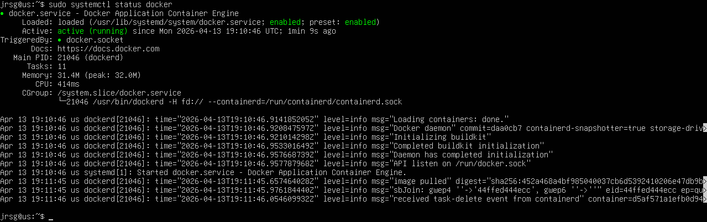

    - Run the ‘Hello World’ test container:

    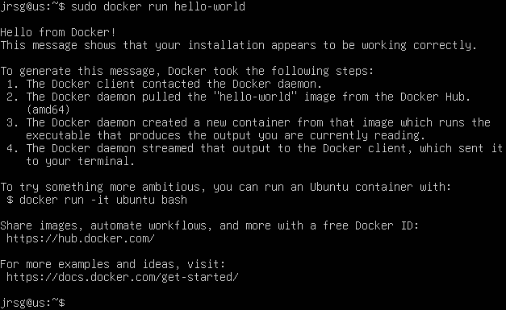

By default, Docker requires `sudo` privileges. To save us from having to enter the password with every command, we’re going to add the user to the `docker` group:

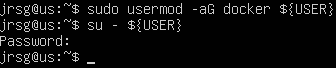

Now let’s start an isolated nginx web server running in the background:

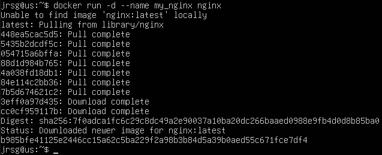

- **`run`**: Creates and starts the container.
- **`-d (detached)`**: Runs the container in the background, returning control of the terminal to you.
- **`--name my_nginx`**: Assigns a custom name so we can refer to it easily.
- **`nginx`**: This is the name of the base image that will be downloaded (if not already present) and run.

### Exercise 2: Find the actual PID of that container on your Linux machine using `docker inspect --format “{{.State.Pid}}” my_nginx`.
Now let’s find out what the actual process ID (PID) is that the host operating system’s kernel has assigned to this container:

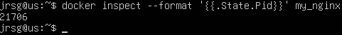

- **`inspect`:** Returns detailed, low-level information about the container.
- **`--format “{{.State.Pid}}”`:** Filters the JSON output to display only the Process ID value.

### Exercise 3: Go to /sys/fs/cgroup/ on your host machine and look for the limits applied to that PID.
With the PID in hand, let’s see how the Linux kernel isolates and limits the resources of that specific process. First, let’s find the path to the cgroup:

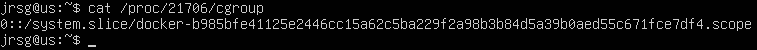

Now we move to the base directory of the cgroup in the file system:

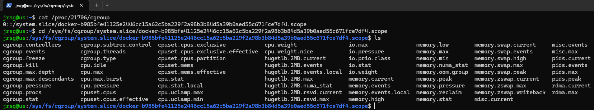

Let’s take a look at some of these files:
- **`cat memory.current`:** Shows the exact amount of RAM in bytes that the container is currently using.

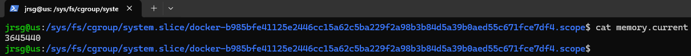

- **`cat memory.max`:** Displays the maximum allowed memory limit (if you did not set any limits when running `docker run`, it will say `max`).

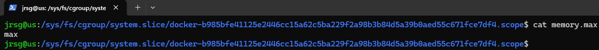

- **`cat cpu.stat`:** Displays detailed statistics on CPU cycle usage.

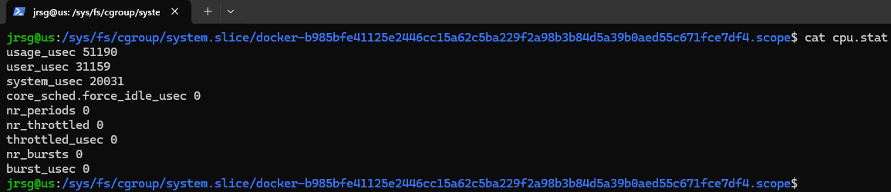

### Exercise 4: Learn how to use `docker rm -f my_nginx`.
Let's remove the container:

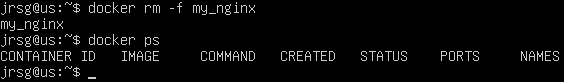