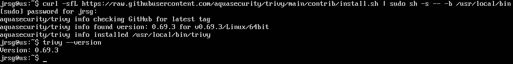
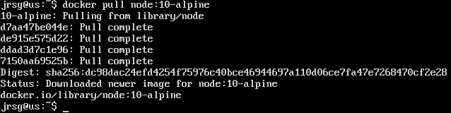
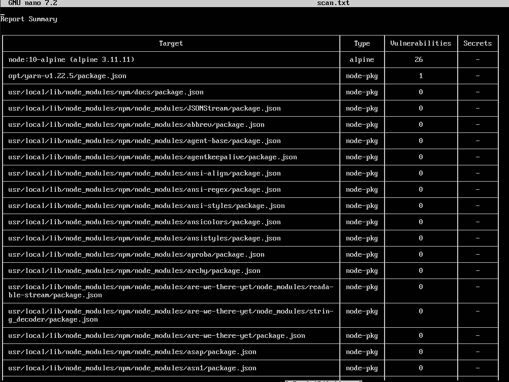
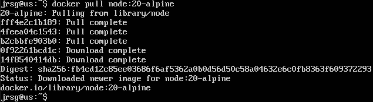
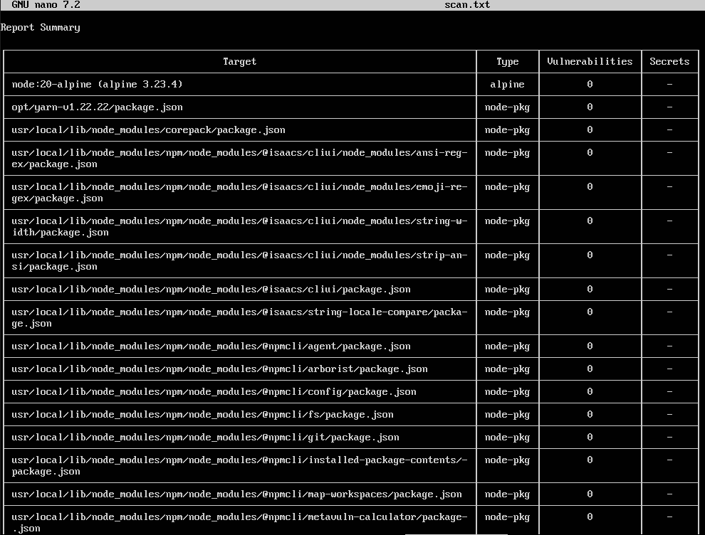

# DevSecOps – Security in Images

## Objetive
Adopt a “shift-left” mindset (security from the outset). Identify and mitigate vulnerabilities before the image reaches a production server.

### CVEs (Common Vulnerabilities and Exposures)
It is a standardised, publicly available dictionary or list of computer security vulnerabilities that have been discovered and reported. Each vulnerability is assigned a unique code, which enables the cybersecurity community, developers and tools to refer to the same issue without confusion. CVEs are usually accompanied by a score from 0 to 10 indicating their severity (CVSS (Common Vulnerability Scoring System)).

When you build a Docker container, you usually start with a `FROM` statement. This is your base image:
- **Accumulation of vulnerabilities (security debt):** Software is a living entity. A base image that was secure two years ago likely now contains dozens or hundreds of recently discovered CVEs.
- **Risk inheritance:** If you use an old base image, your application automatically inherits all the vulnerabilities of the operating system and the libraries pre-installed in that image.
- **Known attack surface:** Attackers use automated scanners to search the internet for containers running old and vulnerable versions of software, using the public exploits associated with those CVEs to infiltrate your system.

It is advisable to always use up-to-date versions and, preferably, slimmed-down images, as having fewer components means they are less likely to contain vulnerabilities.

### SCA (Software Composition Analysis) tools
It is a methodology and a set of automated tools that inspect your source code, your project’s dependencies (libraries, frameworks) and your container images to identify open-source components with known vulnerabilities (CVEs) or licensing issues. The leading tools in this field are Trivy and Snyk; their underlying operation is very similar:
- **Database Synchronisation:** The tool constantly downloads and updates a local database or queries one in the cloud containing the latest reported CVEs.
- **Scan:** You tell the tool what you want to scan; the tool ‘unpacks’ the container image layer by layer and extracts the list of installed operating system packages (apt, apk, yum) and the application’s dependencies. 
- **Matching:** It compares the components and their exact versions found in your image against its vulnerability database.
- **Report Generation:** It generates a report detailing which vulnerabilities have been found, in which specific library, the severity (Low, High, Critical) and, often, the version you need to update to fix the problem.

### Principle of Least Privilege (Docker)
This is one of the oldest and most important concepts in computer security. It states that a user, programme or process should have only the minimum permissions strictly necessary to perform its function, and nothing more.

By default, when you run a container in Docker, the main process within the container runs as the root user (UID 0). If your application (running as root) has a vulnerability and an attacker manages to execute arbitrary code, the attacker will be root within the container. This makes it extremely easy to escalate privileges, install malicious software, modify system files and, in cases of misconfiguration, ‘escape’ from the container and compromise the host machine.

To apply the principle of least privilege, we must tell Docker to run our application as a user without administrator privileges. This is done by creating a user in the Dockerfile and switching to that user using the USER instruction.

### Exercise 1: Install trivy on your Linux machine.

### Exercise 2: Pull an image that is deliberately outdated, for example: `docker pull node:10-alpine`.

### Exercise 3: Run trivy image node:10-alpine.
Let’s analyse the image we’ve just downloaded using trivy. To do this, we’ll use the command `trivy image --output scan.txt node:10-alpine`. In the scan results, we should focus primarily on: the total number of vulnerabilities, their severity, the affected library and the patched version:

### Exercise 4: Review the report. You will see critical vulnerabilities. Run the scan again using a current image (node:20-alpine) and compare the results.
Now let’s pull the latest version and run the same scan using the latest version (`trivy image --output result.txt node:200-alpine`):

There is a significant difference between the two security scans, particularly in the total number of vulnerabilities and the risk level of those that remain.