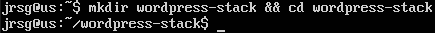
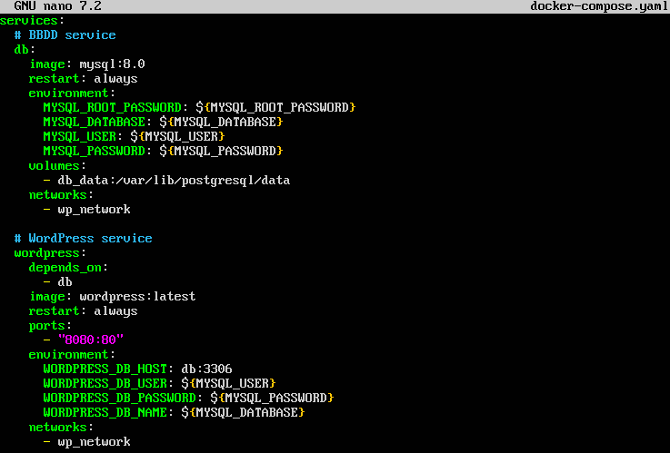
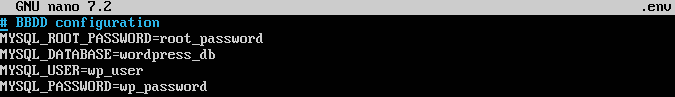
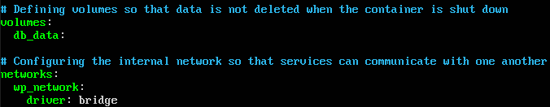
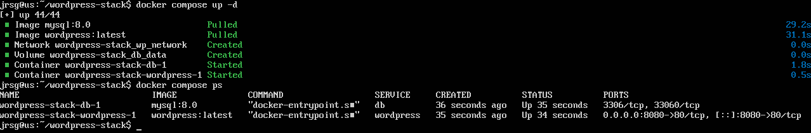
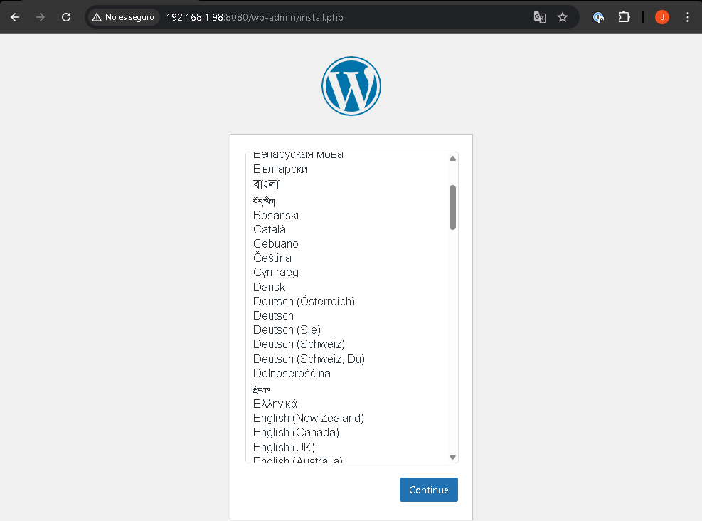

# Local orchestration with Docker Compose

## Objetive
Implement ‘Infrastructure as Code’ (IaC) for development environments. Move away from long `docker run` commands in favour of declarative YAML files.

### Compose YAML structure
Docker Compose is a tool for defining and running multi-container Docker applications using a YAML file. A typical docker-compose.yml file is divided into three main top-level blocks: services, volumes and networks:
- **`services`:** This is the heart of the file. Here you define each of the containers (services) that will make up your application. Each service will run a Docker image and can be configured independently.
- **`volumes`:** This is used to manage data persistence. If a container is destroyed, the data stored within its temporary filesystem is lost. Volumes solve this. You declare ‘named volumes’ (managed by Docker) globally within the file and then map them to specific paths within your services. This allows data to be shared between containers and ensures that critical information (such as a database) survives restarts.
- **`networks`:** Defines the communication networks between containers. By default, Compose creates a single network for the entire application, and services can discover each other using the service name as the ‘hostname’. It also allows you to create custom networks to isolate components.

### Life cycle management
Monitoring how containers start up and recover is vital for the stability of the application. To this end, start commands and the restart policy are essential: 
- **`depends_on` (start-up order):** By default, Compose starts all services at the same time. `depends_on` allows you to specify a start-up order. For example, if the `web` service depends on `db`, Compose will start `db` first and then `web`. `depends_on` only waits for the container to start, not for the application inside it to be ‘ready’. You can use `condition: service_healthy` in conjunction with a health check to ensure that Service B only starts when Service A is 100% operational.
- **`restart_policies` (fall recovery):** Defines what the Docker engine should do if a container stops or the internal process crashes. The main options are:
    - **no:** This is the default setting. The container will not be restarted automatically under any circumstances.
    - **always:** Always restart the container if it stops. If you stop it manually, it will restart when the Docker daemon restarts.
    - **on-failure:** Only restart the container if it exits with an error code (an exit status other than 0). This is the most common option for applications in production.
    - **unless-stopped:** Similar to `always`, but if you explicitly stop the container (`docker stop`), it will not attempt to restart it the next time the Docker daemon restarts.

### Environment Variables
Embedding passwords, tokens or environment settings (development vs. production) directly within a Docker image (in the Dockerfile) is a bad practice for reasons of security and portability. Docker Compose allows you to inject these variables into the container at runtime:
- **`environment`:** You can pass variables directly in the YAML file.
- **`.env` files:** To keep secrets out of the source code, we use .env files. By default, if you place a file called .env in the same folder as your docker-compose.yml, Compose will read those variables automatically. You can use them to substitute values within the YAML itself. If you have multiple environment files (e.g. .env.dev, .env.prod) or want to inject all the variables from a file directly into the container without listing them one by one, use `env_file`.

### Exercise 1: Create a folder called `wordpress-stack/`. Write a `docker-compose.yml` file that starts two services: WordPress and the database (MySQL).
Let’s create the folder and navigate to it:

Now let’s create the `docker-compose.yaml` file, which will define how the services will behave, how they will connect, and where they will store their data:

### Exercise 2: Use an external .env file to store the MYSQL_ROOT_PASSWORD and pass it to both containers.
It is essential not to write passwords directly into the YAML file. We will create a hidden file called `.env`, where Docker Compose will automatically look for the values:

### Exercise 3: Declare a named volume for the database and ensure that both services are on the same internal network.

### Exercise 4: Start everything up with `docker compose up -d` and check that you can access the WordPress installer at localhost:8080.

