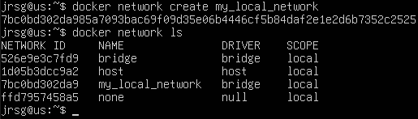
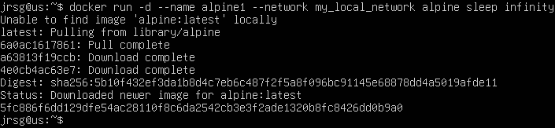
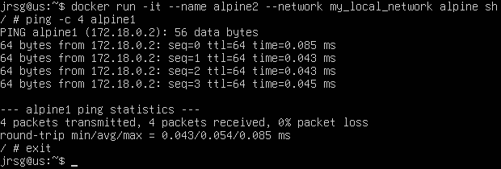
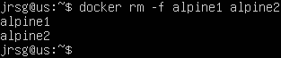
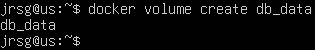
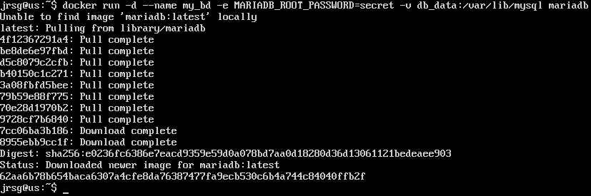
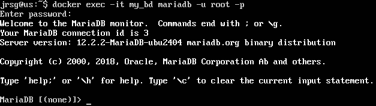
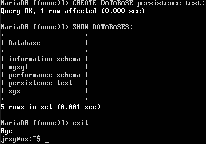
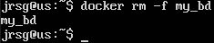
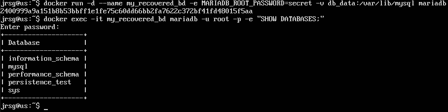

# Perseverance and Internal Networks

## Objetive
Addressing the issue of volatility. Containers come and go, but data and connections must remain secure and reliable.

### Types of Storage
Data created within a container is lost when the container is deleted. To persist data, Docker offers two main mechanisms: Volumes and Bind Mounts:
- **Volumes:** These are managed entirely by Docker. They are stored in a dedicated part of the Docker file system: `/var/lib/docker/volumes/`. They are typically used for databases, to share data securely between multiple containers, and when you want to isolate the container’s data from the host machine’s directory structure. The main advantage is that they are easier to back up or migrate, and offer much better performance in Docker Desktop (Windows/Mac) than Bind Mounts.
- **Bind Mounts:** This is a more direct mechanism where you link a specific path on your physical machine to the container; therefore, they depend directly on the directory structure and the operating system of the host machine. They can be located on any path on the hard drive. They are typically used for live development and for sharing configuration files from the host machine to the container. The downside is that they can cause permission issues (particularly on Linux) and tie the container to a host-specific file structure, reducing portability.

### Docker Networks
Docker uses different network ‘drivers’ to define how containers communicate with each other and with the outside world:
- **`bridge`:** Creates a private internal network on the host. This is the default driver if none is specified. Containers on the same bridge network can communicate with each other, but are isolated from other networks.
- **`host`:** Removes network isolation between the container and the Docker host. The container does not receive its own IP address; it uses the network and ports of the machine on which it is running directly. If your container exposes port 80 and you use the host network, the application will be available on port 80 of your actual machine. It only works natively on Linux.
- **`none`:** Completely isolates the container at the network level. It has no access to the internet or to other containers. It only has the loopback network interface (localhost). Useful for containers performing strictly secure or offline processing tasks.
- **`overlay`:** Allows multiple Docker daemons to be connected together. It is the core driver for Docker Swarm. It allows a container on ‘Server A’ to communicate securely with a container on ‘Server B’ as if they were on the same local network.

### Internal DNS
If you run two containers without specifying a network (bridge network), they cannot be resolved by name. For them to communicate, you would have to use their internal IP addresses, which is unmanageable. Therefore, when a network is created in Docker and containers are connected to it, Docker activates an internal DNS server.

Docker’s DNS intercepts network queries from the containers. If container ‘A’ attempts to contact container ‘B’, the DNS looks up the container’s name (or its alias) and automatically returns its current internal IP address. This makes applications completely independent of IP addresses. Docker ensures that my-bd always points to the correct container, even if it restarts and changes its IP address.

### Exercise 1: Create a Docker network: `docker network create my_local_network`.

### Exercise 2: Set up two Alpine containers on that network and ping from one to the other.
We are going to run a container called alpine1 in the background (detached). We use the `sleep infinity` command to prevent the container from closing immediately, as Alpine does not run any long-running processes by default.

Now we’re going to start a second container called alpine2, connect it to the same network and log in directly to its console (shell) in interactive mode (-it). Once inside the container (your prompt will change to something like `/ #`), let’s ping the name of the first container:

Let’s clear the bins to keep the area tidy:

### Exercise 3: Create a Docker volume: `docker volume create db_data`.

### Exercise 4: Start a MariaDB/MySQL container by mounting that volume to it. Log into the container, create a database, destroy the container, restart it, and check that the database is still there.
We are going to launch a container called `mi_bd`, assign it a mandatory root password, and mount the volume we have just created to the internal path where MariaDB stores its data (`/var/lib/mysql`).

Now we’ll run the MySQL console inside the container and create a database:

Now let’s delete the container and recreate it to check if the database still exists:

