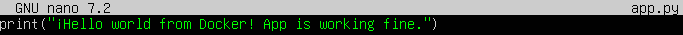
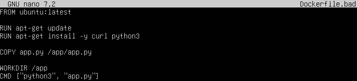
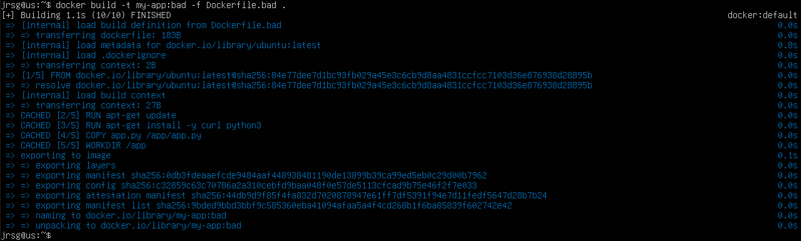
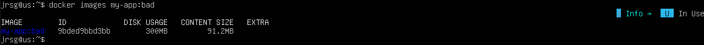
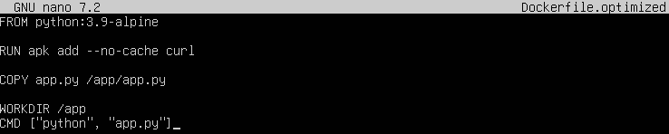
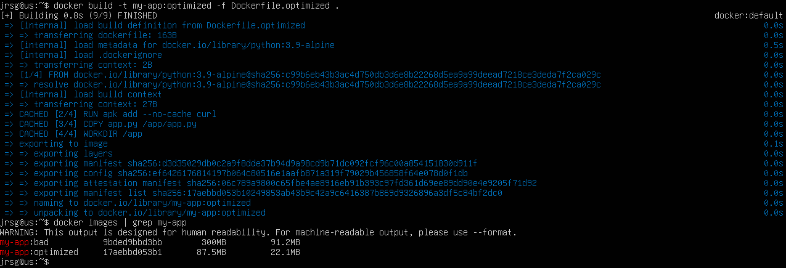
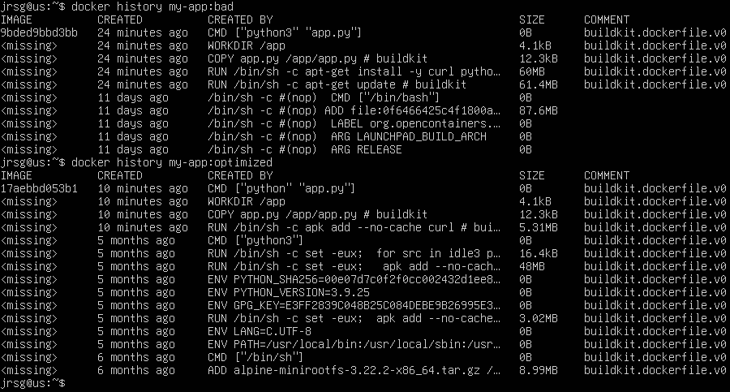

# The Structure and Optimisation of Dockerfiles

## Objetive
Write production-ready Dockerfiles. Understand how the Docker layer cache works to speed up builds and reduce the attack surface by using distroless or Alpine images.

### Layered File System (UnionFS)
Docker does not create a monolithic filesystem for each image, but instead uses UnionFS (Union File System). Each instruction in your Dockerfile creates a new read-only layer superimposed on the previous one.  The Docker cache is evaluated from top to bottom. When Docker processes an instruction, it searches its cache for an existing layer that exactly matches that instruction. If a layer changes (its cache is invalidated), all subsequent layers are also invalidated and must be rebuilt from scratch. This is why the order in which each instruction is executed is critical. The main instructions are:
- **RUN:** Used to execute commands within the image whilst it is being built (during the build phase). It opens a temporary terminal in the base image, executes the command you specify, and saves the resulting changes to a new layer. It is mainly used to install dependencies and create system directories.
- **COPY:** Used to copy files or folders from your local machine (host) into the Docker image. It takes the source path (on your hard drive) and copies it to the destination path (within the image).
- **ADD:** The ADD command does exactly the same as COPY, but has two additional ‘superpowers’ built in:
    - *Extracts compressed files (Tar)*: If the source file is a local compressed file (such as .tar, .tar.gz, .tgz, .bzip2), ADD automatically unpacks it into the destination folder.
    - *Download from URLs*: You can specify a web address (HTTP/HTTPS) as the source, and ADD will download the file and place it in the image.

### Anti-patterns
It is a practice that seems to work, but which ultimately leads to performance, security or stability issues:
- **Anti-pattern 1: Using `apt-get upgrade`:** If you build the image today and again next week, `upgrade` will install different versions, which can introduce unexpected bugs in production. Furthermore, updates download and install packages that your application often doesn’t even need. As an alternative, you can use the `FROM` instruction or specify the exact version of the package required with `apt-get install`.
- **Anti-pattern 2: Leaving orphaned package caches:** Due to the way UnionFS works, if the commands are executed in the wrong order, the in-memory cache of a package that has already been deleted may be retained. The correct approach would be to perform the installation and cleanup within the same execution context (on the same layer) using `&&`.

### Multistage Builds
The biggest challenge when packaging compiled software written in programming languages is that you need heavy-duty tools to compile it, but you don’t need them to run the application. The multistage pattern solves this problem by using multiple `FROM` instructions in a single Dockerfile. Each `FROM` statement starts a new stage. Ultimately, you can selectively copy only the compiled artefacts from a previous stage into the final image, discarding the entire build environment.

### Exercise 1: Create a Dockerfile based on ubuntu:latest, install curl and Python, and copy a ‘Hello World’ script into it. Build the image and check its size using `docker images`.
First, let’s create an `app.py` file to display a message if everything is working correctly:

Now let’s create a Dockerfile with several basic errors, such as using a huge base image that isn’t designed for your language and failing to optimise the build layers:

We build the image and check the size:

We can see that the image is around 100MB, even though the source code is less than 1KB.

### Exercise 2: Rewrite the Dockerfile using python:3.9-alpine.
Now we’re going to use `alpine`, which is an ultra-lightweight Linux distribution designed specifically for containers. We’ll also use the official Python image, which already comes with the environment set up:

As we can see in the last image, `myapp:optimized` is much lighter than the first option because we have chosen the correct base image and have been careful not to install any extra dependencies.

### Exercise 3: Use the `docker history <image_name>` command to see exactly how many megabytes each line of your Dockerfile adds.

A line-by-line comparison of the two apps reveals that: the base layer is much smaller in the optimised version; the Python layer comes pre-optimised; and the layer where you install curl adds very few megabytes because we used the `--no-cache` option, meaning that the installer did not save any residual temporary files in that layer.