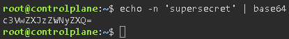
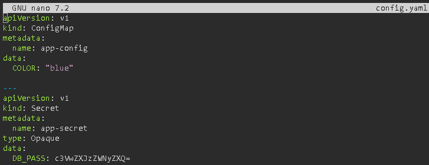
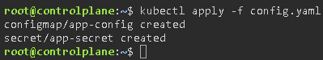
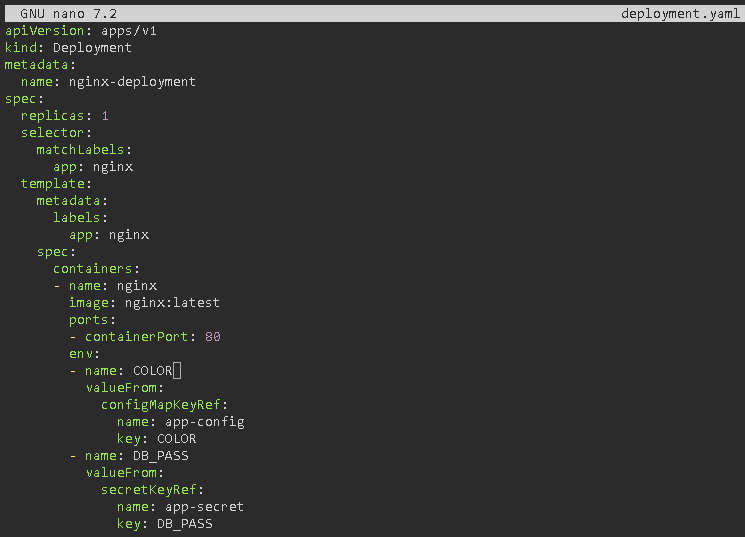
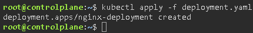
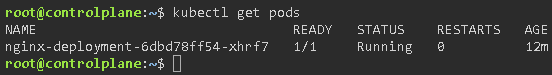
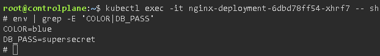

# ConfigMaps & Secrets

## Objetive
Decouple the configuration from the code. The same Docker image should be used for both Development and Production, with only the Secrets and ConfigMaps being changed.

### ConfigMap
It is an API object designed to store non-sensitive data in a key-value format. It decouples the environment configuration from the container image, making applications easily portable. It is used to store everything from simple variables to complete configuration files. It is not designed to hold large amounts of data (the strict limit is 1 MB). You can create a ConfigMap in several ways depending on the source of the data:
- **From literals:** Defining key-value pairs directly in the console (`kubectl create configmap my-config --from-literal=ENV=prod`).

- **From a file:** Taking an entire file and saving it as a value (`kubectl create configmap my-config --from-file=nginx.conf`).

- **From a directory:** Reads all files in a folder and creates a key for each file.

A container can consume a ConfigMap in two main ways:
- **As environment variables:** By injecting specific keys (`valueFrom`) or by injecting all keys from a ConfigMap (`envFrom`). If you update the ConfigMap, the environment variables are not automatically updated in the Pod. You must restart the Pod for it to take on the new values.

- **As mounted volumes:** The ConfigMap is mounted as a directory within the container’s filesystem. Each key becomes a file, and its value is the file’s contents. Unlike variables, if you update a ConfigMap mounted as a volume, the files within the Pod are updated automatically. The application must be prepared to hot-reload these files.

### Secret
It is a Kubernetes object specifically designed to store sensitive information, such as passwords, OAuth tokens, and SSH/TLS keys. Like ConfigMaps, its maximum size is 1 MB, but unlike ConfigMaps, Secrets have built-in ‘types’ that tell Kubernetes what data format to expect:
- **`Opaque`:** The default type. For generic, user-defined key-value pairs.

- **`kubernetes.io/tls`:** Designed to store a public certificate (`tls.crt`) and its private key (`tls.key`). Widely used to configure HTTPS in Ingress Controllers.

- **`kubernetes.io/dockerconfigjson`:** Stores credentials (username/password) so that Kubernetes can authenticate and pull images from private registries (private Docker Hub, AWS ECR, etc.). It is used via the `imagePullSecrets` field in the Pod.

- **`kubernetes.io/service-account-token`:** Tokens used by Pods to communicate with the Kubernetes API itself.

Kubernetes’ default behaviour can be misleading:
- **In the Manifest (YAML):** When you write or read a standard Secret, the data is in Base64. This is simply to avoid formatting issues with special characters (line breaks, quotation marks), not to hide them.

- **On Disk (`etcd`):** By default, Kubernetes stores these values in plain text within its `etcd` database. If an attacker gains access to the master server’s disk (Control Plane), they can read all the passwords.

- **The Solution (EncryptionConfiguration):** To fix this, the cluster administrator must configure the `kube-apiserver` component by passing a configuration file that instructs it to encrypt specific resources (such as Secrets) using algorithms like `AES-CBC` or `KMS` (Key Management Service) before storing them in `etcd`.

As YAML manifests for Secrets are not encrypted, they must never be pushed to a code repository (GitHub/GitLab). For modern workflows (GitOps), third-party tools are used:

- **Sealed Secrets (by Bitnami):** Uses asymmetric cryptography. You encrypt your Secret with a public key by creating a `SealedSecret` object, which you can then safely upload to Git. An operator within the cluster uses the private key to decrypt it and convert it into a native K8s Secret.

- **External Secrets Operator:** Instead of storing secrets in K8s, you store them in a professional external manager (AWS Secrets Manager, Azure Key Vault, HashiCorp Vault). K8s simply connects to them and synchronises them dynamically.

### Exercise 1: Create a config.yaml file that defines a ConfigMap with a variable `COLOR=blue` and a Secret with `DB_PASS=supersecreto` (remember to base64-encode the password in your terminal using `echo -n “supersecreto” | base64`).
Before creating the Secret manifest, we need to encode the `supersecret` value in Base64 format:

Now we’re going to create a single file called `config.yaml` that will contain both resources: the ConfigMap and the Secret. In Kubernetes, you can define multiple resources in a single file by separating them with three dashes (---):

- **`name`:** This is the unique identifier. If you don’t remember this name, the Deployment won’t know where to look.

- **`data`:** Here you define the dictionary of variables. In a ConfigMap, you can put whatever you want, exactly as you want to read it (plain text).

- **`type: Opaque`:** This tells Kubernetes “don’t try to validate whether this is a certificate or a Docker file; it’s a generic secret defined by me”.

- **`data`:** This is the same as the ConfigMap, but the value must be Base64-encoded. If you were to put ‘supersecreto’ here, Kubernetes would throw an error when applying the file or would misread the value when decoding it inside the container.

### Exercise 2: Modify your Nginx Deployment so that it injects the ConfigMap and the Secret as environment variables into the container.

- **`env -> name`:** Defines what the variable will be called when you run `echo $COLOR` or `echo $DB_PASS` within the pod’s operating system. (By convention, it is named the same as the key).

- **`valueFrom`:** This is the key instruction. It breaks from the normal behaviour (which would be to set `value: ‘blue’`) and tells Kubernetes to perform a dynamic lookup when the Pod is created.

- **`KeyRef (configMapKeyRef / secretKeyRef)`:** Defines the source. As we use a key reference (KeyRef), Kubernetes knows that it should only fetch a specific value and not the entire contents of the file.

- The combination of `name` (the K8s object) and `key` (the specific variable) are the exact coordinates for fetching the data.

### Exercise 3: Enter the Pod using `kubectl exec -it <pod-name> -- sh` and run `env` to check that the variables are present.
Now let’s check that Kubernetes has done its job and injected the variables into the container. First, we retrieve the pod’s name:

Now we enter the pod and check the environment variables, filtering with `grep` so we don’t see the entire list of system variables:

