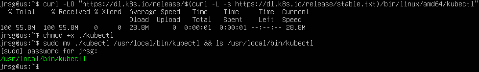
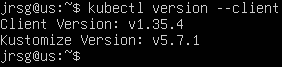
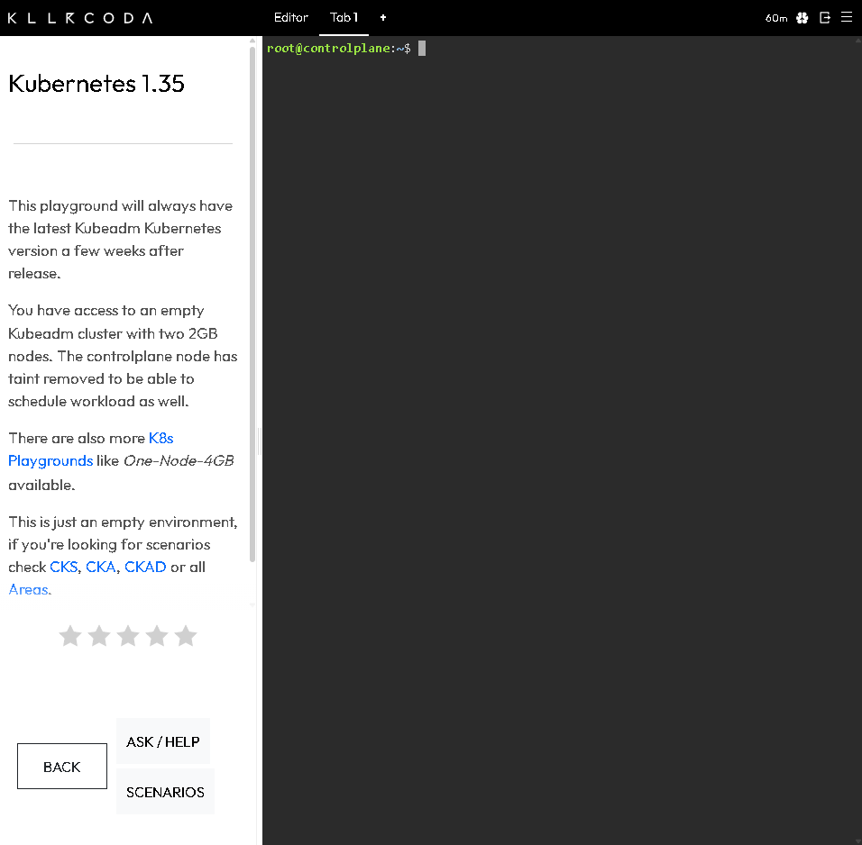
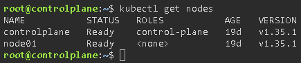
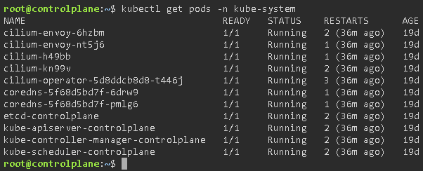

# Kubernetes Architecture

## Objetivo
It’s important to understand that Kubernetes isn’t a single programme, but a distributed system. If you know what each component does, you’ll know where to look when something goes wrong.

### Control Plane (The Brain)
The Control Plane is the true brain of the Kubernetes cluster. Its main responsibility is to make global decisions about the cluster, as well as to detect and respond to events. The four main components are:
- **`kube-apiserver`:** It is the only component in the cluster that exposes a REST API. It acts as the communication hub: all Kubernetes components (both internal and external) communicate with it. The API Server does not store any data itself, which allows it to be scaled horizontally. It does not merely check for a password (Authentication) or permissions (RBAC). It also passes through the Admission Controllers, which can reject a Pod if it does not have, for example, defined memory limits, or even mutate (modify) the request on the fly before saving it.

- **`etcd`:** An open-source, highly available, distributed key-value store. To ensure `etcd` is secure in production, it is deployed across multiple nodes (usually 3 or 5). It uses a consensus algorithm called Raft, which requires a majority of nodes (the quorum) to agree before committing a change. If you have 3 nodes and 2 fail, the Kubernetes cluster locks into ‘read-only’ mode to prevent data corruption. `etcd` has a `Watch` function: as soon as data changes, `etcd` sends a notification to the API Server almost in real time.

- **`kube-scheduler`:** This is the component responsible for assigning a Node to a newly created Pod. The filtering and scoring it performs is based on strict Kubernetes rules:
    - *Requests and Limits*: It checks how much CPU/RAM the Pod requires and looks for Nodes with that amount of free capacity.
    - *Taints and Tolerations*: A Node may state “I am reserved for databases only” (Taint). The Scheduler will not place a Pod there unless the Pod has special permission (Toleration).
    - *Affinity and Anti-Affinity*: The Scheduler reads rules such as “deploy this web Pod on the same node as its cache Pod” (Affinity) or “never place two replicas of the same Pod on the same node to avoid total outages” (Anti-Affinity).

- **`kube-controller-manager`:** This is a binary that groups together multiple controllers. Each controller focuses on a specific type of resource. Within this component, there are several independent controllers that work in parallel:
    - *ReplicaSet Controller*: Constantly compares the number of Pods you requested with those currently running. If you manually delete a Pod, this controller detects it and creates a new one instantly.
    - *Endpoint Controller*: If a Pod dies and a new one is created with a different IP address, this controller updates the ‘Service’ so that traffic is redirected to the new Pod’s IP address without the user noticing the interruption.
    - *Node Controller*: Pings the Nodes. If a Node stops responding, this controller marks it as down and orders all the Pods on it to be evacuated to other healthy Nodes.

### Worker Nodes (The Muscle)
- **`kubelet`:** It is the main Kubernetes agent that runs continuously on every node in the cluster. It acts as the direct bridge between the node and the `kube-apiserver`. `kubelet` does not start containers itself. It uses a standard API called CRI (Container Runtime Interface) to issue commands to the actual container engine installed on the node (such as `containerd` or `CRI-O`). It receives Pod specifications (PodSpecs) from the API Server and ensures that the containers described in that YAML are running and healthy. It is directly responsible for running health checks (Liveness, Readiness and Startup probes). If a container freezes or fails the Liveness probe, it is the `kubelet` that makes the decision to restart it locally at that very moment. When a node starts up, `kubelet` automatically registers with the API Server, sending information about its CPU, RAM and health status.

- **`kube-proxy`:** It is a network component that runs on each node and is responsible for maintaining connectivity and routing rules within the cluster. In Kubernetes, you create a resource called `Service` to group several Pods under a stable IP address. `kube-proxy` is the component that makes that `Service` work in practice, translating that virtual IP address into the actual IP addresses of the Pods. By default, `kube-proxy` is not a traditional proxy that heavily processes traffic. Instead, it communicates with the node’s Linux operating system and rewrites its internal firewall rules (using iptables or IPVS). Thus, traffic is routed at the kernel level, which is extremely fast. When a Service has three Pod replicas behind it, `kube-proxy` acts as a basic load balancer, distributing network requests evenly across the three available Pods.

### Exercise 1: Install kubectl (the CLI client) on your Linux machine.
To install `kubectl`, we first need to download the binary, make the file executable, and move it to a folder within the PATH:

We can check that it has been installed correctly by checking its version:

### Exercise 2: As we’ll be setting up the local cluster on Saturday, today we’ll be using Killercoda (it’s free and gives you a real cluster in your browser in 10 seconds).
Go to https://killercoda.com/playgrounds/scenario/kubernetes and log in with your GitHub account:

### Exercise 3: Run `kubectl get nodes` to view the worker nodes.
To view the nodes, run `kubectl get nodes`:

Two machines appear in the cluster: the `control plane` and `node01`, which is the worker node; both have a `status=READY`.

### Run `kubectl get pods -n kube-system`. Here you will see the Control Plane components running as containers. Which components can you identify?

By default, Kubernetes hides its own critical components within a namespace called `kube-system`. This command allows us to access all the cluster components that were hidden for security reasons when using `kubectl get nodes`. In the screenshot, we can see all the components described in the theory.