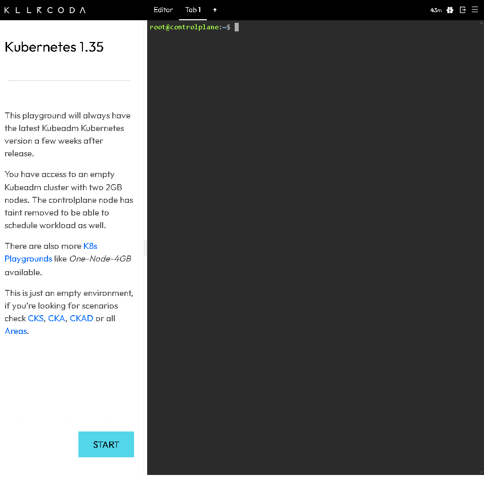
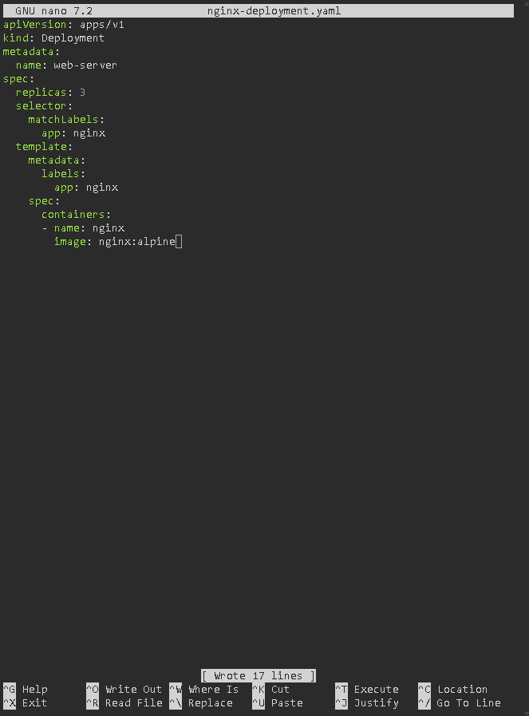
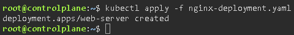
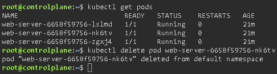
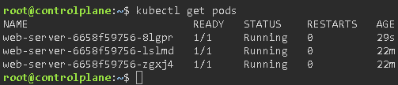

# Pods and Deployments

## Objetive
Forget the concept of ‘running a container’ and move on to the concept of ‘declaring a state’. K8s is declarative, not imperative.

### Pod
It is the smallest and most basic building block of the Kubernetes ecosystem. K8s does not run containers directly; it runs Pods. A Pod can host one or more containers. All containers within the same Pod share a network (address and port) and storage (the same data volumes). Pods are created to be destroyed. If a physical node on your server fails, or if there is a critical error, the Pod is terminated and does not restart. Kubernetes will simply create a new one in its place. That is why you should never store important data directly within a Pod’s container.

### ReplicaSet
Its sole purpose is to ensure that there are exactly ‘X’ (a number you define) identical copies of a Pod running at all times. It works by constantly comparing the ‘Desired State’ with the ‘Current State’. Although this is a crucial concept, you will rarely create a ReplicaSet manually. You will let a Deployment do it for you.

### Deployment
It automatically manages ReplicaSets and, consequently, the underlying Pods. When you create a Deployment, it creates a ReplicaSet underneath to spin up your Pods. If you want to move from version “v1” of an application to “v2”, the Deployment does not shut down all the Pods at once. Instead, it creates a new ReplicaSet V2 and gradually creates v2 Pods whilst shutting down v1 Pods. If the new version (v2) has a critical error, the Deployment remembers the previous ReplicaSets and allows you to perform an instant ‘rollback’ to v1.

### Exercise 1: Create an `nginx-deployment.yaml` file. Define a Deployment named `web-server` using the `nginx:alpine` image and `replicas: 3`.
We’re going to use the “killercoda” website for this exercise:

Let’s create the `nginx-deployment.yaml` file:

- **`apiVersion`** and **`kind`** (lines 1–2): These define the type of object we are creating in Kubernetes. Here, we specify that we want to create a Deployment using the `apps/v1` API version.
- **`metadata`** (lines 3–4): Provides data to identify the resource. Here, we are giving our Deployment the name `web-server`.
- **`spec > replicas: 3`** (line 6): Tells Kubernetes that we want exactly 3 copies (called Pods) of our application running at the same time. If one fails, Kubernetes will automatically create another to keep the number at 3.
- **`spec > selector`** (lines 7–9): Defines the rule that the Deployment uses to determine which Pods it should manage. In this case, it will search for and control any Pod with the label `app: nginx`.
- **`template`** (lines 10–17): This is the ‘template’ or exact blueprint that Kubernetes will use to create each of those 3 replicas. It is divided into two parts:
    - **`metadata > labels`:** Assigns the label `app: nginx` to each newly created Pod.
    - **`spec > containers`:** Defines the actual container to be run. It gives it the name nginx and tells Kubernetes to download and run the `nginx:alpine` image (an official and very lightweight version of the NGINX web server based on Alpine Linux).

### Exercise 2: Run `kubectl apply -f nginx-deployment.yaml`.

### Exercise 3: Use `kubectl get pods` to view your three pods. Copy the name of one and delete it using `kubectl delete pod <name>`.

### Exercise 4: Run a quick `kubectl get pods` command. You’ll see that K8s is already creating a new pod to maintain the desired state of 3.

As we can see in the image, even though we deleted a pod in the previous exercise, Kubernetes has created a new one to maintain the requirements of the `nginx-deployment.yaml` file, where we specified that there must always be three pods.