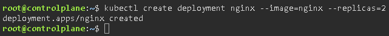
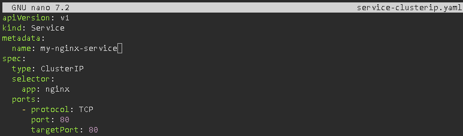
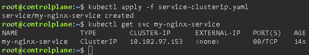
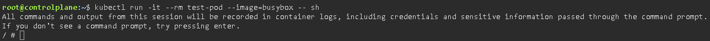
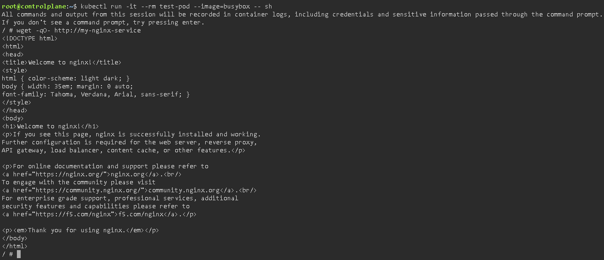

# Services

## Objetive
Understand how traffic finds the Pods, as their IP addresses constantly change whenever they are terminated or recreated.

### Labels & Selectors
In Kubernetes, Pods are ephemeral. They are constantly being created, destroyed and changing IP addresses. K8s does not use static IP addresses or fixed Pod names to connect them; it uses a dynamic system based on labels:
- **Labels:** These are key-value pairs (`key: value`) attached to K8s resources (such as Pods, Nodes, etc.) to identify them with attributes relevant to the user.
- **Selectors:** This is the mechanism used by other resources to search for and group resources that have certain labels. If a Service has the selector `app: backend`, it will intercept network traffic and distribute it evenly (load balancing) only amongst the Pods that have that exact label, ignoring the rest.

A Service in K8s is an abstraction that defines a logical set of Pods (using Selectors) and a policy for accessing them. As Pods are created and destroyed, resulting in new IP addresses, the Service provides a stable access point.
- **ClusterIP:** This is the most secure and closed type of service. It assigns a stable internal IP address to the service. It is only accessible from other resources within the same Kubernetes cluster. It is ideal for databases, caches and backend microservices.
- **NodePort:** Builds on the ClusterIP model but adds external access. It opens a static port (always between 30000 and 32767) on the physical IP address of all nodes in the cluster. You can access the service from outside the cluster by requesting `<Node-IP>:<NodePort>`. It is used in development environments, for rapid testing, or when you have your own physical load balancer manually configured in front of your servers.
- **LoadBalancer:** This is the standard for public-facing applications in production. It builds on the NodePort. When you create it, Kubernetes communicates with your cloud provider’s API (AWS EC2, Google Cloud, Azure) and asks it to provision a real, external load balancer. The cloud provider gives you a static public IP address or a domain. It is used for frontend applications and public APIs.

### Exercise 1: Write a `service-clusterip.yaml` file that points to yesterday’s Nginx Pods (using the selector `app: nginx`). Deploy it.
First, let’s create a deployment with two pods so that the service has somewhere to send traffic:

Now let’s create the service file `service-clusterip.yaml`:

- **`apiVersion: v1`:** Defines the version of the Kubernetes API we are using. Services use the stable v1 version.

- **`kind`:** Service: Tells Kubernetes that this object is a ‘Service’, not a Pod or a Deployment.

- **`metadata`:**
    - **`name: my-nginx-service`:** This is the name of your service. Very important: K8s will use this name to create an internal DNS entry.

- **`spec`:** Defines the desired behaviour of the service.
    - **`type`:** ClusterIP: Indicates that the service will only have an internal IP address within the cluster. It will not be accessible from the internet.
    - **`selector`:**
        - **`app: nginx`:** This is the most critical part. The service will search the entire cluster for any Pod with the `app: nginx` label. If it finds one, it will include it in its target list.
    - **`ports`:**
        - **`protocol: TCP`:** The network protocol (Nginx uses TCP for HTTP).
        - **`port: 80`:** This is the port on which the service will listen within the cluster.
        - **`targetPort: 80`:** This is the port of the Container (within the Pod) to which traffic will be sent. Nginx listens on port 80 by default.

We send the file to Kubernetes to create the resource, verify that it has been created, and check which internal IP address has been assigned to it:

### Exercise 2: Deploy a temporary Pod for testing: `kubectl run -it --rm test --image=busybox -- sh`.

- **`run test-pod`:** Creates a pod called ‘test-pod’.

- **`-it`:** Opens an interactive terminal so you can enter commands.

- **`--rm`:** Automatically deletes the pod as soon as you exit the terminal (to avoid leaving behind any leftover files).

- **`--image=busybox`:** Uses the Busybox image.

- **`--sh`:** Runs the command shell on startup.

### Exercise 3: Within that Pod, run `wget -qO- http://nombre-de-tu-servicio`. You’ll see that K8s resolves the service name to the correct IP address and returns the HTML from Nginx.
Now let’s check if the Kubernetes DNS is working:

- **DNS:** The test Pod asks the internal K8s DNS server (CoreDNS): ‘Who is my-nginx-service?’.

- **Resolution:** The DNS responds with the internal IP (ClusterIP) that we saw in Step 3.

- **Connection:** wget connects to that IP; the Service receives the request and redirects it to one of your Nginx Pods.

- **Result:** You should see the Nginx welcome HTML code (`<!DOCTYPE html>...`) on the screen.