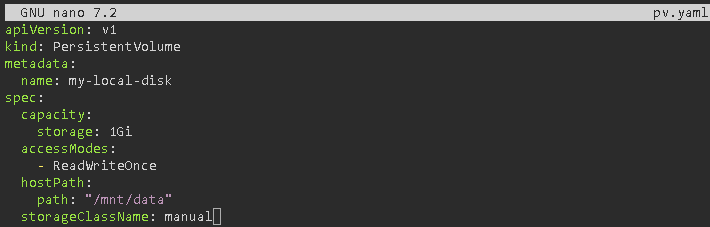
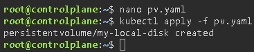
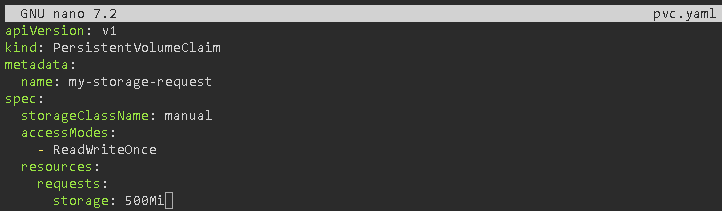
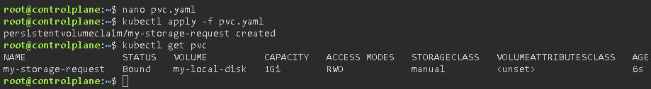
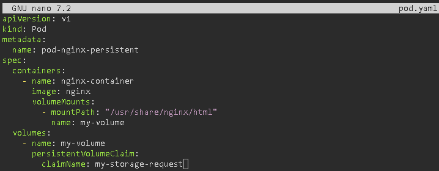
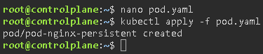
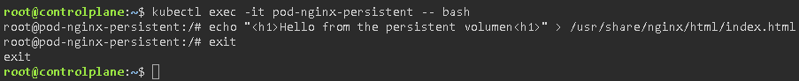
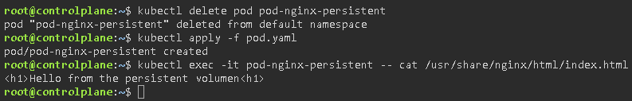

# Storage (PV y PVC)

## Objetive
Addressing persistence. If a database Pod fails, the data must not be lost.

### Persistent Volume (PV): The physical disk (or cloud volume) provisioned by the administrator (you, in your ASIR hat).
This is the actual storage resource (the physical disk partition, the volume in AWS/GCP, an NFS resource on your network, etc.). It is provisioned and managed by the systems/cluster administrator. Its lifecycle is independent of the Pod that uses it. If the Pod is deleted, the PV continues to exist with the data intact (depending on its retention policy or Reclaim Policy). It has several access modes:
- **`ReadWriteOnce (RWO)`:** Only one node can mount it in read/write mode at a time.

- **`ReadOnlyMany (ROX)`:** Multiple nodes can mount it at the same time, but only in read-only mode.

- **`ReadWriteMany (RWX)`:** Multiple nodes can mount it at the same time in read/write mode (useful for NFS).

### Persistent Volume Claim (PVC): The ‘ticket’ or storage request made by the developer (you, in your DAM hat), specifying the amount of storage and access type.
It is a storage request made by a user (developer) or an application (Pod). The developer writes this request in their YAML manifests without needing to know where or how the underlying physical disk is implemented. When you create a PVC, Kubernetes automatically searches for a PV that meets the requirements (same or larger size, and same access modes) and links them (Bound phase). From that point onwards, that PV is for the exclusive use of that PVC.

### StorageClass: The way to automate the creation of PVs (dynamic provisioning).
This is a template that defines how storage should be created dynamically. In the traditional model, the admin (ASIR) had to manually create dozens of PVs (disks) in advance so that the devs (DAM) would have them available when they launched their PVCs. This is inefficient and not very scalable. With a StorageClass, you enable Dynamic Provisioning. You can have several ‘classes’ or profiles, and the developer simply has to specify it in their PVC.

### Exercise 1: Create a hostPath-type pv.yaml file (using a local folder on the node; useful only for testing) with a size of 1GB.

- **`capacity/storage: 1Gi`:** We define the total size of the ‘disk’.

- **`accessModes: ReadWriteOnce`:** This specifies that the disk can only be mounted in read/write mode by a single node at a time.

- **`hostPath/path: ‘/mnt/data’`:** This is the actual path on your node’s hard drive (or on your computer if you’re using Minikube/Docker Desktop).

- **`storageClassName: manual`:** This is a label used to group this type of storage. The PVC must request the same class in order to ‘find’ it.

### Exercise 2: Create a pvc.yaml file requesting 500MB.

- **`storageClassName: manual`:** This is essential for Kubernetes to know that it should search among the PVs that belong to this class.

- **`resources/requests/storage: 500Mi`:** We are requesting less than the PV offers (1Gi), so the ‘fit’ is possible. If we requested 2Gi, the PVC would remain in a Pending state.

### Exercise 3: Deploy a simple Pod that mounts that PVC at /usr/share/nginx/html. Log into the Pod, create an index.html file. Delete the Pod, create a new one with the same PVC and verify that the file is still there.

- **`volumes/persistentVolumeClaim/claimName`:** Here we tell the Pod exactly which ‘ticket’ (PVC) it should use.

- **`volumeMounts/mountPath`:** This is the folder inside the container where the files from the disk will appear.

Now let’s check that the data isn’t deleted. To do this, we enter the pod and create a file:

Now we’ll delete the pod, bring it back up, and check that the file still exists:

