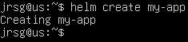
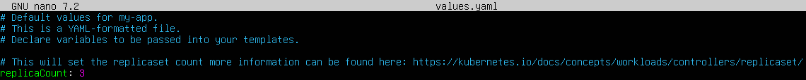
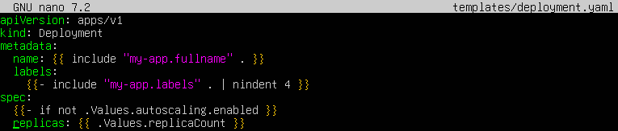
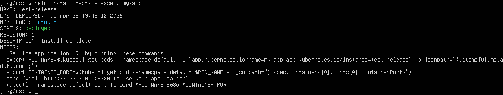

# Helm introduction

## Objetive
Stop copying and pasting YAML files. Learn how to configure your infrastructure so that the same code can be used for 10 different clients.

### Chart
This is Helm’s native packaging format. Structurally, it consists of a directory tree and specific files that group together all the Kubernetes resource definitions required to run an application. It includes the package metadata (in the `Chart.yaml` file), dependencies, default configurations and manifest definitions. It is the artefact that is versioned, stored in repositories and deployed.

### Templates
These are text files, usually with the extension `.yaml` or `.tpl`, located strictly within the `templates/` subdirectory of a Chart. Their internal structure combines the standard Kubernetes manifest schema with programming logic written in the Go template language (`text/template`). Their technical function is to enable the dynamic injection of variables and the execution of control structures (such as conditionals and loops) to compile and generate static, valid YAML files that the Kubernetes API can process.

### Values.yaml
This is the base configuration file located in the root directory of a Chart. Its sole purpose is to store configuration parameters in a structured key-value pair format (YAML). It represents the default set of input data. During execution, the Helm rendering engine reads the structured information in this file and maps it against the corresponding variables defined in the Templates to generate the resulting manifests.

### Run `helm create my-app`. Explore the directory.

This command generates a standardised directory structure. The key components are:
- **`Chart.yaml`:** Contains the package metadata (API version, chart name and application version).

- **`values.yaml`:** Configuration file where default values are defined. These values are fed into the templates during rendering.

- **`templates/`:** Directory containing Kubernetes manifests that can be processed by the Go template engine.

### Edit `deployment.yaml` so that the number of replicas is read from `values.yaml`.
Parameterisation involves replacing static values with dynamic references. To configure the number of replicas, two files need to be modified:

- **`values.yaml`**: Change the value of `replicaCount` from 1 to 3.

- **`templates/deployment.yaml`**: Within the Deployment manifest, Go template syntax is used to call this variable (by default).

The explanation of the syntax of that line is:
- **`{{ ... }}`:** Delimiters that tell the Helm engine to process the content.

- **`.`** (initial dot): Represents the root scope of the data object.

- **`Values`:** An object containing all the parameters defined in the `values.yaml` file.

- **`replicaCount`:** The specific key you wish to retrieve.

### Test your chart with `helm install test-release ./my-app`.

During this process, Helm performs a rendering: it combines the templates from the `templates/` directory with the data from `values.yaml` to produce the final YAML files that Kubernetes can interpret.