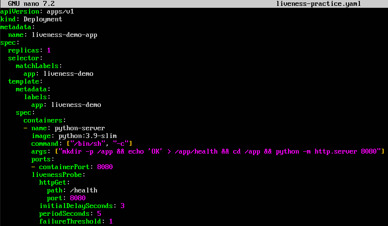
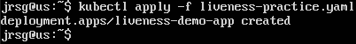
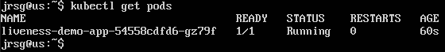
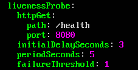
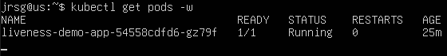
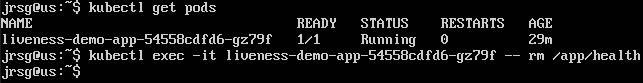
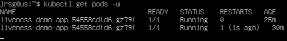

# Native Monitoring (Probes)

## Objetive
Configure Kubernetes ‘auto-healing’. Ensure the cluster knows when to restart a frozen container or when to stop sending traffic to an app that is still starting up.

### Liveness Probe
Determines whether the application inside a container is running correctly or has entered an unrecoverable error state. If it fails, the `kubelet` terminates the container and it is subject to its restart policy (`restartPolicy`). If this is not defined, the default status is `Success`, whereby K8s assumes that, as long as the container is still running, everything is fine.

### Readiness Probe
Determines whether a container is ready to respond to user requests. A container may be ‘alive’ (passing the `Liveness Probe`) but not yet ‘ready’ because it is loading large amounts of data into the cache, establishing database connections, or running migrations. If it fails, Kubernetes does not restart the container. Instead, the Endpoints controller removes the Pod’s IP address from all associated Services. The container stops receiving new traffic. If it becomes successful again, the Pod’s IP is added back to the Service and it begins receiving traffic once more.

### Startup Probe
It is specifically designed to protect containers with very long and unpredictable start-up times. If a `Startup Probe` is configured, it temporarily disables the `Liveness` and `Readiness` Probes until it succeeds. If the `Startup Probe` exhausts its attempts (maximum configured time) and fails, the `kubelet` kills the container and restarts it. Without a `Startup Probe`, a very slow application could be repeatedly killed by its own `Liveness Probe` before it manages to finish booting up.

### Exercise 1: Create a Python Deployment with an endpoint at `/health`.
We create the `liveness-practice.yaml` file:

We apply the file to our cluster: 

We check that the pod has been created correctly, that its status is `Running` and that the `RESTARTS` column has the value `0`:

### Exercise 2: Add a `livenessProbe` that checks that endpoint every 5 seconds.

### Exercise 3: Access the pod and ‘break’ the app (e.g. by deleting the file served by the endpoint). Use `kubectl get pods -w` to see how K8s detects the failure and automatically restarts the container.
Open a second terminal and run `kubectl get pods -w` to see the changes in real time:

Now let’s trigger a failure in the pod by deleting the `health` file that the `Liveness Probe` is checking:

Several things happen immediately:
1. You have deleted the file.

2. Within the next 5 seconds, the `kubelet` will make a request to `http://<pod-ip>:8080/health`.

3. The Python server will respond with a `404 File Not Found` status code instead of `200 OK`.

4. The Liveness Probe will flag a failure.

5. As `failureThreshold: 1`, Kubernetes will immediately decide that the container has ‘died’.

If we look at our second terminal:

We can see that the `RESTARTS` column now shows `1`. Kubernetes killed the faulty container and created a new one from scratch (which once again has the healthy `/health` file).