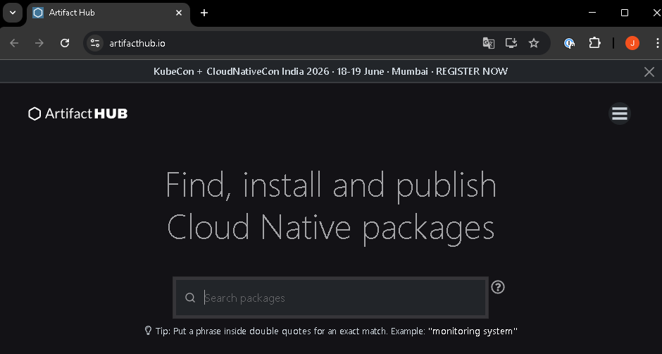
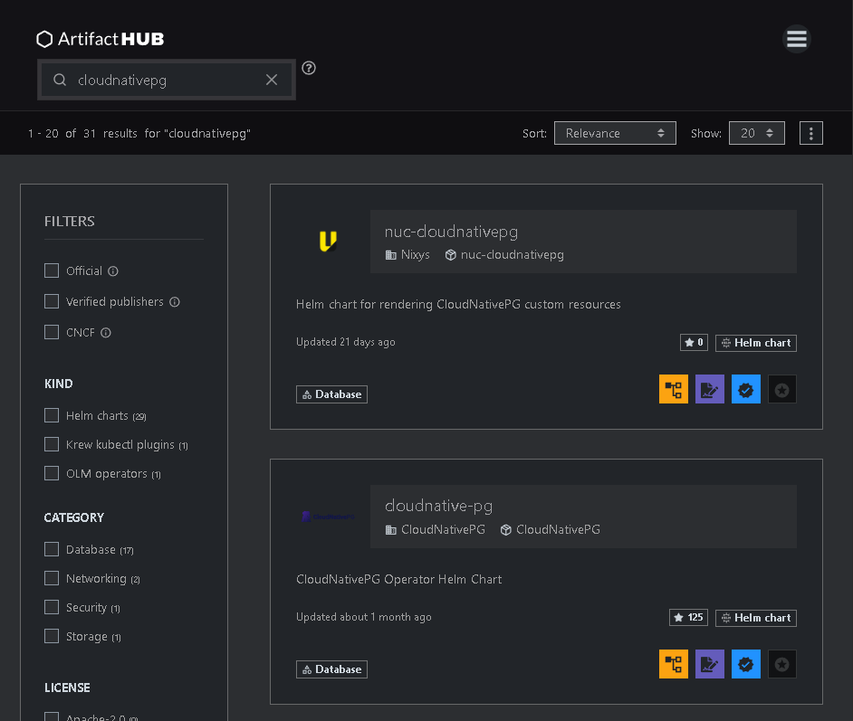
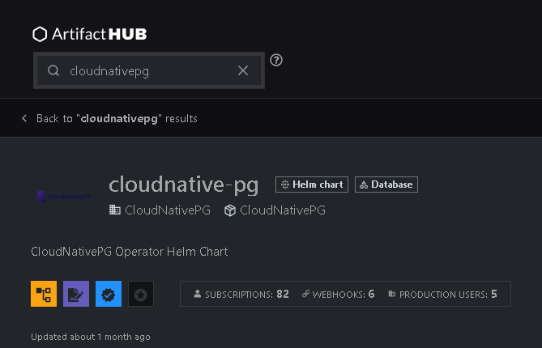

# Operators

## Objetive
Understand how K8s can manage complex applications (such as replicated databases) without human intervention.

### CRD (Custom Resource Definition)
This is the native mechanism by which a new schema (REST endpoint) is dynamically registered with the `kube-apiserver`. When a CRD is created, Kubernetes treats this new resource type with the same hierarchy and capabilities as its built-in resources (Pods, Deployments, etc.). The main structural components are:
- **GVK and GVR (Group, Version, Kind / Resource):** Every resource in the API is identified by a logical Group, an API Version and its Kind. The CRD defines exactly how this triad will be mapped to the corresponding REST endpoint (GVR).

- **Scope:** A CRD must be defined as `Namespaced` (isolated by logical workspaces) or `Cluster` (global across the entire cluster, useful for core infrastructure resources or policies).

- **Schema Validation (OpenAPI v3):** CRDs implement strict structural validation. The `kube-apiserver` rejects any manifest that does not comply with the typing rules, ranges, required fields or regular expressions defined in the OpenAPI schema.

- **Subresources:**
    - **`status`:** Separates the desired specification (`spec`) from the current operational data. It allows controllers to update the status without modifying the user’s configuration and with segregated RBAC permissions.

    - **`scale`:** Allows native tools such as the Horizontal Pod Autoscaler (HPA) to interact with the custom resource by modifying a standardised numeric field.

- **Printer Columns:** Allows you to configure which internal fields of the resource’s JSON are exposed when a user runs standard read commands in the CLI (such as `kubectl get`), improving observability.

- **Conversion Webhooks:** Backward compatibility mechanisms. When an API evolves, the CRD delegates the on-the-fly transformation of the JSON to an external service so that multiple versions can coexist and be served by the same etcd database.

### Operator Pattern
This is the architectural implementation of a custom controller that encapsulates the operational knowledge of the domain (configuration, updates, disaster recovery) in code. It works in conjunction with a specific CRD. The main structural components are:
- **Level-Triggered Design Model:** Unlike event-based (Edge-Triggered) systems that react to instantaneous state transitions, the Kubernetes controller is Level-Triggered. It observes the current overall state of the system at any given moment. If an event is missed due to a network outage, the controller automatically recovers by restarting its read of the current state.

- **Informer and SharedInformer:** To avoid overloading the `kube-apiserver` with constant queries, Operators use local caches (Informers). These continuously synchronise the cluster’s state in memory and trigger internal notifications (Callbacks) only when changes occur (Add, Update, Delete).

- **Workqueue:** Events generated by the Informer are queued. The queue manages concurrency, prevents duplicate processing of the same resource, and provides retry mechanisms with exponential backoff (Rate-Limiting) if a transient error occurs.

- **Reconciliation Loop:** This is the Operator’s central, idempotent function. When removing an item from the queue, the reconciliation function:
    1. Reads the desired specification (`spec`) of the Custom Resource.

    2. Observes the topology and state of all associated child (or external) resources.

    3. Executes the business logic to reduce the mathematical difference between the two states to zero.

    4. Updates the `status` sub-resource to reflect the topological reality.

### Exercise 1: Search Artifact Hub for the ‘CloudNativePG’ (PostgreSQL) operator or the Redis operator.
Open your browser and go to ‘artifacthub.io’:

In the main search bar, type `cloudnativepg`:

### Exercise 2: Read an Operator manifesto. You’ll see that you no longer define ‘Pods’, but high-level objects.
From the results of the previous search, we’ll select one that has the tag “Helm” or “OLM” and is published by the CloudNativePG organisation. Once inside, we can see that this package does not install a database directly, but instead installs the Operator and its associated CRDs on your cluster:

