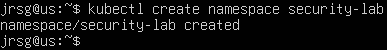
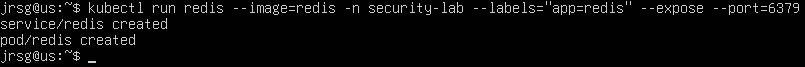
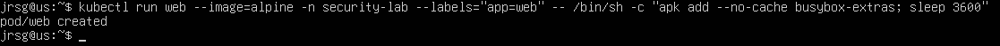
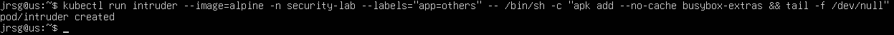
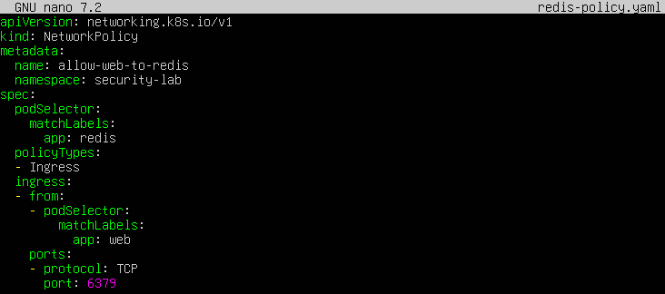
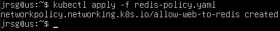
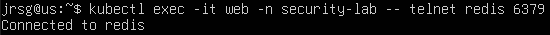
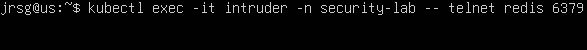

# RBAC & Network Policies

## Objetive
Implement a ‘Zero Trust’ approach. Not all users should be able to do everything, nor should all pods be able to communicate with one another.

### RBAC (Role-Based Access Control)
This is the system Kubernetes uses to authorise the actions an entity can perform on cluster resources. To understand this simply, we need to ask ourselves three questions:
- **ServiceAccount:** The ‘who?’. This is the identity that Kubernetes assigns to the processes and applications running within Pods. Whilst user accounts are for humans or external processes that manage the cluster, Service Accounts are for entities that reside within the cluster. Each namespace has a default Service Account assigned (called `default`), but the best security practice is to create specific Service Accounts for each application, following the principle of least privilege.

- **Role:** The ‘what can it do?’. It is a document containing a set of rules that define permissions within a specific namespace. It is an additive model: a Role can only grant access; it can never explicitly deny it, as in K8s, by default, all access to the API is denied. The components are:
    - **API Groups:** The group to which the resource belongs in the K8s architecture.

    - **Resources:** The object with which interaction is to take place.

    - **Verbs:** The actions permitted on that object.

There is also the `ClusterRole`, which works in exactly the same way, but grants permissions globally across the entire cluster, without being tied to a single namespace.

- **RoleBinding:** The ‘binding’. This is the link that grants the permissions defined in a Role to a ServiceAccount. Like the Role, the RoleBinding applies exclusively within a namespace.

### NetworkPolicies
They protect internal network traffic between applications. These are native Kubernetes rules that control how Pods communicate with each other and with other network endpoints. They operate at the network layer (Layer 3 – IP addresses) and the transport layer (Layer 4 – TCP/UDP ports) of the OSI model. They allow incoming traffic (**ingress**) and outgoing traffic (**egress**) to be filtered independently. 

By design, the standard Kubernetes network model dictates that the cluster is a flat network. This means that all Pods can communicate freely with all other Pods, regardless of which node or namespace they are located in. This carries a risk: if an attacker manages to compromise an exposed container, they could exploit this flat network to move laterally and directly access critical internal databases or services.

This is why the *Zero Trust* concept exists, which involves implementing a base policy in each namespace that completely blocks all traffic (both ingress and egress) for all Pods residing there. The moment a Pod is selected by a NetworkPolicy (even one that blocks everything), that Pod becomes ‘isolated’. From that moment on, any communication not explicitly permitted by another policy will be dropped. The implementation is as follows:
1. The ‘Default Deny’ policy is created and deployed.

2. From there, additional granular NetworkPolicies are created to open explicit traffic flows only for strictly necessary communication.

### Exercise 1: Create a NetworkPolicy that only allows traffic to port 6379 (Redis) if the traffic originates from pods with the label `app:web`.
First, let’s create the components that will interact with one another:
- A namespace:



- A database (Redis):



- An authorised web pod:



- An intruder pod (unauthorised):



Now we create the isolation NetworkPolicy. This policy applies the implicit Default Deny principle for Redis, allowing only what we specify:



The most important sections of the file are:

```
spec:
  podSelector:
    matchLabels:
      app: redis
```
- Instructs Kubernetes to search for all Pods in the current namespace that have the `app: redis` label.

```
policyTypes:
  - Ingress
```
- This specifies that the rules in this policy will only apply to incoming traffic (`Ingress`) to the Pods selected in the previous step.

```
ingress:
  - from:
    - podSelector:
        matchLabels:
          app: web
```
- Create a whitelist rule for incoming traffic. This specifies that traffic should be accepted if, and only if, the source is another Pod within the same namespace that contains the `app: web` label.

```
ports:
    - protocol: TCP
      port: 6379
```
- Add a final restriction to the previous rule. Traffic originating from the permitted source (`app: web`) will only be accepted if its final destination is TCP port `6379`.

We apply the following policy:



### Exercise 2: Try to telnet to Redis from a pod with a different label. It should time out.
Now let’s test whether our firewall is working. First, we’ll run the test on the web pod (the authorised one):



We can see that it connects without any issues. Now let’s move on to the intruder pod (the unauthorised one):



We can see that this pod, which does not have permission to connect, gets stuck waiting for a connection.