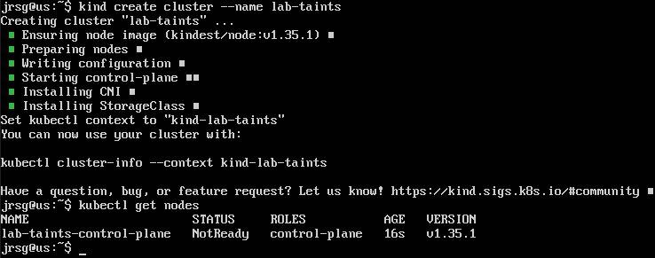
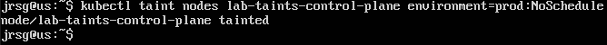
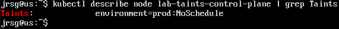
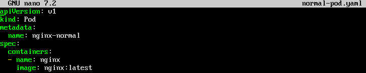
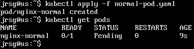
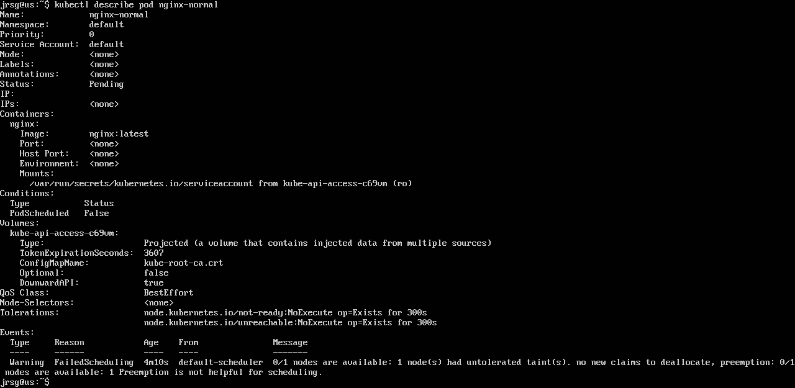
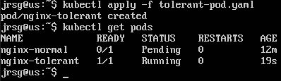

# Taints & Affinity

## Objetive
Control exactly where your workloads run. Ideal for separating environments (Prod/Dev) or using nodes with specific hardware (GPUs/SSDs).

### Taints
These are properties that apply to Nodes. Their main function is to repel Pods. If a node has a Taint, it will not accept any Pods unless that Pod has the specific “Tolerance” for that taint. The ‘effect’ defines how strict the repulsion rule is:
- **`NoSchedule` (Strict):** No Pod will be scheduled on this node unless it has the appropriate tolerance. Pods that were already on the node before the taint was applied remain there.

- **`PreferNoSchedule` (Soft):** The Kubernetes scheduler will try not to place new Pods on this node, but if no other nodes are available in the cluster, it will place them there anyway.

- **`NoExecute` (Very Strict):** Not only does this prevent new Pods from being scheduled, but it also immediately evicts Pods that were already running on the node if they do not have the corresponding tolerance.

### Tolerations
These apply to Pods. They act like a ‘VIP pass’ that allows the Pod to ignore a node’s taint and thus run on that node. Having a tolerance does not force the Pod to go to that tainted node; it simply gives it permission to run there if the scheduler decides to do so. There are two tolerance operators:
- **`Equal`:** The Pod must specify the exact key, value and effect of the Taint.

- **`Exists`:** The Pod only needs to specify the key and the effect. It does not matter what the value is. It is a broader wildcard.

### Node Affinity
It is a Pod property that tells Kubernetes what characteristics a node must have in order for the Pod to run. It is a much more advanced and flexible version of the old `nodeSelector`. Names in Kubernetes are long, but very descriptive:
- **`requiredDuringSchedulingIgnoredDuringExecution` (Hard Rule / Required):** The Pod must go to a node that meets the rules. If there is no node that meets them, the Pod remains in a Pending state (it does not run).

- **`preferredDuringSchedulingIgnoredDuringExecution` (Soft Rule / Preferred):** The Pod prefers to be placed on nodes that meet the rules. It is assigned a ‘weight’ (from 1 to 100). If the ideal node is not found, the Pod will run on any other available node.

In addition, `NodeAffinity` uses logical operators:
- **`In`:** The value of the node label must be within a provided list of values.

- **`NotIn`:** The value of the label must NOT be in the list (useful for Anti-Affinity).

- **`Exists`:** The node must simply have the label, regardless of its value.

- **`DoesNotExist`:** The node must NOT have the label.

- **`Gt / Lt`:** The value of the label (if it is a number) must be greater than (Gt) or less than (Lt).

### Exercise 1: Select a node from your Kubernetes cluster and add a taint: `kubectl taint nodes <node-name> environment=prod:NoSchedule`.
First, let’s create a cluster for testing:

Now let’s tell that node to only accept ‘production’ workloads from now on:

We’ll check that it has been applied correctly:

### Exercise 2: Try deploying a standard Nginx Pod. You’ll see that it remains in the Pending state because it doesn’t tolerate the taint.
To deploy an `nginx` pod, we’re going to create a `normal-pod.yaml` file to deploy it:

We apply the file and see the results:

As we can see, the pod’s status is “Pending” because it does not tolerate the taint. We can investigate further using the `kubectl describe pod nginx-normal` command:

In the ‘Events’ section, we can see a message from the `default-scheduler` describing the problem: *Warning  FailedScheduling  ...  0/1 nodes are available: 1 node(s) had untolerated taint {environment: prod}*.

### Exercise 3: Modify the Pod’s YAML to add the appropriate tolerance and deploy it. It will work now!
Let’s create a new Pod, but this time we’ll grant it the necessary permissions so it can access the node:

