# Global Infrastructure and CLI

## Objetive
Understand the physical topology of AWS to design fault-tolerant architectures and master console interaction, avoiding the web interface.

### Regions
It is a physical, completely isolated geographical area in the world where multiple data centres are grouped together. Each region is independent of the others; this ensures that if an entire region fails, the others continue to operate without any impact. When deploying an architecture, a region is not chosen at random. Three critical factors must be assessed:
- **Latency (Proximity to users):** You should choose the region closest to your main user base so that data travels as little as possible, reducing response time (latency).

- **Legal Compliance and Data Sovereignty (GDPR):** Local laws may require that user data never leaves a specific territory. To comply with the GDPR in Europe, you must ensure that your data is stored and processed in a European region.

- **Price by Region:** The costs of cloud services (computing, storage, networking) are not the same across all regions. They vary according to local electricity costs, taxes and land prices.

### Availability Zones (AZs)
It consists of one or more discrete (physically separate) data centres located within the same Region. They are situated at a safe distance from one another to prevent a local disaster from affecting more than one AZ at the same time. They are interconnected via private fibre-optic networks offering extremely high speeds and very low latency. The main features of AZs are:
- **Physical Redundancy:** Each AZ has completely independent power supplies, backup generators and network connectivity.

- **The Pillar of High Availability (HA):** High Availability involves designing systems that continue to function even if a component fails. To achieve HA, applications must always be deployed across at least two different AZs (Multi-AZ design). If one data centre goes down, traffic is instantly redirected to the healthy AZ.

### Edge Locations
These are mini data centres distributed across the globe. They are not designed to run large servers or complex databases, but rather to bring static content and routing closer to the end user, achieving the lowest possible latency. Two key services are used:
- **Content Delivery Network (CDN – CloudFront):** Caches images, videos and web pages close to the user. If your main server is in Tokyo but a user in Madrid opens your website, the image will be downloaded from the Madrid Edge Location in milliseconds, not from Japan.

- **Global DNS (Route 53):** Resolves domain names from the point closest to the user, speeding up the first step of any web connection.

### Exercise 1: Create your AWS account. Install AWS CLI v2 on your Linux machine.
Let’s go to the AWS website:

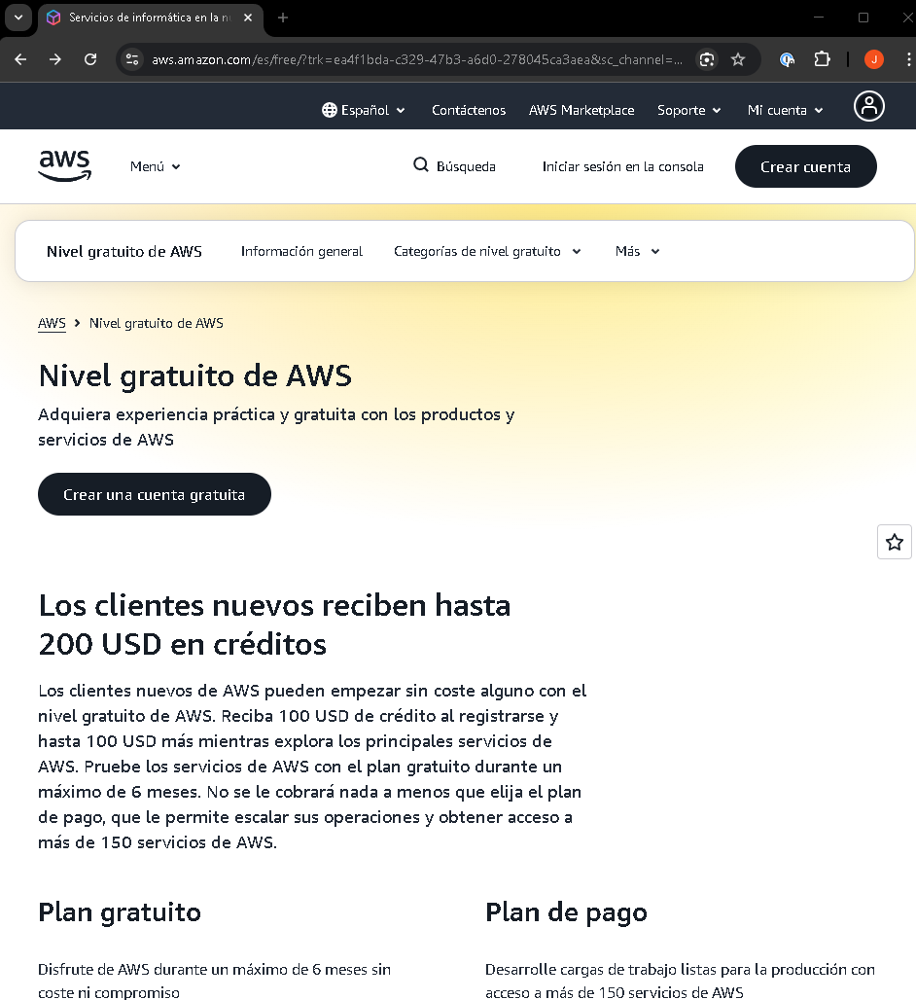

Once there, we’ll complete the registration process:

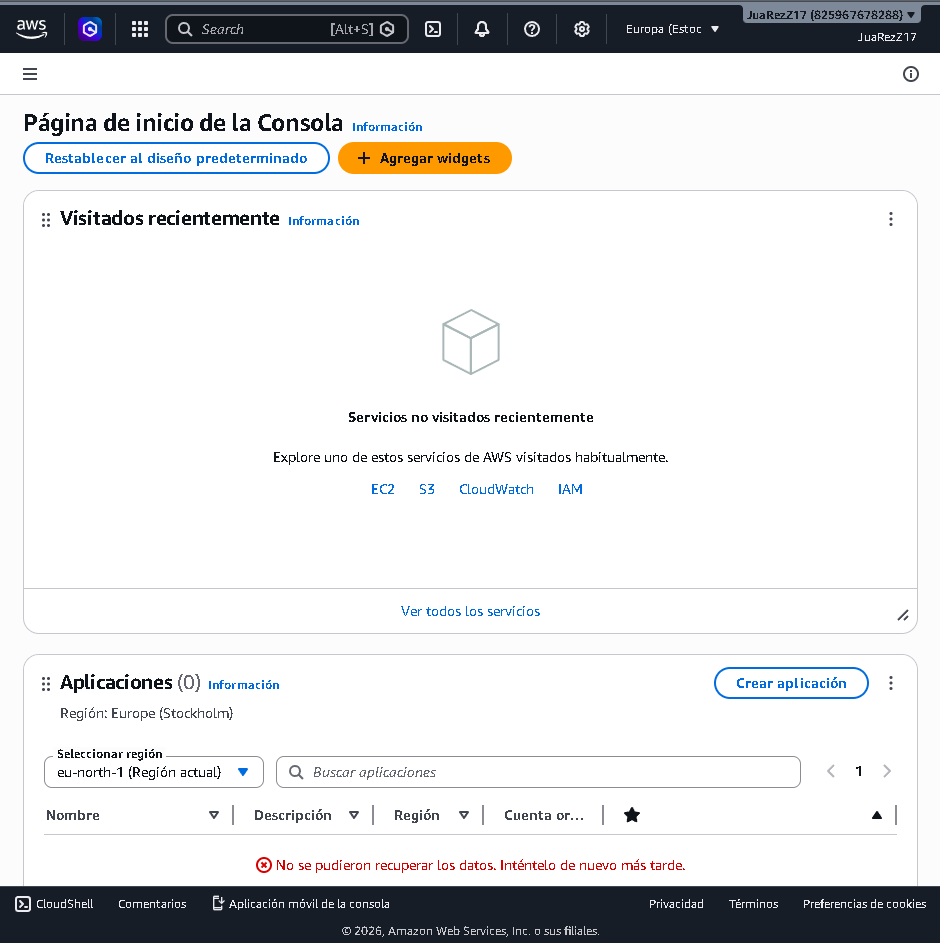

Once we’ve created the AWS account, we’ll go to the virtual machine to install AWS CLI v2. To do this, we’ll use the following commands:
```
# 1. Download the installation file
curl ‘https://awscli.amazonaws.com/awscli-exe-linux-x86_64.zip’ -o ‘awscliv2.zip’

# 2. Unzip the package (if you don’t have unzip, install it with sudo apt install unzip)
unzip awscliv2.zip

# 3. Run the installer with administrator permissions
sudo ./aws/install
```

We check the installed version:
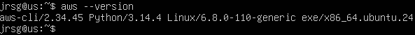

### Exercise 2: Configure your local credentials using `aws configure` (you will need to create temporary Access Keys in IAM).
Go to your AWS user dashboard and type ‘IAM’ into the search bar. Open the service and, in the left-hand menu, click on “Users” and then ‘Create user’. Choose a name:

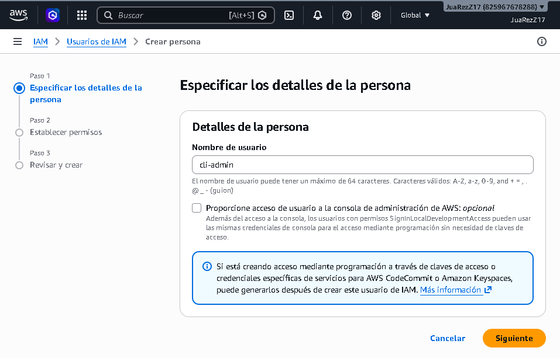

In the next section (permissions configuration), select the ‘Attach policies directly’ option and tick the box for the policy called ‘AdministratorAccess’:

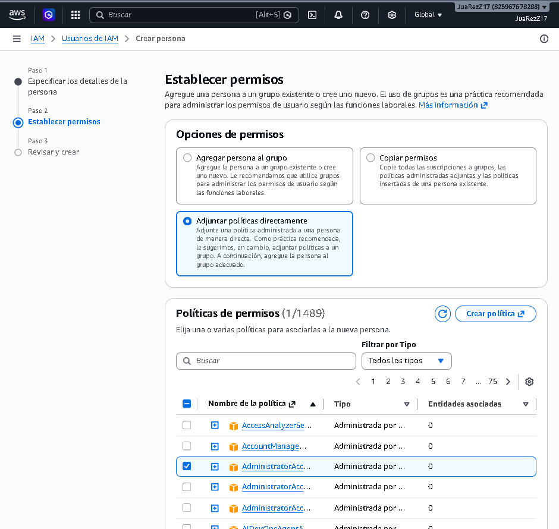

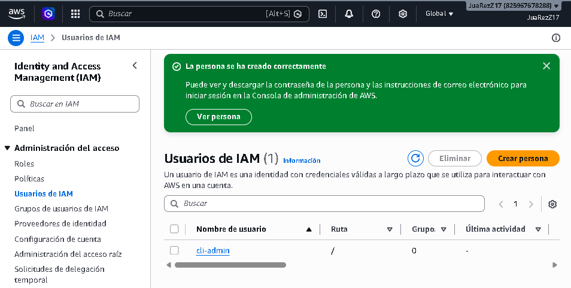

The next step is to create an access key for this user. To do this, click on the username and scroll down to ‘Access Keys’. On the first screen, select ‘Command Line Interface (CLI)’ and tick the confirmation box at the bottom:

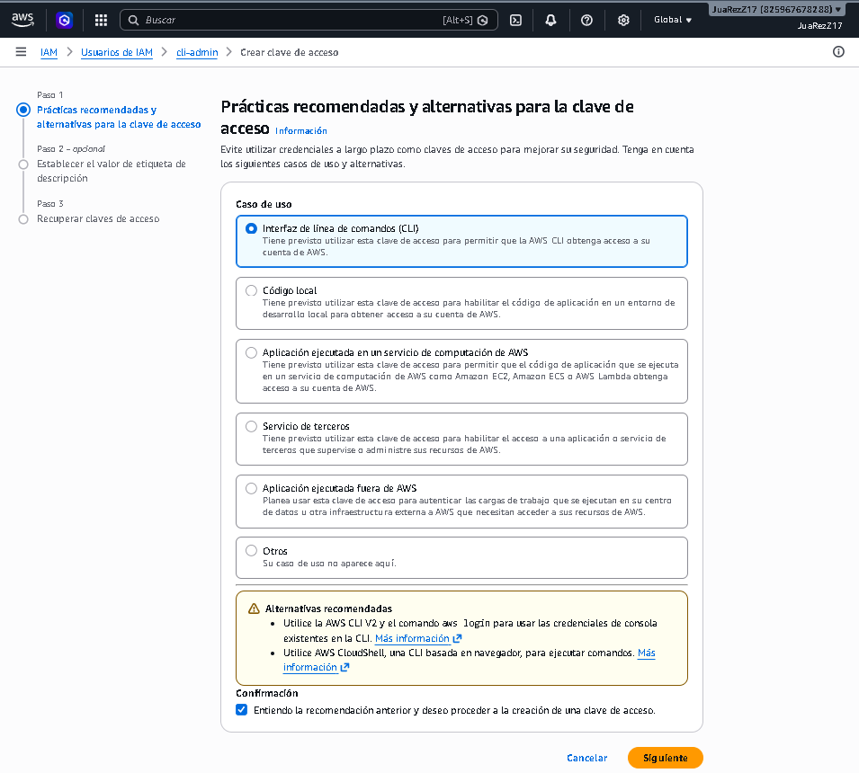

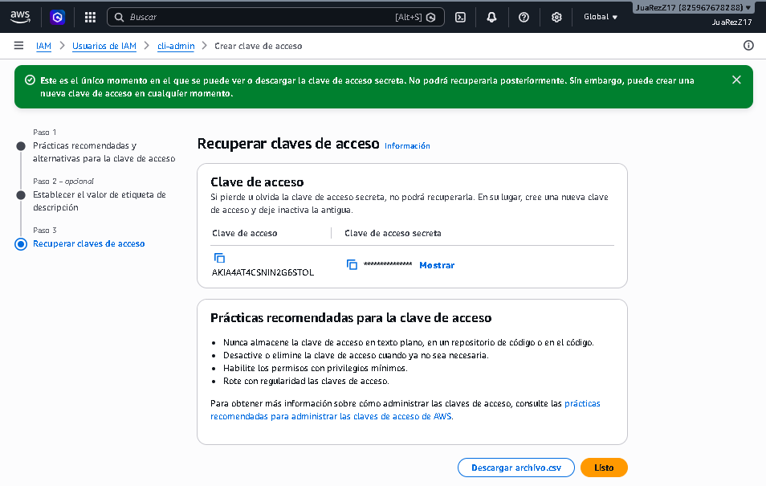

It is **very important** to save the Access Key ID and the Secret Access Key or download the .csv file, as this is the only time AWS will display the secret key.

Now let’s go to the virtual machine to configure the credentials. To do this, in the Linux terminal, run the command `aws configure` and enter all the details requested:

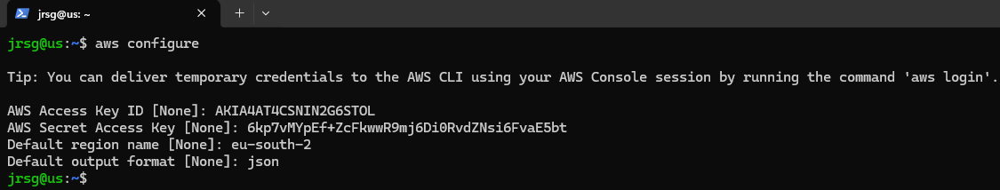

### Exercise 3: List all active regions: aws ec2 describe-regions --output table.

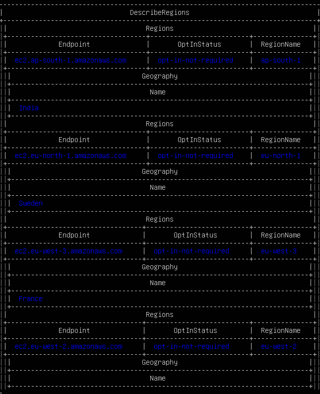

### Exercise 4: Check the Availability Zones for your primary region (e.g. eu-west-1 or eu-south-2): aws ec2 describe-availability-zones.

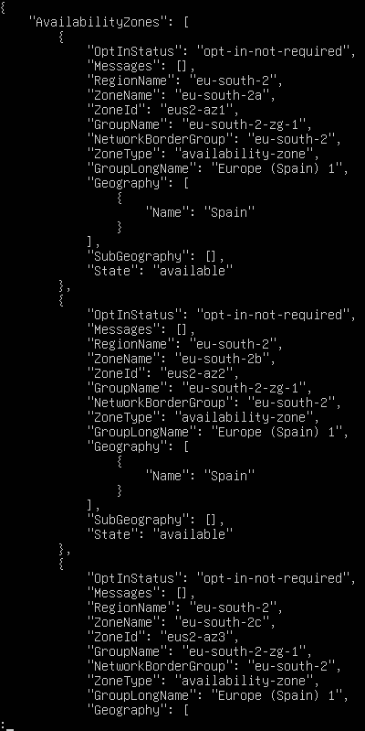