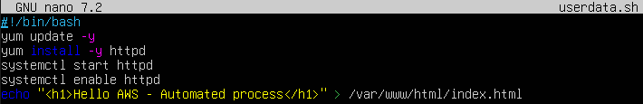
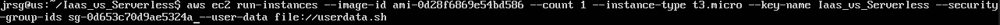
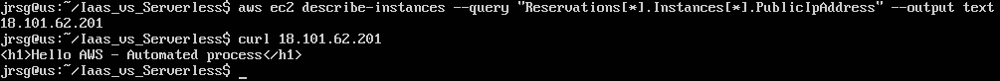
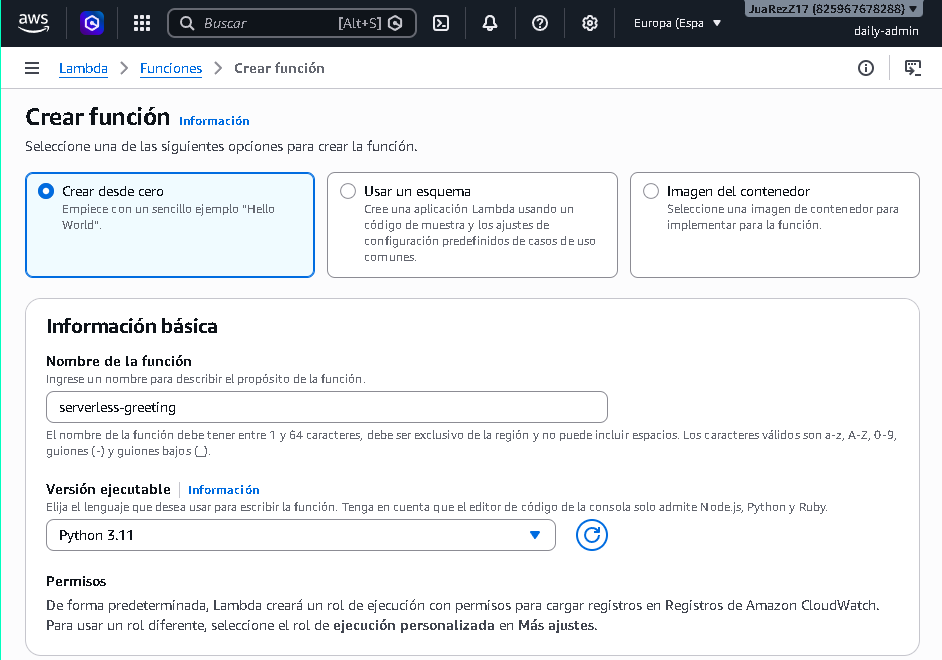
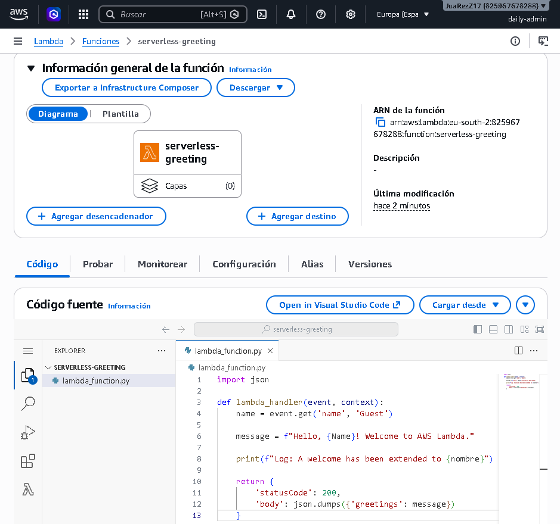
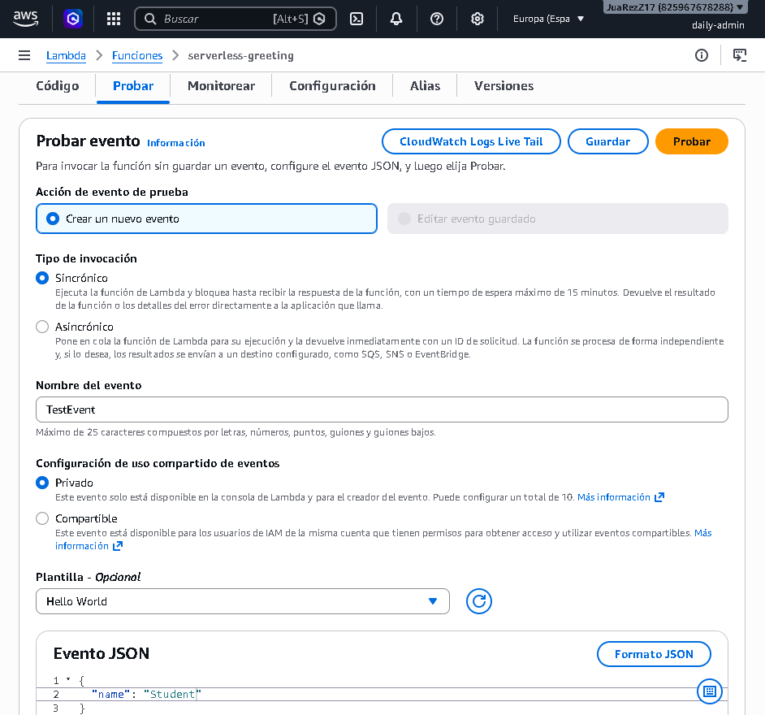
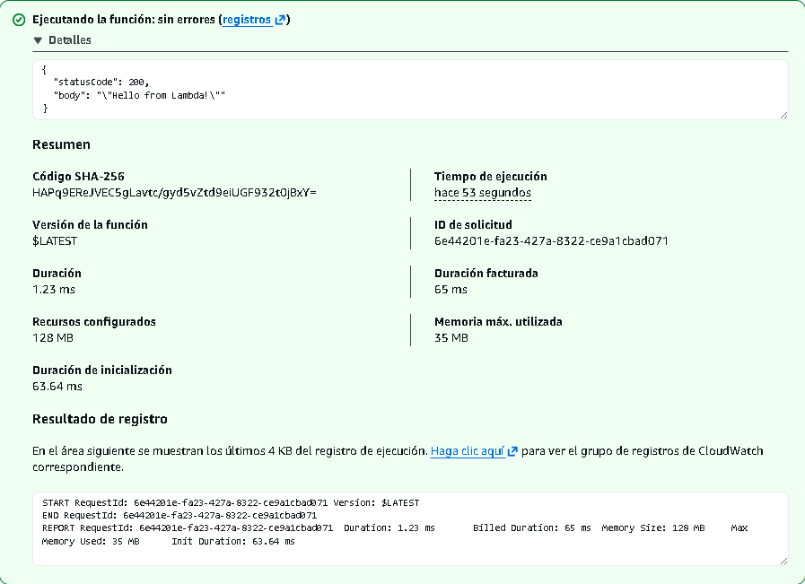
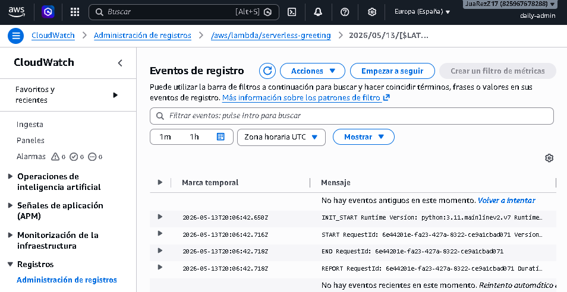

# IaaS vs Serverless

## Objetive
Compare traditional infrastructure maintenance (virtual servers) with event-driven code execution, where AWS manages the server.

### EC2 (Elastic Compute Cloud)
This service provides scalable computing power in the cloud (virtual machines known as instances). Each family is optimised for different use cases based on the balance of resources (CPU, RAM, network):
- **T:** These provide a baseline level of CPU performance with the ability to accumulate credits to handle occasional spikes in workload (bursts). Ideal for development/testing environments, small microservices or websites with moderate traffic.

- **M:** Offers an optimal balance between computing, memory and network resources. This is the default option for standard workloads, enterprise web servers and small to medium-sized databases.

- **C:** Designed for applications requiring high processor performance. They have a higher vCPU-to-memory ratio. Ideal for batch processing, scientific modelling, distributed analytics and video games.

There are two main pricing models:
- **On-Demand:** You pay for computing capacity by the hour or by the second (depending on the OS) with no long-term commitments. It offers maximum flexibility and availability but is the most expensive model. It is used for applications with short-term, irregular or non-interruptible workloads.

- **Spot:** Allows you to take advantage of unused EC2 capacity in the AWS region with discounts of up to 90% compared to On-Demand. The downside is that it is volatile; if AWS needs to reclaim that capacity, your instance will receive a 2-minute termination notice before being terminated or put into hibernation. It is suitable for fault-tolerant, stateless workloads, image rendering, big data analysis or containerised environments that can be easily resumed.

### AWS Lambda
Serverless is an execution model in which the cloud provider (AWS) dynamically manages server allocation and provisioning. Billing is based on the number of requests and the duration of code execution, rounded to the nearest millisecond. If 1,000 simultaneous requests arrive, AWS automatically provisions the environment to handle them in parallel and then terminates it. There are two key concepts in execution:
- **Cold Start:** This occurs when a Lambda function is invoked for the first time or after a period of inactivity. AWS must download the code, start a new container/execution environment, load the runtime and execute the initialisation code. This first request experiences higher latency. Subsequent invocations reuse the already active environment (Warm Start), executing almost instantly.

- **Concurrency:** This is the number of instances of your Lambda function that are running at the same time. It ensures that a specific number of execution instances are always available for a critical function, preventing other functions from exhausting the account limit. It pre-initialises execution environments so that they are ready immediately, completely eliminating the cold start problem

### UserData
This is a mechanism that allows you to automate the initial configuration of an EC2 instance immediately after it is launched, a technique known as bootstrapping. The script runs only once, at the end of the instance’s first boot process. If you restart the machine subsequently, the script will not run again. Scripts placed in UserData run automatically with superuser (root) privileges, so there is no need to use the sudo command within the script. It is ideal for installing software packages, updating the operating system, downloading code repositories or starting web services from the very first moment without manual intervention.

### Exercise 1: Launch a t2.micro or t3.micro instance (Free Tier) via the CLI. Pass a --user-data file in Bash that updates the system, installs Apache/Nginx, and writes ‘Hello AWS’ to index.html.
First, let’s create a local file called `userdata.sh`:

The most important lines in this file are:
- **`yum install -y httpd`:** Installs the Apache web server in unattended mode (-y automatically answers “yes” to the confirmation prompt).

- **`systemctl enable httpd`:** Configures Apache to start automatically if the EC2 instance is restarted in the future.

- **`echo ‘...’ > ...`:** Overwrites (or creates) the index.html file in the Apache root directory with the welcome message.

Now we launch the instance from the terminal:

- **`--instance-type t3.micro`:** Selects the T family (burst loads), eligible for the free tier.

- **`--user-data file://userdata.sh`:** Uploads the local file. AWS CLI automatically encodes it in Base64 before sending it to the AWS API.

We look up the instance’s public IP and run a curl command to get a response from the server, thereby checking whether the instance has been created correctly:

### Exercise 2: Serverless: Create a Lambda function in Python 3.11 from the console. Write a simple piece of code that receives a JSON object containing a name and returns a greeting.
We log into the AWS console and search for ‘Lambda’. We click on ‘Create function’ and select the ‘Author from scratch’ option, choose a name, select `Python 3.11`, and create the function:

In the next window, we replace the code in the `lambda_function.py` file with the following:

The most important lines are:
- **`def lambda_handler(event, context):`:** This is the entry point. `event` contains the input data (the JSON we will send), and `context` contains execution metadata (time remaining, memory, etc.).

- **`event.get(“name”, “Guest”)`:** Searches for the ‘name’ key in the incoming JSON. If the user does not send it, it uses ‘Guest’ to prevent the code from failing.

- **`print(...)`:** In Lambda, everything you send to standard output (print in Python) is automatically captured by the logging service.

### Exercise 3: Test: Run a test event on the Lambda function and check the logs automatically generated in Amazon CloudWatch Logs.
On the same Lambda screen, go to ‘Test’, create a new event and give it a name. In the JSON, enter:

Save and test:

To monitor, go to the ‘Monitor’ tab > ‘View CloudWatch logs’ > ‘Log Streams’ and you will see the following:

