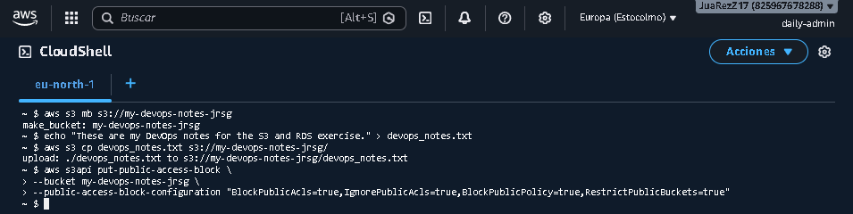
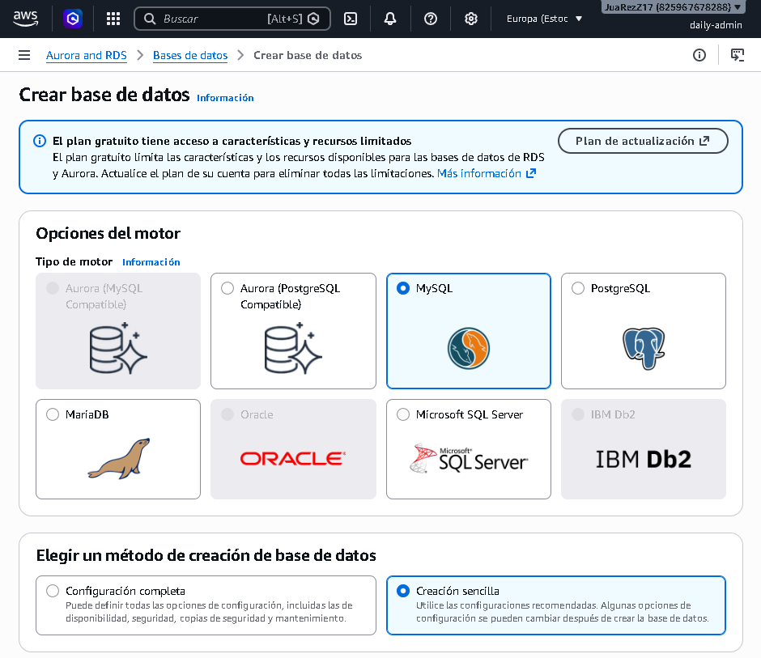
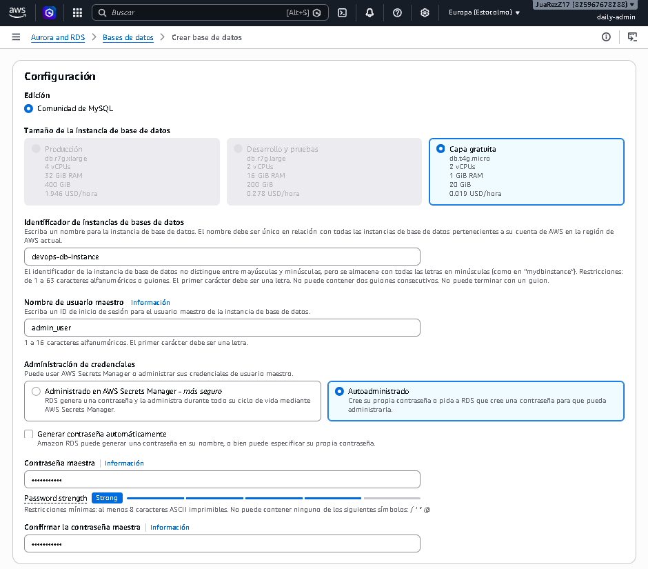
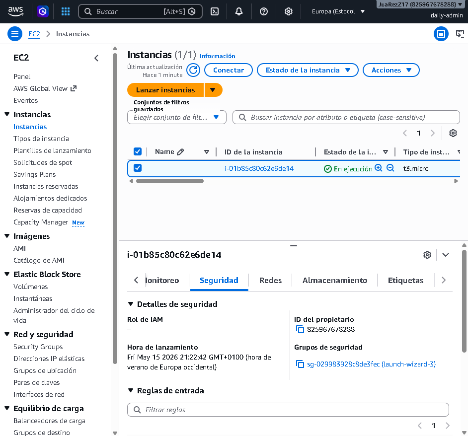
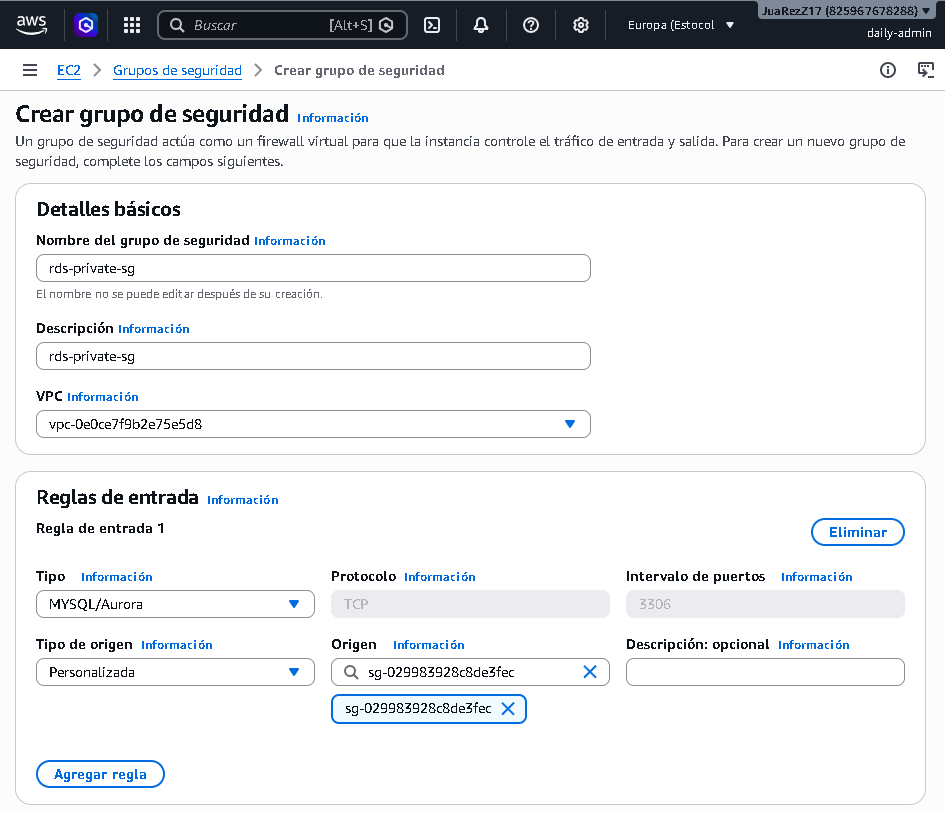
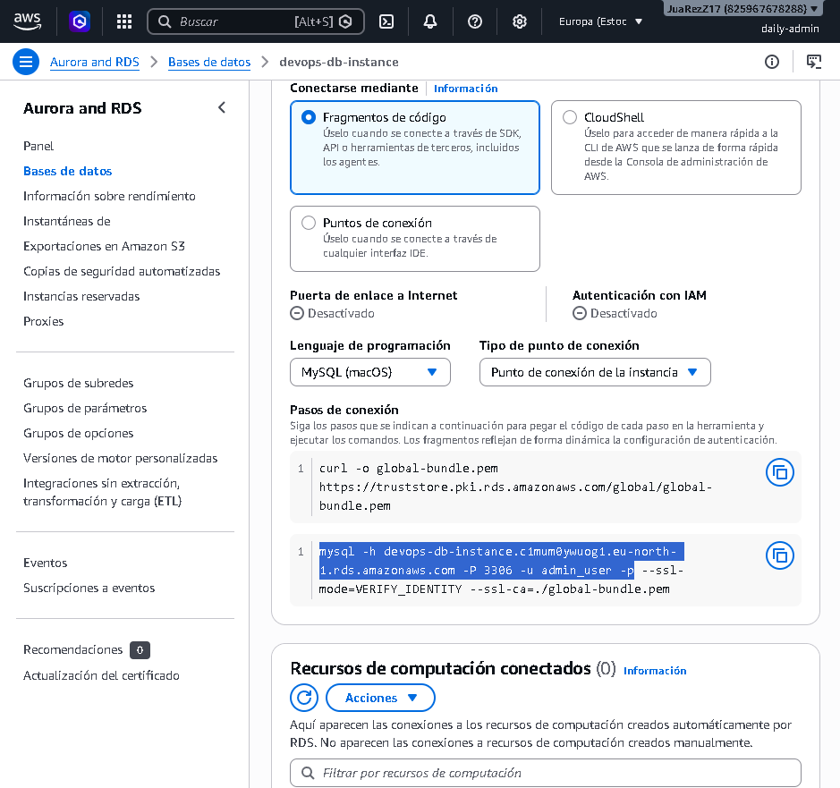
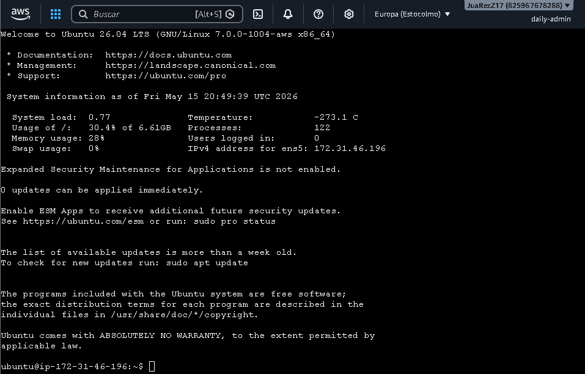
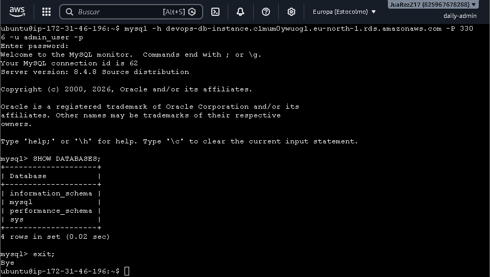

# Storage and Databases

## Objetive
Decouple storage from the state of your compute servers to enable horizontal scaling.

### S3 (Simple Storage Service)
It is a managed object storage service, designed to store and retrieve any amount of data from anywhere on the internet. It offers extremely high availability and durability. Unlike a traditional file system, S3 does not use an actual folder and subfolder structure:
- **Buckets:** These are the main containers for the data. Each bucket must have a name that is globally unique across the entire AWS platform.

- **Flat Structure:** Everything in S3 is a key-value pair. The value is the data itself. The key is the full path of the file.

- **The illusion of folders:** When you see a path such as ‘images/2026/photo.jpg’, S3 has not created a folder called “images” and another called ‘2026’. For S3, the full name of the object (its key) is literally the text string ‘images/2026/photo.jpg’. The AWS consoles and development tools display slashes ‘/’ as ‘folders’ simply to make it easier for humans to organise and visualise.

S3 optimises costs by allowing you to choose where to store your data based on how often you access it:
- **S3 Standard:** Used for frequently accessed data due to its high availability, low latency and excellent performance. This is the default option.

- **S3 Infrequent Access (S3 IA):** Used for data that is accessed less frequently but needs to be available immediately when requested. Storage cost per GB is lower than Standard, but a fee is charged for each GB retrieved.

- **S3 Glacier:** Used for very long-term file storage, historical data or legal compliance where access is very rare. Storage costs are extremely low. The downside is that access is not immediate. There are three sub-classes:
    - **Glacier Instant Retrieval:** Retrieval in milliseconds.

    - **Glacier Flexible Retrieval:** Retrieval takes from a few minutes up to 3–5 hours.

    - **Glacier Deep Archive:** The cheapest option across the whole of AWS. Retrieval time is 12 to 48 hours.

### RDS (Relational Database Service)
It is a managed service that simplifies the configuration, operation and scaling of relational databases in the cloud. It supports engines such as MySQL, PostgreSQL, Oracle, SQL Server and MariaDB. It is the AWS architecture specifically designed to provide High Availability (HA) and Fault Tolerance at the database level:
- **Primary Instance:** This is the active database. Your application connects directly to it to perform all read and write operations as usual.

- **Standby Replica (Hidden):** When Multi-AZ is enabled, AWS automatically creates an exact replica of your database in a different Availability Zone (AZ), i.e. in a completely separate physical data centre within the same region.

- **Synchronous Replication:** Every time your application writes data to the primary instance, this change is replicated synchronously to the Standby Replica before confirming that the write was successful. This ensures that both databases are 100% identical at all times. This replica is hidden and does not support direct read or write connections whilst everything is functioning correctly.

If a disaster occurs at the primary data centre (a major power cut, flooding, critical hardware failure, etc.):
1. AWS detects the failure of the primary instance immediately.

2. It automatically synchronises and promotes the standby replica to become the new primary instance (failover).

3. Your database endpoint remains unchanged. AWS internally updates the DNS record to point to the new physical location.

4. Your application will only experience a brief interruption whilst the DNS record is being updated, with no data loss and no need for manual intervention by an administrator.

### Exercise 1: Create a bucket with a globally unique name (e.g. my-devops-notes-your-surname). Upload a file using `aws s3 cp`. Set the ‘Block Public Access’ option to ensure it remains private.
We open the AWS console and run the following commands:

The most important commands are:
- **`aws s3 mb`:** Stands for *Make Bucket*. Creates a new bucket in S3.

- **`aws s3 cp`:** Stands for *Copy*. Copies the local file devops_notes.txt directly to the root of your cloud bucket.

- **`aws s3api put-public-access-block`:** This line is crucial for security. It injects a configuration of four parameters (BlockPublicAcls, IgnorePublicAcls, BlockPublicPolicy, RestrictPublicBuckets set to true) which ensures that, even if someone attempts to make a file public by mistake in the future, AWS will block that attempt at the bucket-wide level.

### Launch a MySQL database (be sure to select the Free Tier template with a db.t3.micro or db.t4g.micro instance).
Search for RDS in the AWS Console and click on ‘Create database’:

### Configure the RDS Security Group to only accept traffic on port 3306 from the Security Group of your EC2 instance. Connect to it from your EC2 instance.
First, go to the EC2 instances and, in the ‘Security’ tab, copy the Security Group ID:

Now go to EC2 > ‘Security groups’ and create a group with an inbound rule containing the ID copied earlier:

To check, we connect to EC2 via SSH, install the MySQL client and enter our database endpoint:

