# VPC Core

## Objetive
Design an isolated virtual data centre. Retire the default VPC and understand packet routing in software-defined networks (SDN).

### VPC (Virtual Private Cloud)
It is a dedicated, logically isolated virtual network within the AWS cloud. It is confined to a specific AWS Region but spans multiple Availability Zones (AZs). When creating a VPC, you must assign it a range of IPv4 addresses using CIDR notation. The primary CIDR block can range from `/16` to `/28`; you must use private network ranges defined by RFC 1918, and you can add secondary CIDR blocks but cannot modify the primary block. 

When dividing your VPC into subnets, bear in mind that AWS always reserves 5 IP addresses in each subnet, which you cannot assign to your instances:
- **`x.x.x.0`:** Network address.

- **`x.x.x.1`:** Reserved by AWS for the VPC router.

- **`x.x.x.2`:** Reserved by AWS for the DNS server (AmazonProvidedDNS).

- **`x.x.x.3`:** Reserved by AWS for future use.

- **`x.x.x.255`:** Broadcast address (AWS does not support broadcast in VPC, but reserves it).

### Public vs Private Subnets
A subnet is a segment of the VPC’s IP range that resides within a single Availability Zone (AZ). It cannot span multiple AZs. The routing table defines where network packets leaving the subnet are directed. Each subnet must be associated with a routing table.

The difference between a public and a private subnet lies in the internet egress components configured in their routing table:
- **Internet Gateway (IGW):** This is a horizontally scalable, redundant, high-availability component that enables bidirectional communication between your VPC resources and the internet. For an instance to be public, it must be in a subnet with a route to the IGW and have a Public IP or an Elastic IP (EIP) assigned.

- **NAT Gateway (Network Address Translation):** This allows instances in private subnets to connect to the Internet in one direction. It must be deployed in a public subnet and requires an Elastic IP (static public IP). External parties on the Internet cannot initiate a connection to private instances via the NAT Gateway.

### Firewall Layers
AWS implements network security across two key layers:
- **Security Groups (SGs):** These act as a virtual firewall at the instance level. If you allow a packet to enter (inbound), the response to that packet is automatically permitted to leave (outbound), regardless of the configured outbound rules. They only support Allow rules. All traffic not explicitly permitted is denied by default. Instead of using only IP addresses, you can specify another Security Group as the source of a rule.

- **Network ACLs (NACLs):** These act as a virtual firewall at the subnet level, controlling traffic entering and leaving the subnet boundary. Stateless behaviour: Inbound and outbound traffic are evaluated completely independently. If you allow incoming traffic on port 80, you must explicitly allow the outgoing response to the client’s ephemeral ports. They support both Allow and Deny rules. Rules are evaluated in strict numerical order from lowest to highest. As soon as a packet matches a rule, that action is applied and subsequent rules are not evaluated.

### Exercise 1: Create a VPC with the CIDR 10.10.0.0/16.
In the AWS console, navigate to ‘VPC’ > ‘Create VPC’. In the creation window, select ‘VPC only’, choose a name, and enter `10.10.0.0/16` in the ‘IPv4 CIDR’ field. 

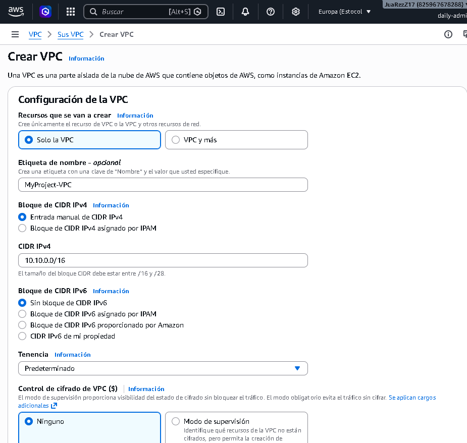

Leave the rest of the options as default and click ‘Create VPC’:

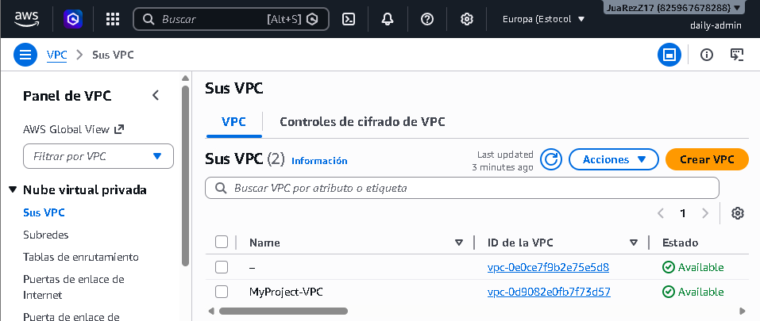

### Exercise 2: Create a Public Subnet (10.10.1.0/24) and a Private Subnet (10.10.2.0/24).
In the menu on the left, go to ‘Subnets’ > ‘Create Subnet’ and create one public and one private subnet:

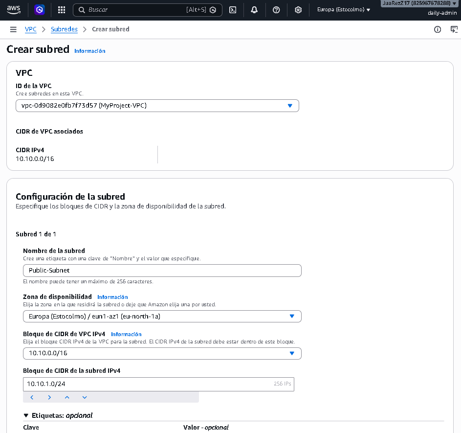

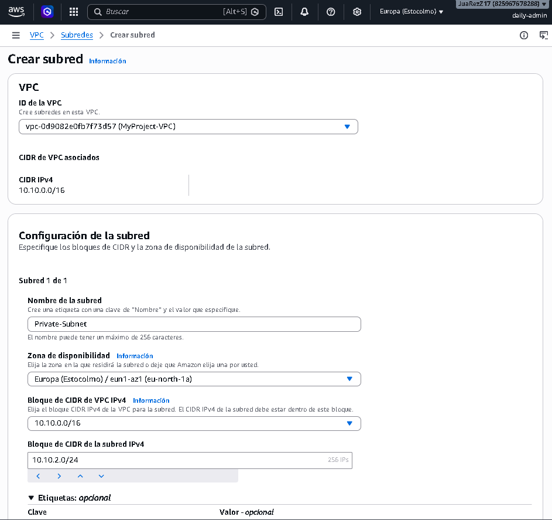

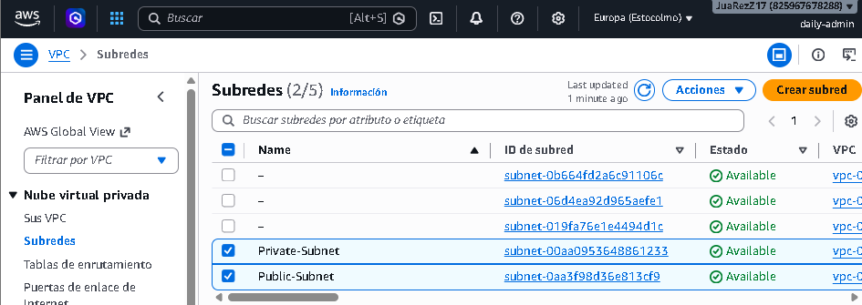

### Exercise 3: Create an Internet Gateway and attach it to the VPC.
Go to ‘Internet Gateways’ > ‘Create internet gateway’:

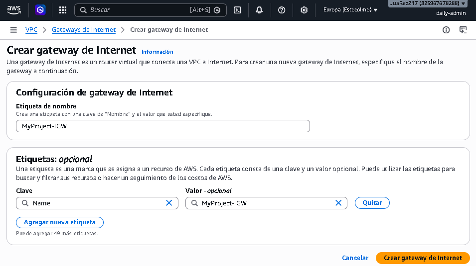

Once created, select it and, in the ‘Actions’ menu, go to ‘Attach to VPC’ and select your VPC:

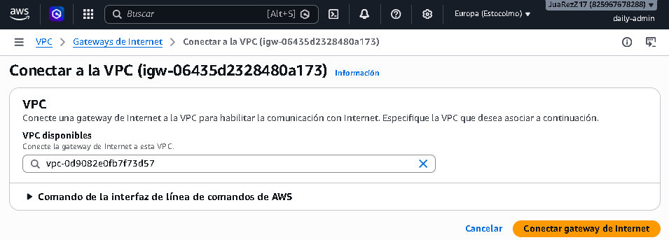

### Exercise 4: Create a Public Route Table, add a route 0.0.0.0/0 to the IGW and associate it with your Public Subnet.
Go to ‘Route Tables’ > ‘Create route table’. Choose a name and select the VPC:

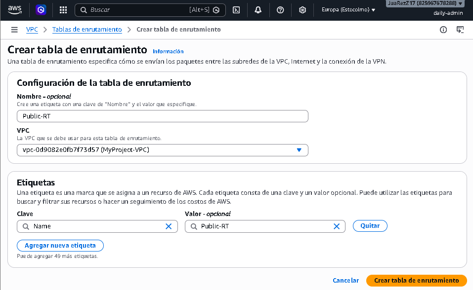

In the route tables menu, select your table and, under ‘Actions’ > ‘Edit routes’, add a new destination route:

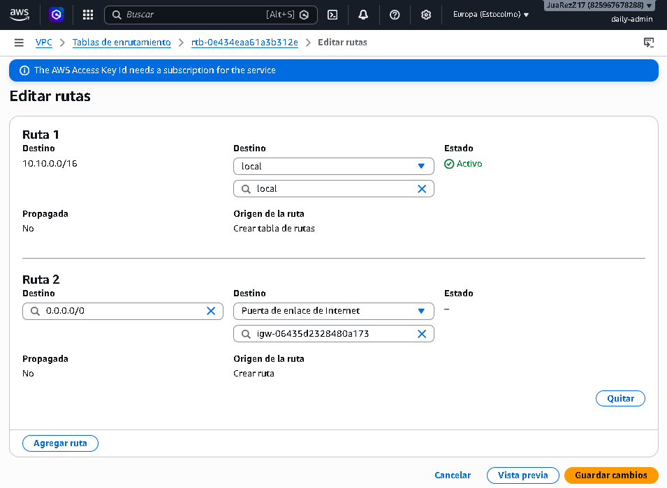

In the routing tables menu, select your table and, under ‘Actions’ > ‘Edit subnet associations’, select your `Public-Subnet`:

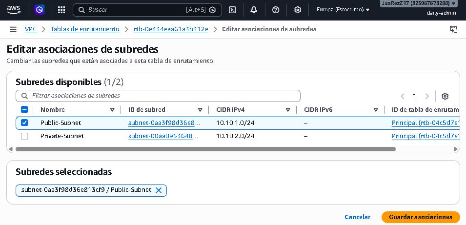

### Exercise 5: Launch an EC2 instance in the public subnet with a public IP address assigned and verify that you can access it via SSH.
We search for ‘EC2’ in the AWS menu and launch an instance with the following configuration:

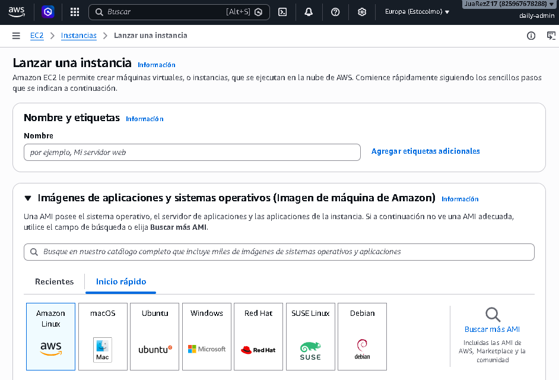

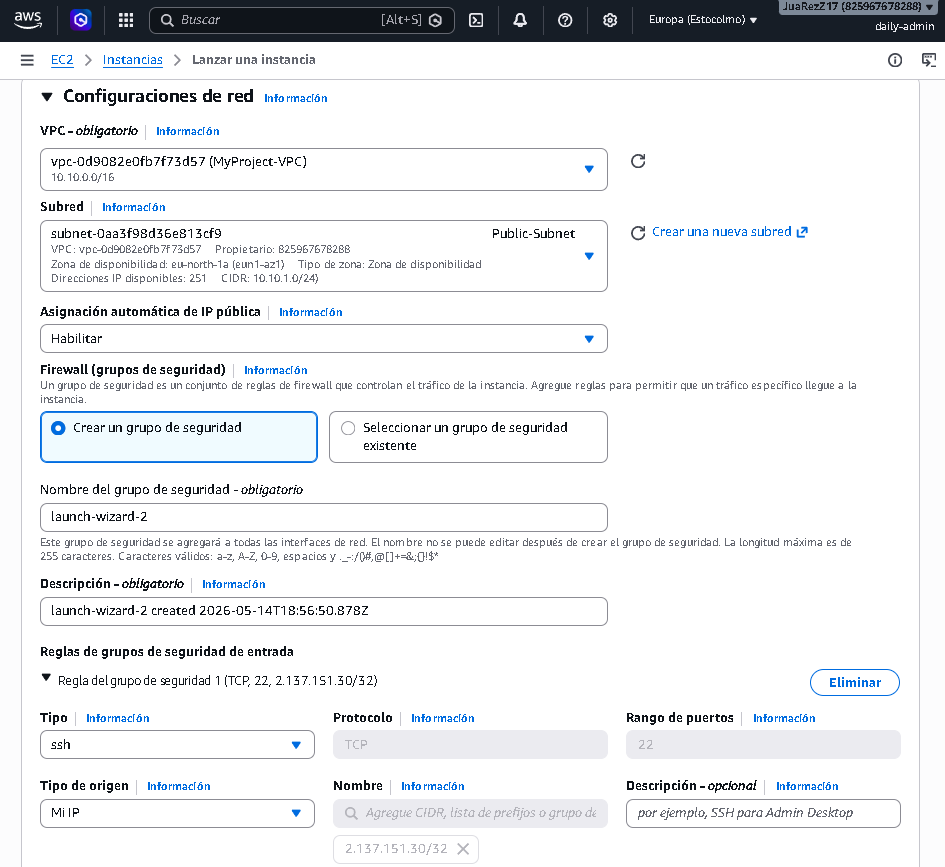

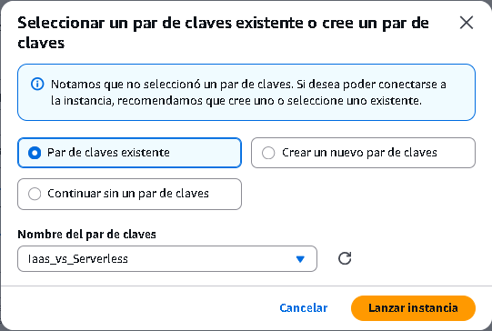

We run the test from our terminal:

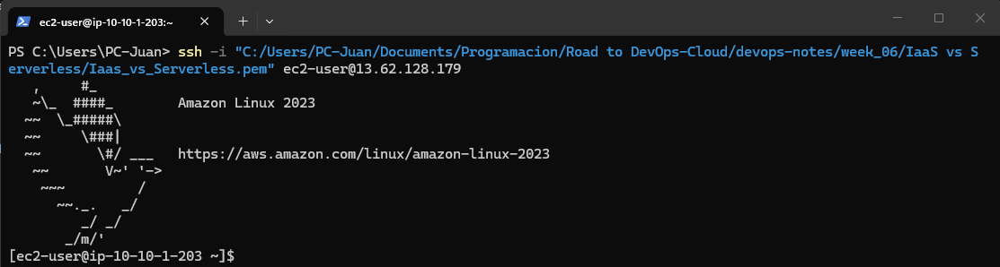