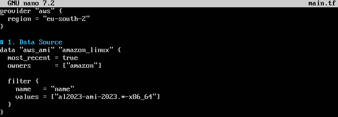
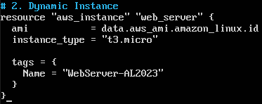
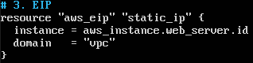
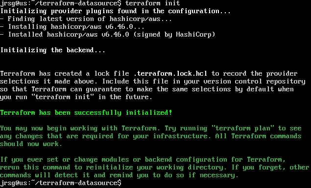
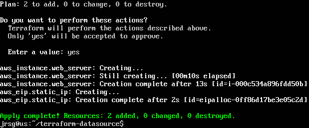

# Dependencies and Data Sources

## Objetive
Understand how Terraform builds the ‘Dependency Graph’ and how to query AWS data without creating it (Data Sources).

### Data Sources
`data` blocks allow Terraform to read information about existing infrastructure, whether it was created manually, by another team, or in a different Terraform project. They are like read-only queries (a ‘GET’) to the provider (AWS, Azure, Google Cloud, etc.). 

`data sources` do not modify anything; they are strictly read-only. Terraform will never attempt to update or destroy a resource defined with `data`. They are very useful for obtaining IDs or dynamic values without having to write them by hand (hardcode them), which makes your code much more portable.

### Implicit vs Explicit Dependencies
Terraform does not execute the code from top to bottom. Instead, it constructs a Dependency Graph to determine the order in which it should create or destroy resources. This order is defined by dependencies. There are two types:
- **Implicit:** These occur automatically when you reference a resource’s attribute within another resource.

- **Explicit:** These are used only when the dependency is not obvious from the code. This occurs when a resource needs another resource to exist in order to function correctly, but does not need to extract any data (such as an ID or an IP address) from it.

### Lifecycle
By default, when you change a critical parameter of a resource, Terraform destroys the old resource and then creates the new one. This results in service downtime. The `lifecycle` block allows you to override this default behaviour to protect your infrastructure. There are three main rules:
- **`create_before_destroy`:** It tells Terraform to first create the replacement resource, wait until it is ready, and only then destroy the old one. Widely used for load balancers and auto-scaling.

- **`prevent_destroy`:** If set to `true`, Terraform will throw an error if any command (even a `terraform destroy`) attempts to delete that resource. Ideal for production databases (`aws_db_instance`).

- **`ignore_changes`:** Tells Terraform to ignore changes to certain parameters made outside your code. Useful if an Auto Scaling Group dynamically adds tags or changes the number of instances on its own.

### Exercise 1: Write a data block ‘aws_ami’ ‘amazon_linux’ that dynamically filters the latest Amazon Linux 2023 image.

### Exercise 2: Launch an EC2 instance using the ID obtained in the previous step (ami = data.aws_ami.amazon_linux.id).

### Exercise 3: Assign an Elastic IP (static IP) to that instance. Note how Terraform automatically understands the order in which it should create it.

We initialise and apply with Terraform:

What we see in the last image is how Terraform connects to AWS and searches for the AMI image, sends the command to create the server using the ID obtained in the previous step, and only when AWS confirms that the EC2 instance already exists and returns its official ID does Terraform trigger the request to create the static IP and connect it to that server.