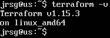
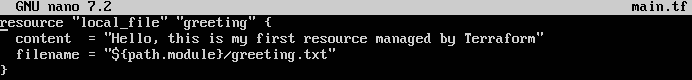
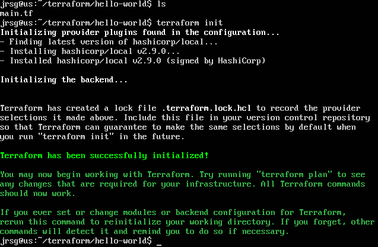
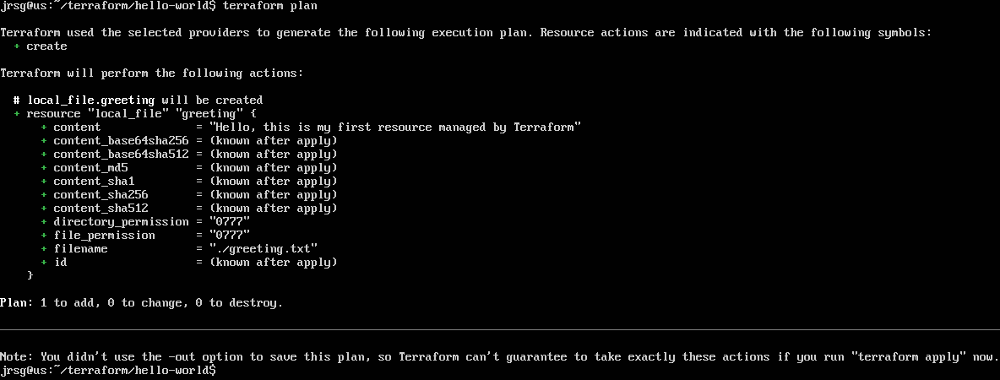
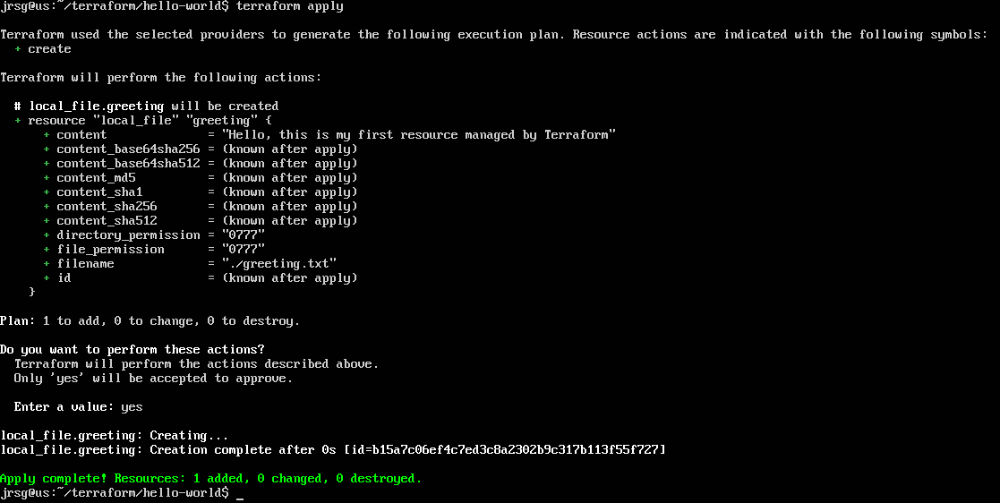
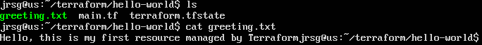

# IaC Concepts and HCL Syntax

## Objetive
Shift your mindset from “executing commands” to “declaring states”. Understand the HashiCorp Configuration Language (HCL).

### Imperative vs Declarative
Understanding the difference between these two approaches is key to grasping why Terraform is the industry standard compared to traditional scripts:
- **Imperative Approach (e.g. Bash, Python, AWS CLI):** You tell the system HOW to do things, step by step. It’s like giving step-by-step directions to get to a place. You run a command to create a VPC, then another to create a subnet, then another for the EC2. If the script fails at step 2, you’re left with an ‘incomplete’ infrastructure. If you run the script again, it will try to create step 1 all over again, causing duplication errors.

- **Declarative Approach (e.g. Terraform, Kubernetes YAML):** You tell the system WHAT you want to achieve (the desired end state), and the tool works out how to do it. It’s like using a satnav. You simply enter the destination address and the system calculates the best route.

### Idempotence
It is a mathematical property applied to computer science. It provides an absolute guarantee that you can run the same code on an environment once, ten times or a thousand times, and the final result will always be the same, without causing any side effects or duplicating resources:
- **Without idempotence (Bash scripts):** If you run `aws ec2 run-instances` twice, you will end up with two virtual servers created and will be charged for both.

- **With idempotence (Terraform):** If you run `terraform apply` and the server already exists and has the correct configuration, Terraform will analyse the environment and make no changes.

Terraform achieves this through its State File (`terraform.tfstate`). Terraform keeps a ‘map’ of the actual infrastructure. Before making a change, it compares your code with this state file and only applies the difference (known as the Delta).

### HCL Syntax
It is the language created by HashiCorp for Terraform. It is designed to be easily readable by humans (unlike complex JSON) but mathematically structured for machines. Everything in HCL is based on a highly standardised format. The structure of a code block consists of three main parts:
- **The Block Type:** Defines what type of object we are declaring. The most common are:
    - **`resource:`** Creates something new in the cloud (e.g. an EC2 instance, an S3 bucket).

    - **`data:`** Reads something that already exists in the cloud (e.g. retrieves the ID of an official AMI).

    - **`variable:`** Defines input parameters.

    - **`output:`** Defines which values to display on screen once execution is complete.

- **Identifiers (Identifiers/Labels):** Most blocks require two labels (especially resources):
    - **Provider Type:** This is specific to the cloud provider. For example, `aws_instance` (an EC2 instance on AWS) or `aws_s3_bucket`. You don’t make this up; it’s specified in the official Terraform documentation.

    - **Local Name:** This is the name you give it to refer to it in other parts of your Terraform code. This name is not the one AWS will see in the web console; it is for internal use within your code only. (e.g. web_server, my_database).

- **Arguments:** These are enclosed in curly brackets { }. They are the resource’s characteristics or configurations in key=value format.

### Exercise 1: Install Terraform on your local machine.
```
# 1. Make sure your system is up to date and install the basic dependencies
sudo apt-get update && sudo apt-get install -y gnupg software-properties-common

# 2. Install the HashiCorp GPG key
wget -O- https://apt.releases.hashicorp.com/gpg | \
gpg --dearmor | \
sudo tee /usr/share/keyrings/hashicorp-archive-keyring.gpg > /dev/null

# 3. Add the official repository to your system
gpg --no-default-keyring \
--keyring /usr/share/keyrings/hashicorp-archive-keyring.gpg \
--fingerprint

echo "deb [signed-by=/usr/share/keyrings/hashicorp-archive-keyring.gpg] \
https://apt.releases.hashicorp.com $(lsb_release -cs) main" | \
sudo tee /etc/apt/sources.list.d/hashicorp.list

# 4. Update and install Terraform
sudo apt update
sudo apt-get install terraform

# 5. Verify the installation
terraform -v
```



### To understand HCL without touching AWS just yet, we’re going to use the local provider. Create a file called main.tf.
You should never create Terraform files in your home directory, so we’re going to create a directory specifically for this type of file, which we’ll call `terraform`. Within this directory, we’ll create another one for this exercise called `hello-world`, and inside that we’ll create the file `main.tf` with the following code:
```
resource ‘local_file’ ‘greeting’ {
  content  = ‘Hello, this is my first resource managed by Terraform’
  filename = ‘${path.module}/greeting.txt’
}
```
The explanation of the code is:
- **`resource`:** This is the reserved keyword (the *Block Type*) that tells Terraform you want to **create** something new (in this case, a file).
    - **`‘local_file’`:** This is the resource type offered by the provider. By using `local`, Terraform knows it does not need to connect to AWS or any cloud; it will work directly on your local machine (your hard drive).
    - **`‘greeting’`:** This is the logical name or internal identifier. It is not the final filename; it is the name Terraform will use to refer to this block if you need to link it to another part of your code in the future.
- **`content = ‘...’`:** This is a required argument for the `local_file` resource. It tells Terraform what text to write into the file.
- **`filename = ‘${path.module}/greeting.txt’`:**
    - **`${path.module}`:** This is a very useful internal Terraform variable (interpolation). It means *‘the exact path where this main.tf file is located’*. It ensures that the file will be created in your current directory, regardless of where you run the command.
    - **`greeting.txt`:** This is the actual name of the file that will be created.



### Run terraform init (download the provider) and then terraform apply. Check that the file has been created.
The first step is to initialise the directory. Terraform needs to download the `local` provider binaries (the ‘plugin’ that knows how to create files on your hard drive).



Now let’s see what Terraform wants to do before it does it:



We apply the plan:



We check whether the file has been created and whether its content is correct:

