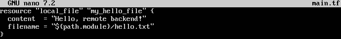
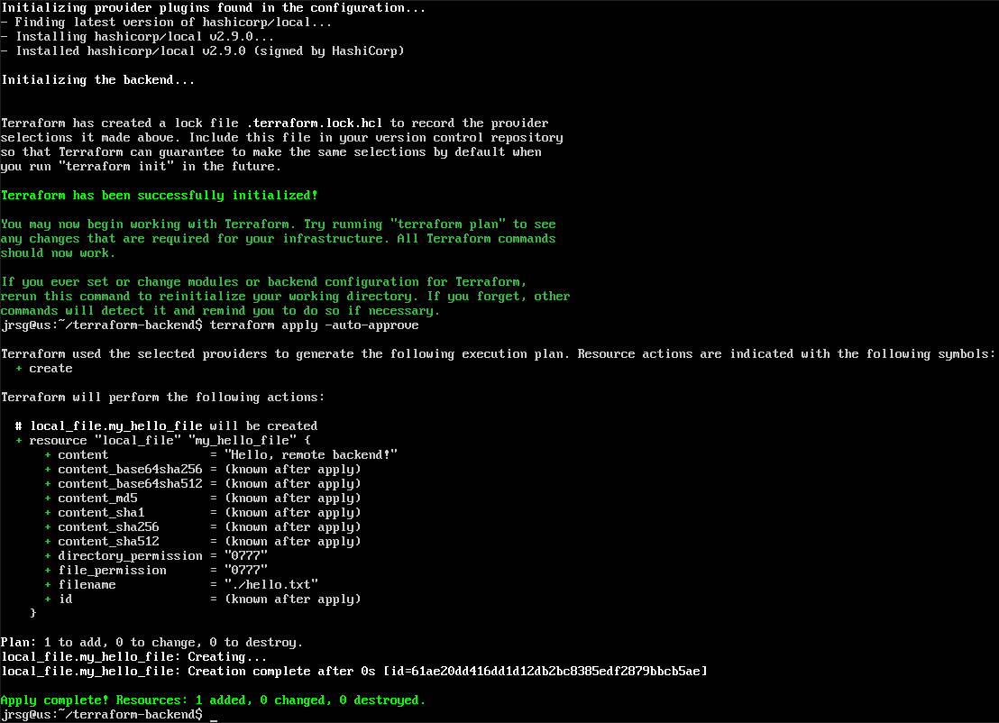
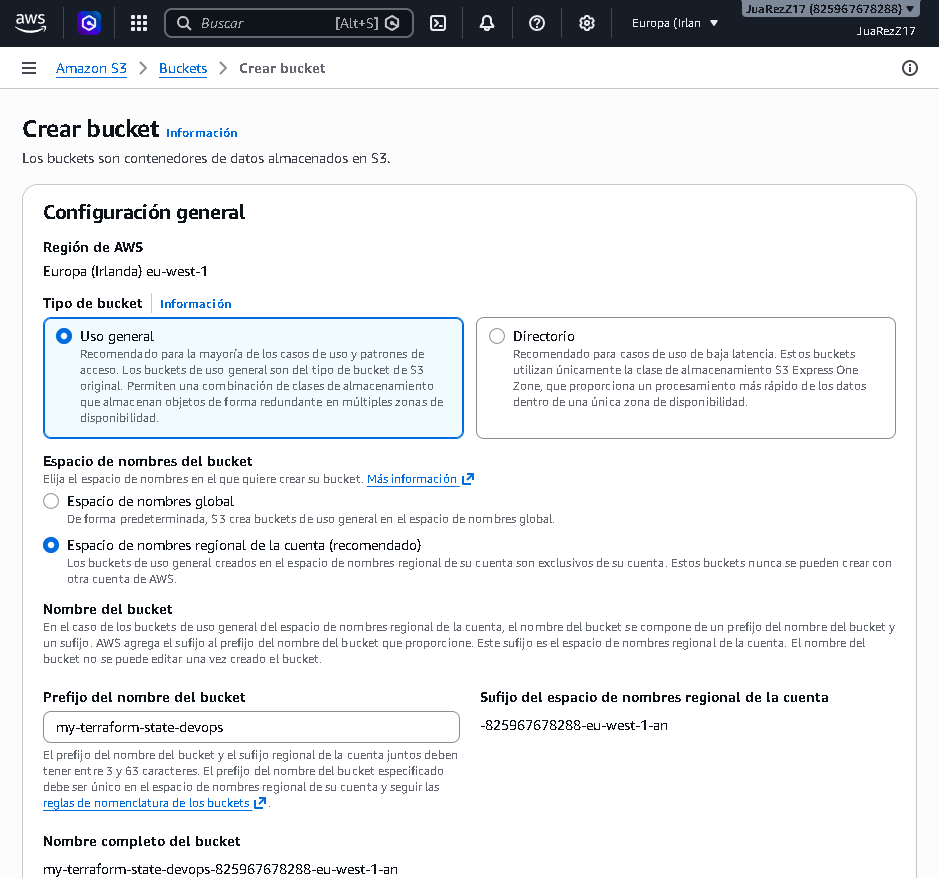
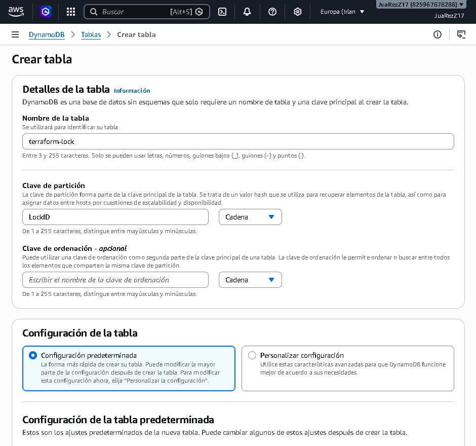
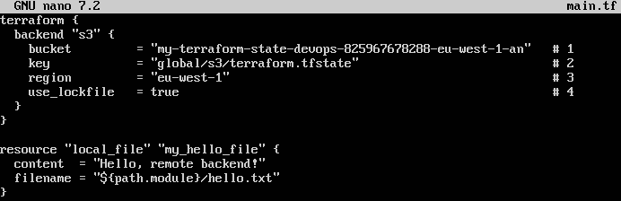
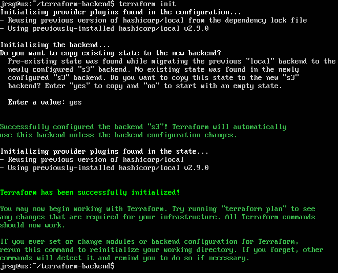
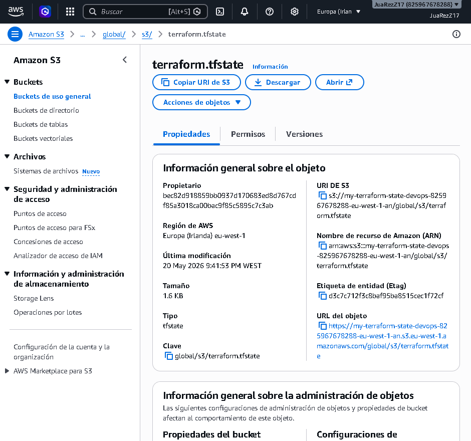

# Remote Status

## Objetive
Solve the problem in a real-world environment. If five DevOps engineers are working on the same code, they cannot have the `tfstate` on their local machines.

### Backend
The state (`terraform.tfstate`) is the file where Terraform stores the ‘map’ of the infrastructure it has created. It is the only way Terraform can know which resources actually exist, which ones have changed, and which ones need to be deleted. The backend is, quite simply, the location where Terraform chooses to store this state file.

When working alone, the local backend is sufficient. But when you join a team, if every developer has their own `terraform.tfstate` on their computer, Terraform will go haywire creating and destroying infrastructure because everyone has a different “version of reality”. To solve this, we move the state to Amazon S3. This way, the whole team reads from and writes to the same central file.

### State Locking
Storing the state centrally in S3 solves the problem of sharing it, but introduces a new and dangerous issue: **race conditions**. It is possible that two developers might run a `terraform apply` command simultaneously, and Terraform will attempt to modify the `terraform.state` file to apply the changes. What happens is that the state file becomes corrupted, Terraform loses track of which resources actually exist, and the infrastructure ends up in an inconsistent state.

To avoid this disaster, we use an **Amazon DynamoDB** table to implement State Locking. What Terraform does when a `terraform apply` is run is go to the DynamoDB table and create a record. When the second developer runs the same command, Terraform blocks the execution and an `Error acquiring the state lock` error is returned. When the first process finishes, the record in DynamoDB is deleted, allowing the next one in the queue to proceed safely.

### Exercise 1: Backend Infrastructure (Manual): Go to the AWS Web Console and create an S3 bucket (e.g. `my-terraform-devops-state`) and a table in DynamoDB called `terraform-lock` with a partition key named `LockID` (String type).
First, let’s create a file called `main.tf` with a basic resource and apply it:





Now let’s create a bucket and a DynamoDB table in the AWS console:





### Exercise 2: Configure the Backend: In your Terraform code, add the following block:
```
Terraform
   terraform {
     backend ‘s3’ {
       bucket         = ‘my-terraform-devops-state’
       key            = ‘global/s3/terraform.tfstate’
       region         = ‘eu-west-1’
       dynamodb_table = ‘terraform-lock’
     }
   }
```



The most important lines are:
- **`bucket = ‘my-terraform-state-devops’`:** The exact name of the S3 bucket you have created.

- **`key = ‘global/s3/terraform.tfstate’`:** The path where the state will be stored. Terraform will automatically create the global and s3 folders within the bucket.

- **`region = ‘eu-west-1’`:** The AWS region where the bucket is located.

- **`dynamodb_table = ‘terraform-lock’`:** The name of the DynamoDB table. Terraform will use this to create a record every time someone runs code, blocking access to others.

### Exercise 3: Migration: Run `terraform init`. Terraform will ask if you want to migrate your local state to S3. Say yes and check in the AWS console that the JSON file is now in S3.
Now we’re going to reconfigure Terraform by running `terraform init` again:



What has happened is that Terraform has detected the local state and the new backend, and is asking us if we want to migrate everything to the new one. As a final check, we go to our S3 bucket and see that it now contains the `terraform.tfstate` file, which tells us that our state is now in the cloud.

