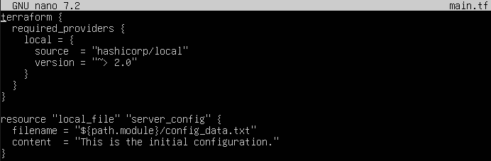
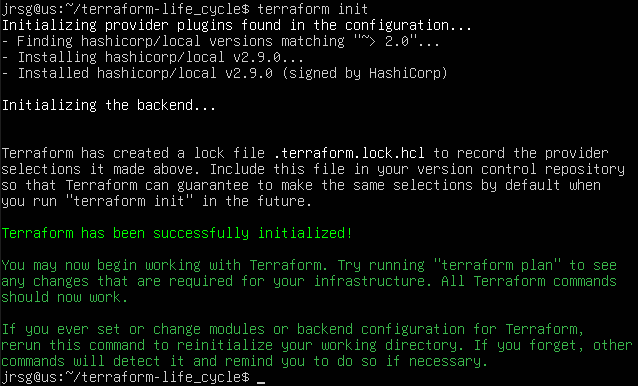
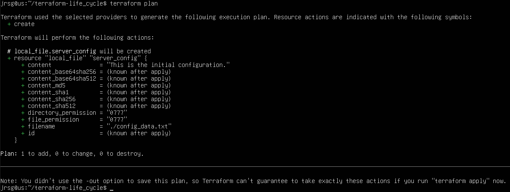
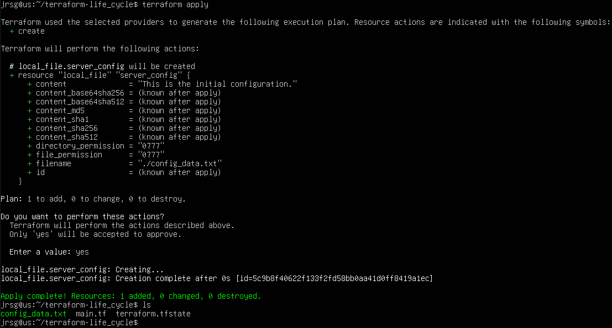
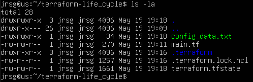
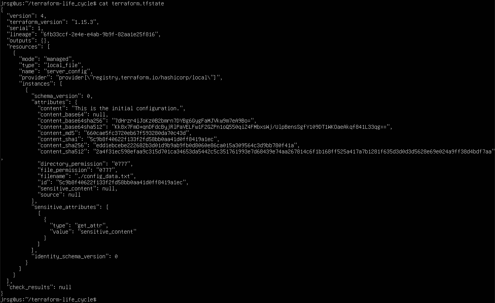
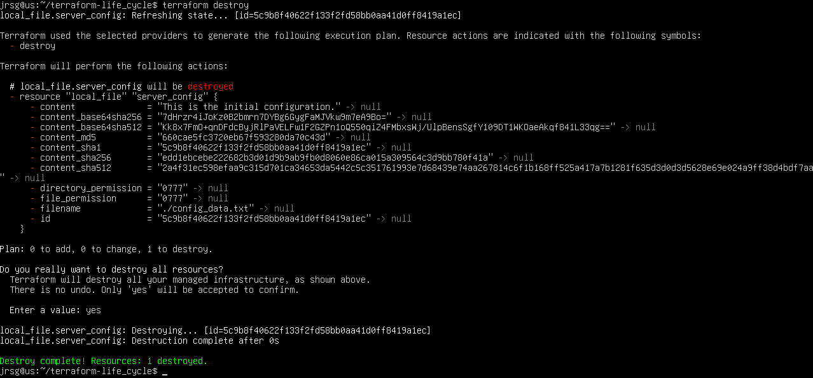

# The Life Cycle and tfstate

## Objetive
Mastering Terraform’s ‘Holy Grail’: the state file. Understanding how Terraform knows which resources it has created and which it hasn’t.

### The Workflow
The Terraform lifecycle is strict. Skipping a step or altering the order will result in errors, as each phase depends on the information generated in the previous one:
1. **Write:** You write the infrastructure as code using HCL (HashiCorp Configuration Language) in `.tf` files. This is where you define the desired state.

2. **Init:** You run `terraform init`. This sets up your working directory by connecting to the internet to download the provider binaries and modules needed for your code to communicate with the cloud.

3. **Plan:** You run `terraform plan`. This is a dry run. Terraform compares your HCL code with its state (tfstate) and shows you an exact summary of what it will create (green), modify (yellow) or destroy (red). Nothing is changed in the cloud at this stage.

4. **Apply:** Run `terraform apply`. Terraform connects to your cloud provider’s API and executes the changes proposed in the plan. This is where your code becomes actual infrastructure.

### terraform.tfstate
This is Terraform’s “memory”. It is a JSON file where Terraform records the actual ID assigned by the cloud provider to each resource you created with your code. It acts as the bridge between HCL and reality.

- Golden Rule 1: **NEVER edit it manually**. Terraform relies entirely on this file. If you alter it with a text editor and get a comma wrong, you corrupt that state and Terraform becomes out of sync with reality, which can lead to critical resources being accidentally destroyed.

- Golden Rule 2: **NEVER upload it to GitHub**. The state file stores information about your entire infrastructure and often contains secrets in plain text. Uploading it to a repository is a very serious security breach.

In professional environments, the tfstate file is not stored on your local computer, but on a remote backend configured with a locking system (State Locking with DynamoDB) so that two developers cannot apply changes at the same time and corrupt the file.

### Drift
This happens when the actual cloud infrastructure diverges or “drifts” from what is defined in your code and state file. Imagine you create a database using Terraform. A few days later, due to a sudden surge in traffic, a colleague logs into the AWS web console and increases the size from `micro` to `large`:
1. The next time someone on the team runs `terraform plan`, Terraform will read the cloud, see the `large` size and compare it with your code, which still says `micro`. It will detect the drift.

2. Terraform is declarative; its job is to ensure that reality is identical to your code. Therefore, it will propose reverting the manual change, downgrading the database back to `micro` and undoing your colleague’s work.

3. If that change to `large` was necessary and must remain, you must manually update your `.tf` code to say `large`. By doing this, the code matches reality again, the drift disappears, and the next `apply` will not destroy anything.

### Exercise 1: In a new directory, create a `main.tf` file, define the `‘aws’` provider { region = ‘eu-south-2’ } and declare a simple `aws_s3_bucket` resource.
Let’s create a working directory (`terraform-life_cycle`) and our first infrastructure file:

The key lines in the file are:
- **`resource ‘local_file’ ‘server_config’`:** Declares that you are going to create a resource of type `local_file`. `server_config` is simply the internal name you give this resource within your code so you can refer to it later.

- **`filename = ‘${path.module}/config_data.txt’`:** Defines the exact path where the file will be created. `${path.module}` is a Terraform variable meaning ‘in this very folder’.

- **`content = ‘...’`:** This is the desired state. You are telling Terraform exactly what text the file should contain.

### Exercise 2: Run `terraform init`, then `terraform plan` (note the green + symbol), and `terraform apply`.

### Exercise 3: Open the locally generated `terraform.tfstate` file and analyse how it stores your bucket’s metadata.

The image shows a JSON file in which Terraform has mapped your `server_config` resource to the actual file (the one you’ve just created). It stores metadata such as the file’s permissions, a unique ID, and the exact content at the time of creation.

### Exercise 4: Clean up your account with `terraform destroy`.

