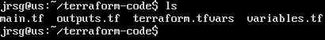
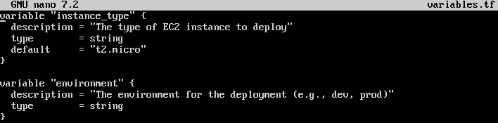
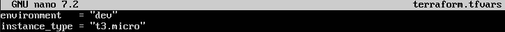
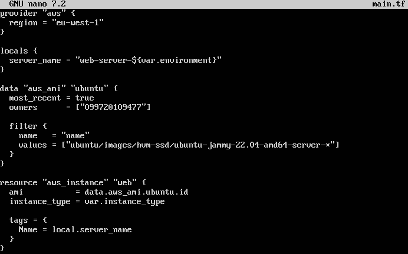
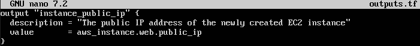
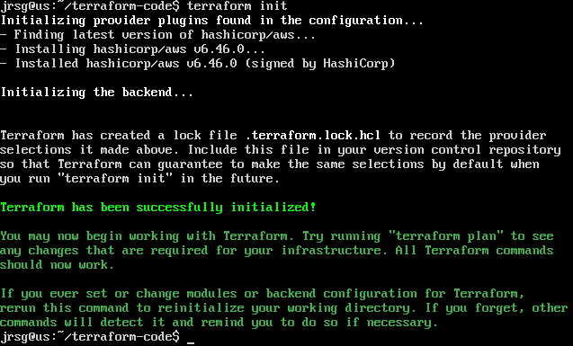
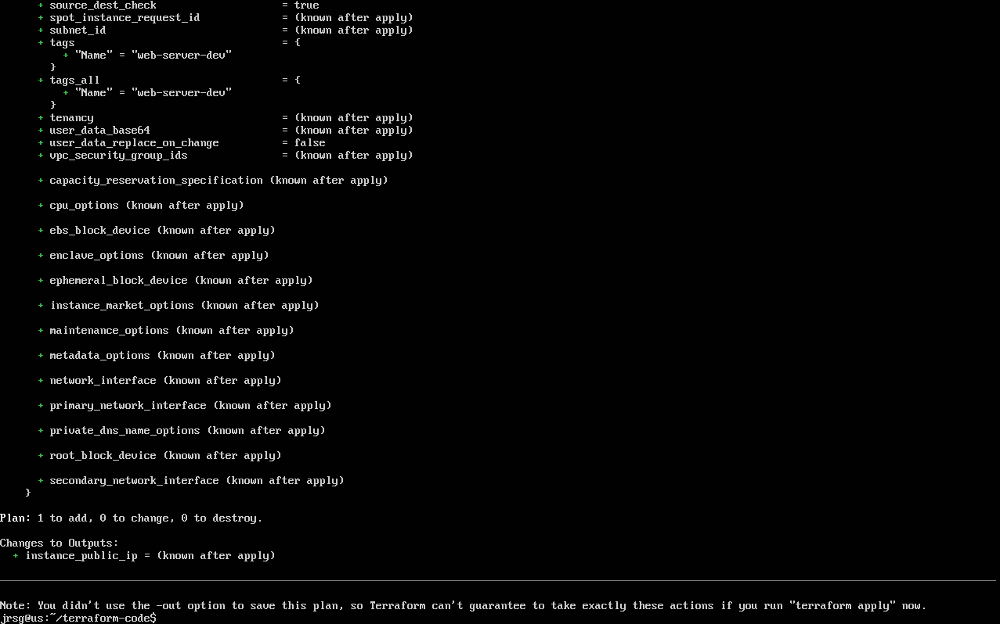
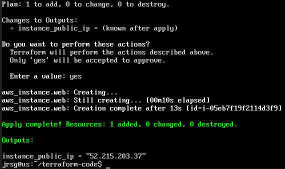

# Variables, Outputs and Locals

## Objetive
Stop hard-coding values into the code. Make your templates reusable for Dev, Staging and Production.

### Variables
Variables in Terraform act like the parameters or arguments of a function. They allow you to customise the behaviour of your modules without having to modify the source code. To define a variable, you use the `variable` block. It is good practice to always specify the data type and add a description.
```
variable ‘region’ {
  description = ‘AWS region where the resources will be deployed’
  type        = string
  default     = ‘eu-west-1’ # Optional: If no value is passed, this will be used.
}
```

To reference a variable in your resources, use the `var.` prefix:
```
provider ‘aws’ {
  region = var.region
}
```

Although you can define default values, the best way to inject actual values into variables is via a `.tfvars` file. This allows you to use the same code across different environments. By default, Terraform automatically loads any file named `terraform.tfvars` or `terraform.tfvars.json`.

### Outputs
These are equivalent to the return values of a function. They are used to display useful information in the terminal after running `terraform apply`, or to share data with other Terraform modules. They are defined using the `output` block, referencing the specific attribute of a resource that has already been created or calculated by Terraform.
```
output ‘public_server_ip’ {
  description = ‘The public IP address of the EC2 instance’
  value       = aws_instance.my_server.public_ip
}
```

### Locals
They are equivalent to temporary local variables within a function. They are used to assign a name to a complex expression or calculation, thereby avoiding having to repeat it throughout your code (the DRY principle: Don’t Repeat Yourself). The variables are supplied from outside. Locals are calculated within Terraform using functions or by combining existing variables, and the user cannot override them. They are all defined within a single `locals` block (plural) and are referenced using `local.`.

### Exercise 1: Create three files: `main.tf`, `variables.tf` and `outputs.tf`.



### Exercise 2: In `variables.tf`, define a variable `instance_type` with a default value of `t2.micro` and a variable `environment`.



Key lines:
- **`default = ‘t2.micro’`:** By defining a default value, this variable becomes optional. Unless the user specifies otherwise, Terraform will use `t2.micro`.

- **`variable ‘environment’`:** As it does not have a default value, this variable is mandatory. Terraform will return an error if we attempt to run the code without providing a value.

We will also create a `terraform.tfvars` file to inject the actual values into the variables we defined in the previous step:



### Exercise 3: In `main.tf`, launch an EC2 instance using `var.instance_type`. Assign it a tag using a local variable that concatenates values.



Key lines:
- **`server_name = ‘web-server-${var.environment}’`:** Here we use interpolation (${...}) within the `locals` block to create a dynamic name. If the environment is ‘dev’, the calculated value will be web-server-dev.

- **`instance_type = var.instance_type`:** We tell the instance to use the value from the variables (in this case, it will take ‘t3.micro’ from our .tfvars file).

- **`Name = local.server_name`:** We assign the machine name using the internal variable calculated in the locals block.

### Exercise 4: In `outputs.tf`, have Terraform print the EC2 instance’s `public_ip` after it has been created. Run plan and apply, passing a `terraform.tfvars` file.



Key lines:
- **`value = aws_instance.web.public_ip`:** We access the resource we created in main.tf (the aws_instance named “web”) and specifically retrieve its public_ip attribute.





