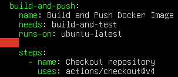
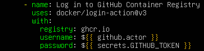
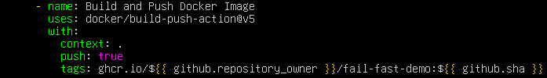

# Continuous Delivery (CD)

## Objective
Automate secure packaging. Once the code is valid, build the Docker image and store it.

### Secret Management
In any CI/CD pipeline, it is crucial to separate configuration from credentials. GitHub offers two main mechanisms for this, but they serve very different purposes and have very different levels of security:
- **Environment variables (`env`):** These are used to store general configuration (flags, paths, environment names). They are written in plain text and are visible in the workflow code and in the logs. They are defined in a YAML file or at the environment/repository level. They are directly available in the runner environment.

- **GitHub Secrets (`Secrets`):** These are used to store credentials, tokens, passwords and private keys. They are encrypted with a public key using Libsodium (they appear as `***`). They are configured in the GitHub UI, CLI or API (never in the code).

### GHA and Docker
When it comes to building and publishing Docker images, the official Docker actions are the industry standard. They work together in a logical flow: Authentication > Tagging > Building:
- **`docker/login-action`:** Authenticates the GHA runner to a container registry. Avoids the use of insecure commands such as `docker login` directly in scripts.

- **`docker/metadata-action`:** Extracts information from the GitHub context to generate dynamic tags and labels for your Docker image. Standardises versioning.

- **`docker/build-push-action`:** Uses Docker Buildx under the hood to build the image and, optionally, `push` it to the registry. Supports multi-architecture builds, leverages the GHA layer cache, and automatically consumes the output of the metadata action.

### Security (OIDC)
Traditionally, for GitHub Actions to access AWS, you had to generate long-lived `AWS_ACCESS_KEY_ID` and `AWS_SECRET_ACCESS_KEY` credentials and store them as GitHub Secrets. This poses a chronic security risk.

OpenID Connect (OIDC) allows your GitHub workflows to authenticate directly with your cloud provider (AWS, Azure, GCP) using dynamically generated short-lived tokens. The OIDC flow with AWS is as follows:
1. You configure AWS (IAM Identity Provider) to trust the GitHub OIDC provider for your specific repository.

2. During the workflow, GHA requests a JSON Web Token (JWT) from GitHub.

3. GHA sends this JWT to AWS.

4. AWS verifies the JWT’s signature. If it is valid and originates from your repository, AWS allows GitHub Actions to assume a specific IAM role.

5. AWS returns temporary STS (Security Token Service) credentials that are valid only for the duration of the job.

The main advantages are:
- It eliminates the risk of permanent AWS keys being leaked.

- The credentials last for minutes, not years.

- AWS CloudTrail logs exactly which GitHub repository and workflow requested access.

### Exercise 1: Add a new job (`build-and-push`) to your pipeline. It must depend on the Testing job (`needs: test`).

Instead of using `needs: test`, I’ve adapted it to the exact name of the job in the original file (`build-and-test`). This means that if `flake8` or `pytest` fails, the Docker image will not be built.

### Exercise 2: Use the native token `${{ secrets.GITHUB_TOKEN }}` to automatically log in to GitHub Container Registry (GHCR).

I have added the `docker/login-action`. It uses `${{ secrets.GITHUB_TOKEN }}` to connect to `ghcr.io`, eliminating the need for you to set up static passwords in your repository.

### Exercise 3: Configure the `build-push-action` step to compile your app’s `Dockerfile` and push it to GHCR tagged with the commit hash (`${{ github.sha }}`).

The `docker/build-push-action` step has been added. Build your Python application using the `Dockerfile` in your repository and tag the image on GHCR with the exact commit hash of that Pull Request (`${{ github.sha }}`).