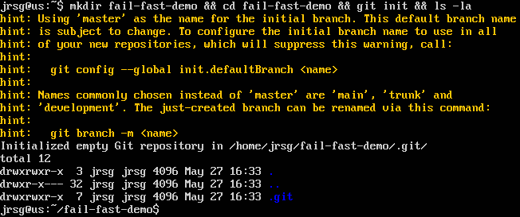
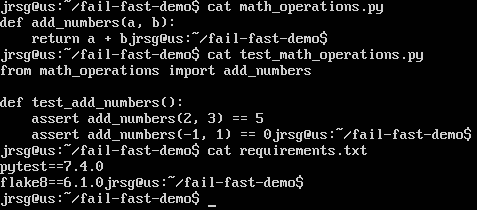
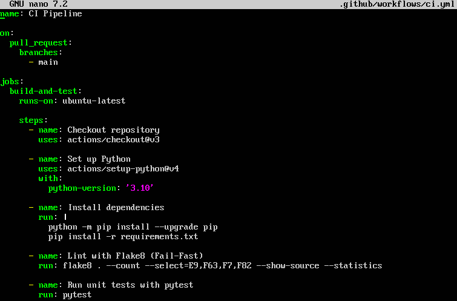
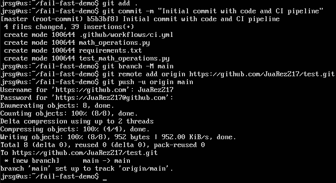
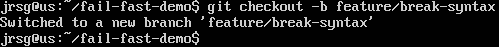
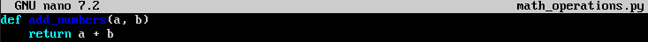
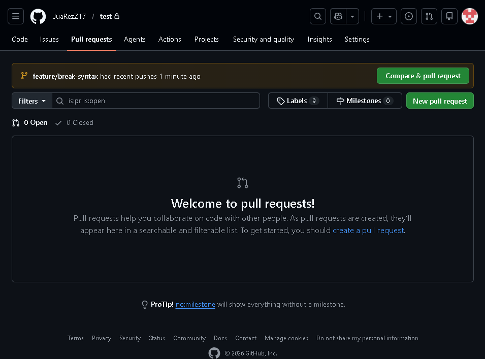
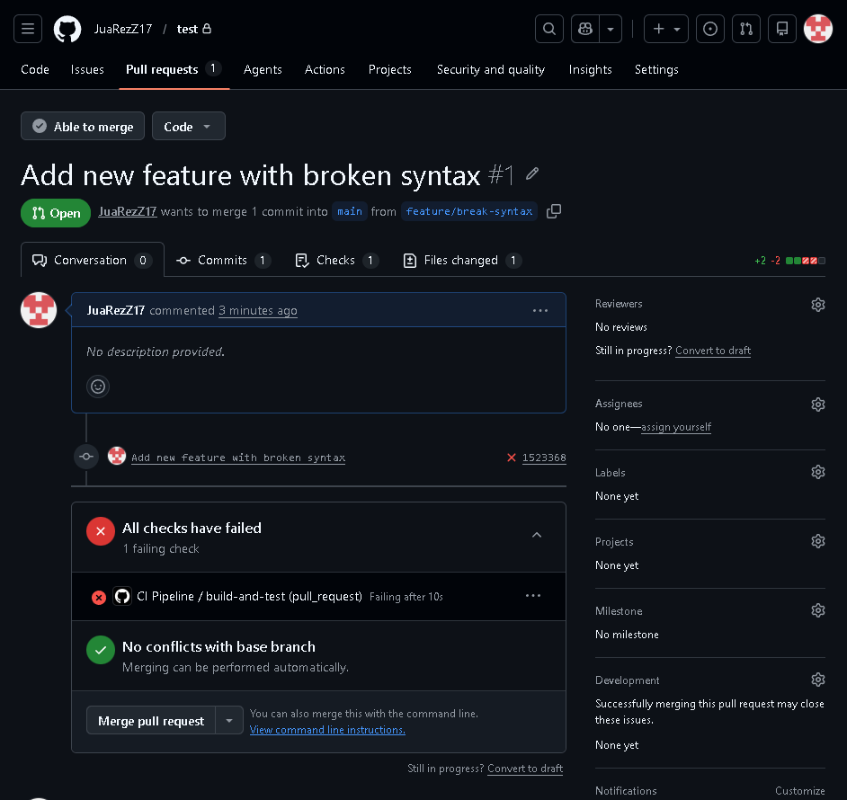

# Continuous Integration (CI)

## Objective
Implement quality gates. If the code does not meet the standards, the pipeline ‘breaks’ (fails) and blocks the deployment.

### Fail-Fast
It is a CI/CD pipeline that involves organising code validation tasks sequentially, arranging them from the quickest and least resource-intensive to the slowest and most resource-intensive. The aim is that if the code contains a basic error, the process stops immediately. To apply this philosophy, the stages should be ordered from least to greatest friction:
1. **Linting and Formatting (Seconds):** Tools such as ESLint (JS), Flake8 (Python) or Prettier check syntax and style. If the code does not comply with the rules, it fails immediately.

2. **Static Security Analysis / SAST (Seconds – Minutes):** Scans for known vulnerabilities or exposed credentials in the source code.

3. **Unit Testing (Minutes):** Checks isolated functions. These are usually very quick.

4. **Build (Minutes):** Compiling the code or creating Docker images only if the previous step has passed.

5. **Integration and E2E Testing (Minutes – Hours):** Heavy-duty tests that populate databases and simulate user clicks (Selenium, Cypress).

The key benefits are:
- **Immediate Feedback:** The developer knows within less than a minute if they have broken any basic rules, allowing them to stay focused (in the flow).

- **Cost Savings:** A drastic reduction in CPU/RAM usage on continuous integration servers.

- **Prevention of Bottlenecks:** Frees up runners (servers that run the tests) so that other colleagues can use them.

### Matrix Builds
They are a feature of CI/CD tools that allow you to run the same set of instructions (a job) multiple times in parallel, varying one or more configurations, without having to copy and paste the pipeline code.

To do this, you define arrays of variables. The CI/CD tool automatically calculates the Cartesian product of these variables and launches a virtual machine (or container) for each combination.

The key benefits are:
- **Pipeline scalability:** Adding support for a new version requires changing just one character in the pipeline, not writing 50 new lines of code.

- **Speed through Parallelism:** Instead of testing version 3.9, then 3.10 and then 3.11 sequentially, the system runs them all at the same time.

- **Comprehensive Coverage:** It enables the automated detection of environment-specific errors.

### Exercise 1: In your Python app, make sure you have a `requirements.txt` file and a very basic unit test using `pytest`.
First, let’s create a directory for the project, initialise Git and create the base files:

Now let’s create a `math_operations.py` file with a mathematical function, a `test_math_operations.py` file using `pytest` to verify that the function works as intended, and a `requirements.txt` file listing the libraries our application and pipeline need to run:

### Exercise 2: The CI Pipeline (`ci.yml`): 
### Configure it to run only on pull requests to the `main` branch.
### Add a step to install `flake8` (linter) and check the syntax.
### Add a step to install dependencies and run pytest.

- **`on: pull_request: branches: [main]`:** This is the trigger. It tells GitHub: ‘Only run this pipeline when someone attempts to make a pull request to the main branch’.

- **`runs-on: ubuntu-latest`:** Launches a lightweight virtual machine running Linux to execute the steps.

- **`uses: actions/checkout@v3`:** This is a pre-built GitHub action that clones your code into the virtual machine so that the pipeline can analyse it.

- **The Fail-Fast order** : `Flake8` takes milliseconds to scan the code for syntax errors. If this fails, GitHub stops the pipeline immediately and never gets as far as running pytest, saving time.

We uploaded the files to GitHub:

### Exercise 3: Create a new branch, deliberately break the syntax of your Python code, and open a pull request. Check that GitHub Actions blocks the PR and displays a red X.
First, let’s create a new branch:

Now let’s modify the `math_operations.py` file by introducing a syntax error:

We commit the changes and open a pull request. On GitHub, we’ll see the ‘Compare & pull request’ option appear:

We can see that, when making the pull request, it doesn’t show that the checks have failed.

