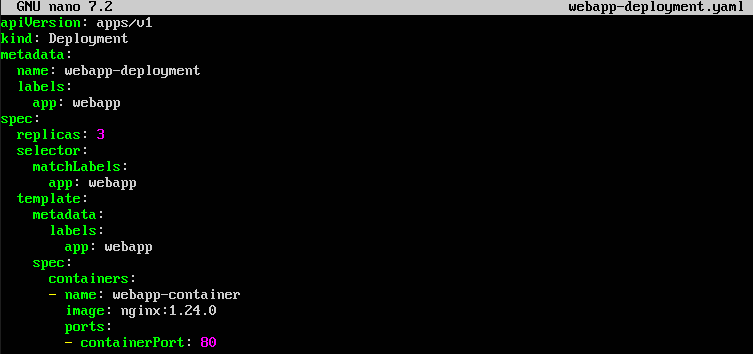
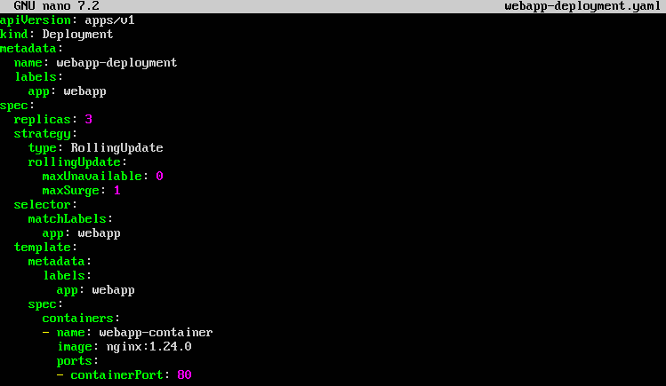
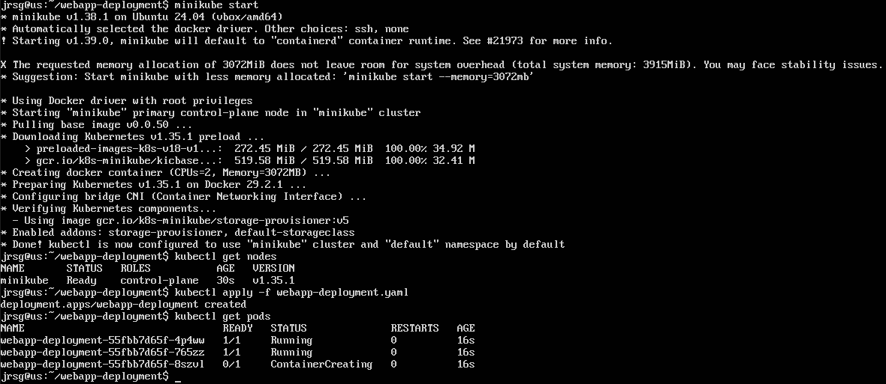
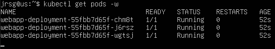
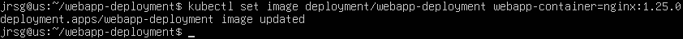
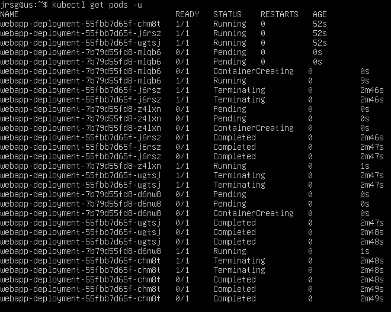

# Deployment Strategies

## Objective
Understanding the production deployment architectures used by large companies to ensure 99.99% uptime (zero downtime).

### Rolling Update
This is the default and native strategy in Kubernetes. It involves updating the application by gradually replacing instances (pods) of the old version with those of the new version. Kubernetes launches a new pod with the new version. Once this pod is ready (it passes its readiness probes), it terminates an old pod. This cycle repeats until all pods have been updated. There are two key parameters:
- **`maxSurge`:** The maximum number of pods that can be created in excess of the desired quantity during the update.

- **`maxUnavailable`:** The maximum number of pods that can be unavailable during the update.

The advantages are zero downtime and resource efficiency. The disadvantages are slowness and the coexistence of different versions.

### Blue-Green
This strategy aims to eliminate deployment risk by maintaining two exactly identical, parallel infrastructure environments. The blue environment is the current production environment, handling 100% of user traffic. The green environment is the exact replica where the new version is deployed. Once the version has been deployed in the Green environment, the QA team can carry out real-world testing there without affecting users. If everything is correct, the load balancer or router is reconfigured to send 100% of traffic to the Green environment in one go.

The advantages are instant rollback and secure testing. The disadvantages are cost and state management.

### Canary Release
This involves releasing the new version to a very small subset of users before rolling it out to everyone. What happens is that the new version is deployed alongside the old one; using an Ingress Controller or a Service Mesh (such as Istio), a small percentage of traffic (e.g. 5%) is routed to the new version, whilst the remaining 95% continues to use the old one. Logs, error metrics and performance are closely monitored. If there are no issues, traffic is gradually increased. If errors are detected, the process is aborted and 100% of traffic is returned to the old version.

The advantages are the minimal blast radius and testing with live traffic. The disadvantages are technical complexity and slow deployment.

### Take your application’s deployment.yaml file.



The most important lines in the file are:
- **`replicas: 3`:** This specifies that we want to have 3 instances (pods) of our application running simultaneously. This will help us to better visualise the update process.

- **`image: nginx:1.24.0`:** This is the ‘old’ version of our application that we will start with.

### Edit the manifest to include the explicit strategy:
```
YAML
strategy:
  type: RollingUpdate
  rollingUpdate:
    maxUnavailable: 0
    maxSurge: 1
```



The most important lines in the file are:
- **`strategy / type`:** RollingUpdate: This explicitly tells Kubernetes that we do not want to shut everything down at once, but rather perform a gradual replacement.

- **`maxUnavailable: 0`:** This is a strict rule. It guarantees 100% availability of the original capacity.

- **`maxSurge: 1`:** When combined with the previous rule, the cluster will create a fourth pod with the new version and, only when this is ready, will it shut down one of the old ones.

### Apply the change to your local `kind` or `minikube` cluster. Change the image version and deploy again, noting how `kubectl get pods -w` brings up the new one before killing the old one.
First, let’s set up the local cluster where the tests will be run and apply the manifest:



Now let’s open another terminal to check the current status of the pods:



We return to the first terminal, change the nginx version in our pods and view the result in the second terminal:



