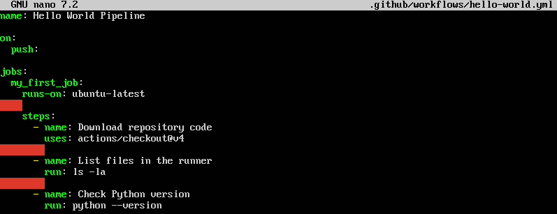
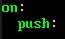
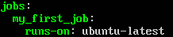
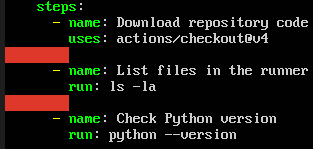
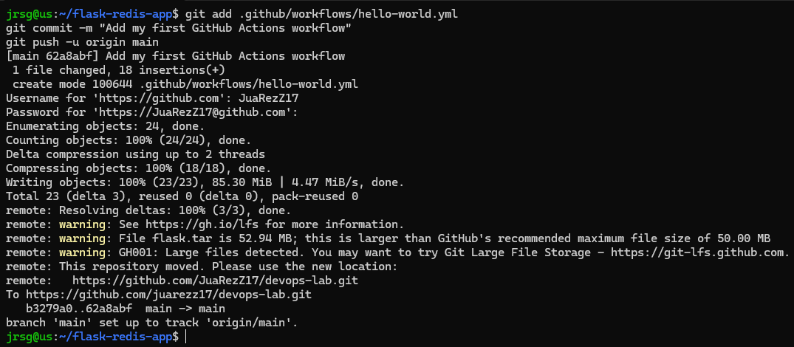
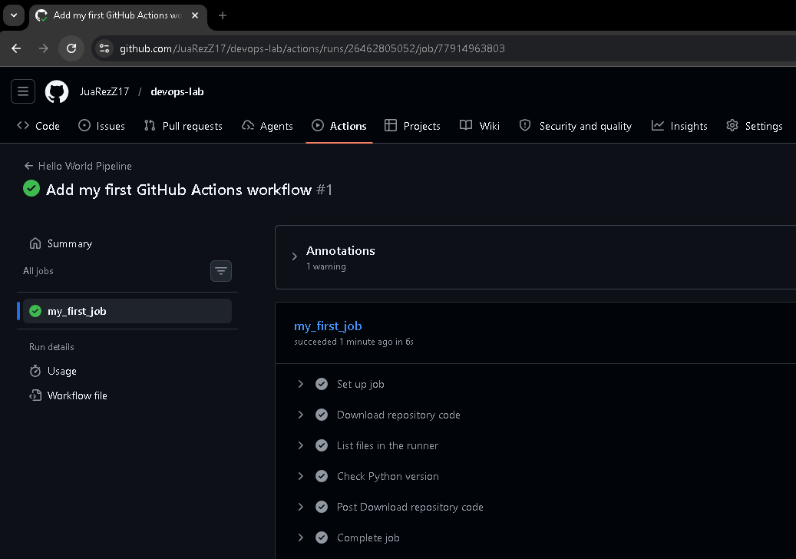

# GitHub Actions syntax

## Objetive
Become proficient in GitHub's native tool. Understand how repository events trigger ephemeral virtual machines (Runners).

### Events (`on`)
Events are the triggers that tell GitHub Actions when a workflow should run. They are defined under the `on` key in the YAML file.
- **`push`:** Triggered every time code is pushed to a repository (commits). It is usually filtered so that it only reacts to specific branches or to changes in certain file paths.

- **`pull_request`:** Runs when a pull request is opened, synced or reopened. It is vital for running automated tests (CI) before allowing the code to be merged into the main branch.

- **`workflow_dispatch`:** Allows the workflow to be run manually via the GitHub web interface or the API. It is very useful for controlled deployments to production or for passing manual variables at the start (inputs).

- **`schedule`:** Runs the workflow at predefined times using standard cron syntax (`* * * * *`). Ideal for maintenance tasks, backups or overnight testing.

### YAML hierarchy
Understanding the structure of a GitHub Actions file is essential. The system operates from a high-level to a low-level abstraction.
- **`Workflow (The file)`:** This is the top-level component. It represents a complete automated process. A repository can have multiple workflows, each in its own `.yml` file within the `.github/workflows/` directory.

- **`Jobs`:** A workflow contains one or more jobs. By default, they run in parallel. If you need one to wait for another, you can use the `needs` key. Each job runs in its own virtual machine or container, defined by the `runs-on` key.

- **`Steps`:** Each job consists of a series of steps. They run sequentially within the same virtual machine as the job, so they share the file system and environment. A step can be a console command (`run`) or an Action (`uses`).

- **`Actions`:** These are the smallest building blocks. They are reusable, packaged tasks created by the GitHub community (or by yourself). They save you from having to write complex code from scratch.

### Contexts and Variables
Contexts are objects that contain vital information about the current workflow run, the environment, secrets, or the user who triggered it. To access this data and use it dynamically within your YAML, you use the interpolation syntax: `${{ <context>.<property> }}`. Most commonly used contexts:
- **`github`:** Contains information about the event that triggered the workflow and the repository.
    - **`${{ github.sha }}`:** The hash (long ID) of the exact commit that triggered the workflow. Very useful for tagging Docker images.

    - **`${{ github.ref }}`:** The branch or tag that triggered the workflow (e.g. refs/heads/main).

    - **`${{ github.actor }}`:** The username of the person who initiated the workflow.

- **`runner`:** Contains information about the virtual machine running the current job.
    - **`${{ runner.os }}`:** The runner’s operating system. Useful if you’re writing cross-platform conditional scripts.

    - **`${{ runner.arch }}`:** The runner’s architecture.

- **Other important contexts:** `env` (environment variables), `secrets` (hidden passwords and tokens) and `inputs` (parameters passed in a `workflow_dispatch`).

### Exercise 1: In your Python application’s repository (Week 2/3), create the `.github/workflows/` directory and a `hello-world.yml` file.
GitHub Actions requires a very specific folder structure to detect your workflows. Let’s create the `.github/workflows/` directory. Inside this directory, create the `hello-world.yml` file:

### Exercise 2: Configure it to trigger on a push. 

- **`on: push`:** This is the trigger. It tells GitHub Actions to run this entire file automatically every time someone pushes a new commit to the repository.

### Create a Job that runs on ubuntu-latest.

- **`runs-on: ubuntu-latest`:** This defines the runner (the virtual machine). It tells GitHub to spin up a fresh server running the latest version of Ubuntu Linux to execute your steps.

### Add Steps to perform actions/checkout@v4 (download your code) and execute basic Bash commands (ls -la, python --version).

- **`uses: actions/checkout@v4`:** This is a crucial pre-built Action provided by GitHub. By default, the virtual machine starts completely empty. This step downloads (clones) your repository code into the virtual machine so that the following steps can interact with your files.

- **`run: ...`:** The `run` keyword allows you to execute standard Bash commands directly in the virtual machine's terminal. In this case, `ls -la` lists all the files you have just downloaded, and `python --version` checks the pre-installed Python version.

### Exercise 3: Push the file and look at the ‘Actions’ tab on GitHub to view the terminal in real time.

To view a real-time, step-by-step breakdown of my commit, we can go to GitHub, navigate to the repository that has been modified, and view the actions:

