# Disaster Recovery

## Objective
Experience the true power of GitOps. If your data centre goes down, you can spin up an identical cluster in minutes because the entire state of the infrastructure is safely stored in Git.

### The App-of-Apps pattern
The App-of-Apps pattern is a way of organising deployments in ArgoCD where there is a main application whose role is to manage and deploy other ArgoCD applications. This main application acts as the system’s entry point. Instead of creating each application manually via the ArgoCD interface, everything is defined in Git and ArgoCD is responsible for applying that state to the cluster. This pattern is widely used for cluster bootstrapping, i.e. to automatically set up a cluster from scratch. It allows you to install the necessary applications, services, configurations and components by following what is defined in a Git repository. The main advantages are:
- Centralises application management.

- It facilitates deployment automation.

- It reduces the need for manual intervention.

- It allows a cluster to be rebuilt more quickly.

- It keeps the configuration versioned in Git.

- It promotes consistency across environments such as development, testing and production.

### RTO (Recovery Time Objective)
RTO is the maximum time an organisation considers acceptable for restoring a system following an outage or failure. In other words, it indicates how long a service can be down before the impact becomes too severe. A low RTO means the system must be restored very quickly. A higher RTO allows for a longer recovery time.

GitOps helps reduce RTO because the entire desired state of the system is defined in Git. This includes configurations, applications, services and necessary cluster resources. When a failure occurs, there is no need to rebuild everything manually. ArgoCD can read the Git repository and resynchronise the cluster with the defined state. This reduces human error, speeds up recovery and allows environments to be restored more predictably. GitOps reduces recovery time because:
- Configuration is centralised in Git.

- Changes are versioned.

- Deployment is automated.

- Reliance on manual steps is avoided.

- The cluster state can be rebuilt in a repeatable manner.

- ArgoCD detects differences between the actual state and the desired state.

### Exercise 1: Create an ArgoCD manifest that points to a folder in your Git repository called `clusters/production/`. Inside that folder, place the Application files for your database, your web application and your firewall.

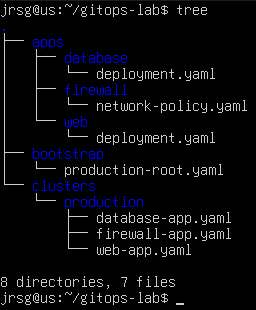

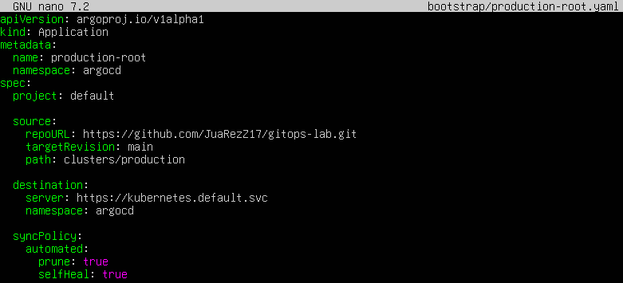

- **`name: production-root`:** This is the main application.

- **`path: clusters/production`:** Here’s the key to the exercise: this app points to the folder containing the other applications.

- **`prune: true`:** Deletes resources that are no longer in Git.

- **`selfHeal: true`:** Corrects manual changes made to the cluster.

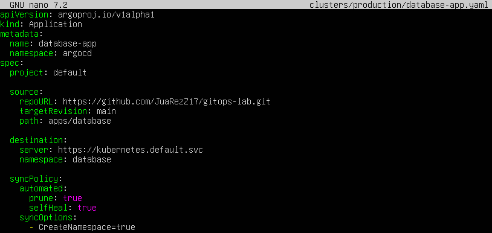

- **`name: database-app`:** Name of the database application.

- **`path: apps/database`:** Specifies where the database YAML file is located.

- **`namespace: database`:** The database will be deployed to the `database` namespace.

- **`CreateNamespace=true`:** ArgoCD will create the namespace if it does not exist.

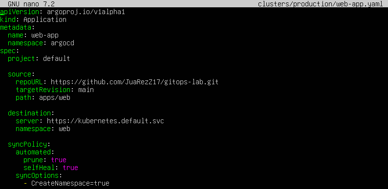

- **`name: web-app`:** Name of the web application.

- **`path: apps/web`:** Specifies the location of the web application’s YAML file.

- **`namespace: web`:** The web application will be deployed to the `web` namespace.

- **`name: firewall-app`:** Name of the firewall application.

- **`path: apps/firewall`:** Specifies where the network rules are located.

- **`namespace: database`:** The network policy will be applied to the database namespace.

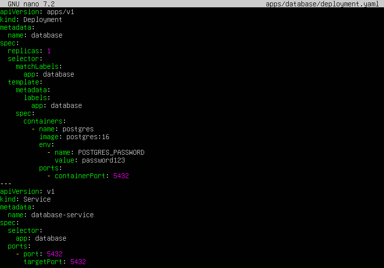

- **`image: postgres:16`:** Uses PostgreSQL as the database.

- **`POSTGRES_PASSWORD`:** The password required for PostgreSQL to start.

- **`kind: Service`:** Allows other pods to access the database within the cluster.

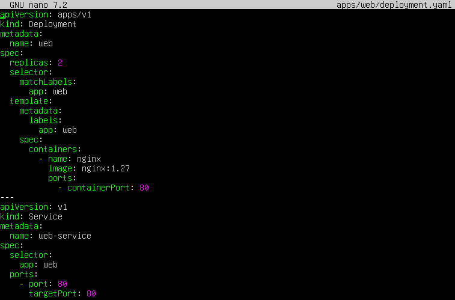

- **`replicas: 2`:** Creates two web pods.

- **`image: nginx:1.27`:** Uses Nginx as a simple web application.

- **`port: 80`:** The web application listens on port 80.

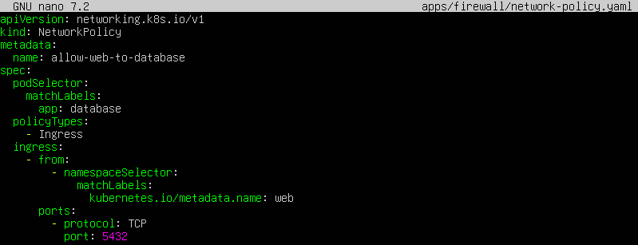

- **`kind`:** NetworkPolicy: Creates a network rule.

- **`podSelector:
  matchLabels:
    app: database`**

The rule applies to database pods.

- **`kubernetes.io/metadata.name: web`:** Allows traffic from the web namespace.

- **`port: 5432`:** Only allows connections to the PostgreSQL port.

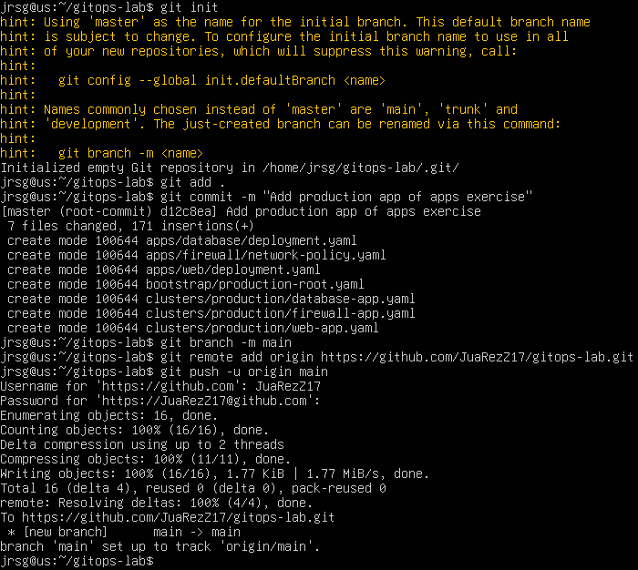

### Exercise 2: Completely destroy your local Kind cluster (`kind delete cluster`). The infrastructure has vanished.

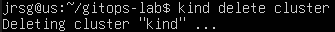

### Exercise 3: Create a new Kind cluster from scratch, install ArgoCD (Tuesday’s step) and apply only the “App of Apps” manifest. Sit back and watch as ArgoCD starts downloading from Git and automatically recreates your entire network, services, Kustomize environments and databases.
We delete the existing cluster and create a new one:

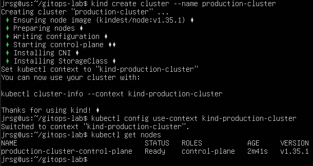

We apply the ‘App of apps’ and check that everything has been created:

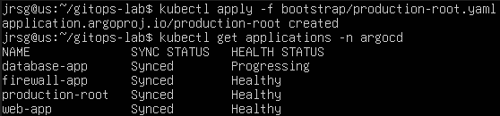

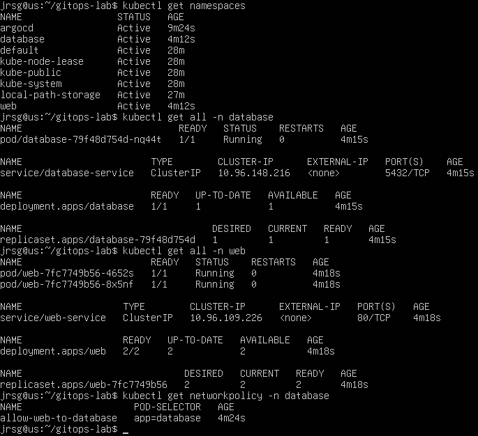