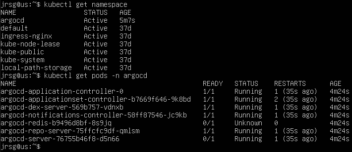
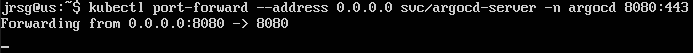
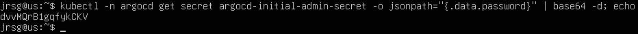
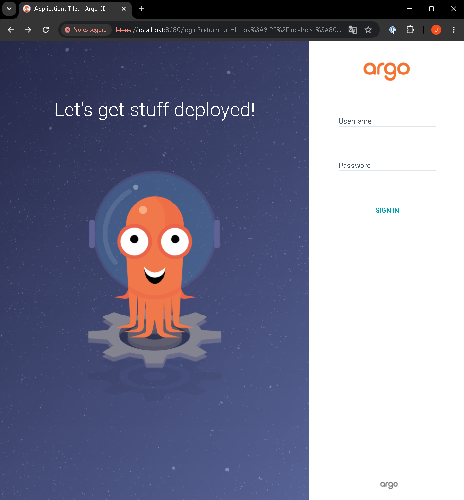
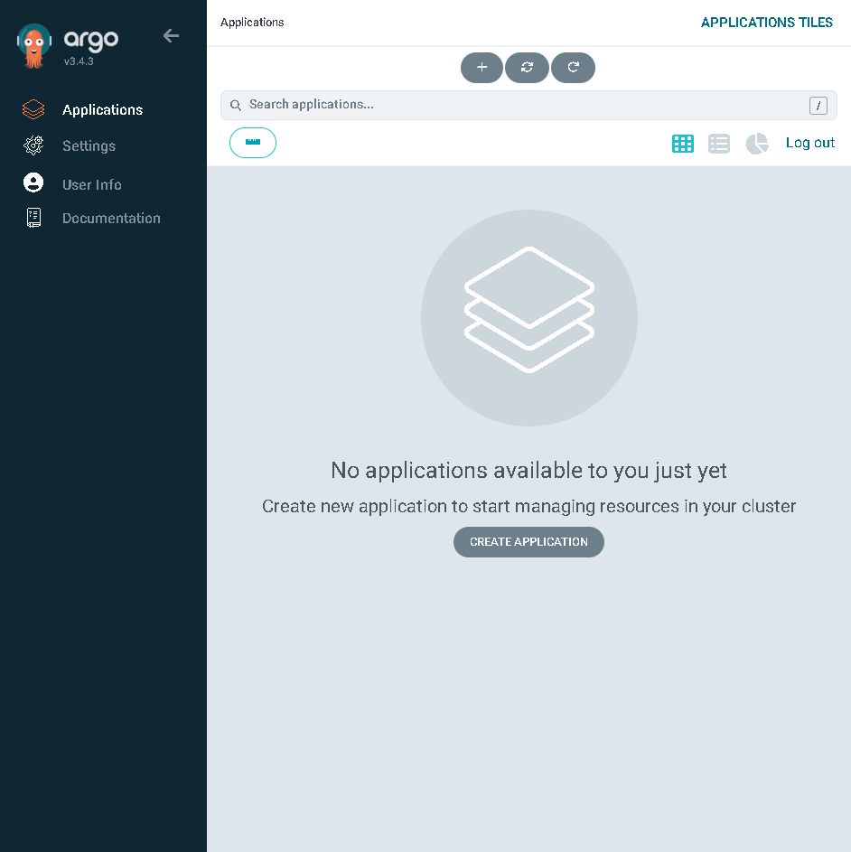

# Installing ArgoCD (EKS/Kubernetes)

## Objective
Deploy ArgoCD, the market-leading tool for GitOps, and understand its internal architecture (Application Controller, API Server, Repository Server).

### ArgoCD Core Components
ArgoCD is a declarative continuous delivery (CD) tool for Kubernetes based on the GitOps paradigm. To function, it is divided into several microservices, the two most critical being the controller and the server:
- **`argocd-application-controller`:** This is the main control component. Its role is to run a continuous reconciliation loop to ensure that what is deployed matches what is defined. It continuously monitors the applications running in the cluster, compares the current live state with the desired state defined in the Git repository; if it detects a difference, it marks the application as `OutOfSync` and, depending on the configured synchronisation policies, can automatically apply the changes so that the cluster matches Git again.

- **`argocd-server`:** This component is an API server (gRPC/REST) that exposes ArgoCD’s functionality to the outside world. It does not deploy applications itself, but rather facilitates interaction with the system. It hosts the well-known ArgoCD web console, where you can view the status of your applications, the resource tree and the differences (diffs) in a visual and graphical manner; it is the endpoint to which the command-line tool (`argocd cli`) connects to when you run commands in your terminal; it receives manual requests from users, such as forcing a synchronisation (sync), performing a rollback, or creating a new application; and it manages access  by integrating with SSO systems (OIDC, SAML, GitHub, etc.) or using local credentials.

### ArgoCD CRDs
As a true native Kubernetes tool, ArgoCD does not rely on an external database to store its configuration, but instead extends the Kubernetes API using CRDs. This allows ArgoCD itself to be managed using Kubernetes manifests.

The `Application` CRD is the centrepiece of ArgoCD. It represents a logical group of Kubernetes resources and acts as the bridge linking your repository (source) to your cluster (destination). An `Application` object requires two key pieces of information:
- **`source (Source - Git)`:** Defines where the manifests will be read from.

    - **`repoURL`:** The URL of the Git repository (or Helm registry).

    - **`targetRevision`:** The specific branch, tag or commit (e.g. main, v1.2.0, HEAD).

    - **`path`:** The folder within the repository where the files are located (e.g. k8s/production).

- **`destination (Destination - Cluster)`:** Defines where these manifests will be deployed.

    - **`server`:** The URL of the Kubernetes cluster API (by default https://kubernetes.default.svc if it is the same cluster where ArgoCD is running).

    - **`namespace`:** The Kubernetes namespace where the resources will be created.

### Exercise 1: Create the argocd namespace and install ArgoCD using the official HashiCorp/Argo manifests:
```
kubectl create namespace argocd
kubectl apply -n argocd -f https://raw.githubusercontent.com/argoproj/argo-cd/stable/manifests/install.yaml
```



- **`kubectl create namespace argocd`:** Creates an isolated logical environment (namespace) in your cluster called argocd so that the components do not interfere with your other applications.

- **`kubectl apply -n argocd -f ...`:** Downloads the install.yaml file (which contains hundreds of lines of configuration) from the internet and tells Kubernetes: “Install all of this within the argocd namespace”. This will deploy the controller pods, the API server, and the Custom Resource Definitions (CRDs).

### Exercise 2: Install the argocd CLI on your Linux system. Expose the web service using `kubectl port-forward svc/argocd-server -n argocd 8080:443`.
```
# 1. Download the binary for the Linux AMD64 architecture
curl -sSL -o argocd-linux-amd64 https://github.com/argoproj/argo-cd/releases/latest/download/argocd-linux-amd64

# 2. Move it to the system’s executable directory and set the permissions
sudo install -m 555 argocd-linux-amd64 /usr/local/bin/argocd

# 3. Delete the temporary file we downloaded
rm argocd-linux-amd64
```



### Exercise 3: Retrieve the auto-generated administrator password using `kubectl` (it is stored in a Secret) and access the visual dashboard at `localhost:8080`.
Open a new terminal and run the following command:



Open your browser and go to localhost:8080:



Log in with the username `admin` and the password is the secret from the previous step:

