# Multi-environment with Kustomize

## Objective
Address the issue of code duplication. Use Kustomize (a native K8s tool) to reuse the same base YAML files in Development, Staging and Production, changing only what is necessary (replicas, environment variables, names).

### Kustomize Architecture
Kustomize is a tool that allows you to customise Kubernetes YAML files without modifying the original manifests. It is used to reuse common configurations and adapt them to different environments, such as development, testing or production. There are two basic concepts to understand:
- **Bases:** Bases contain the application’s common YAML. They include configuration shared across all environments and should be kept as generic as possible. Their aim is to avoid duplicating files and to facilitate maintenance.

- **Overlays:** Overlays are customisation layers applied on top of a Base. Each Overlay typically represents a different environment and contains only the changes necessary for that environment. They can modify aspects such as: number of replicas, namespace, application image, environment variables, labels, CPU and memory resources.

### Kustomization.yaml
The kustomization.yaml file is Kustomize’s main configuration file. It does not apply directly to Kubernetes. Kustomize uses it to generate the final YAML files. It specifies which resources to use, which Base to load, which patches to apply, and which transformations to perform.

### Exercise 1: Organise your application in Git using Kustomize:
```
apps/miapp/
├── base/
│   ├── deployment.yaml
│   ├── service.yaml
│   └── kustomization.yaml
└── overlays/
    ├── dev/
    │   └── kustomization.yaml
    └── prod/
        └── kustomization.yaml
```

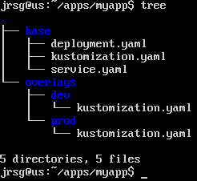

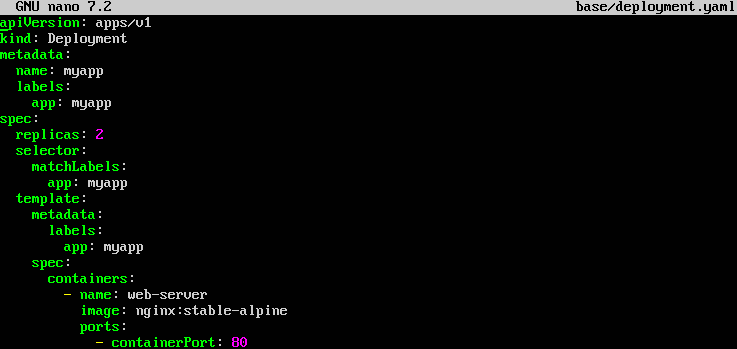

- **`metadata.name: myapp`:** This is the original name of the Deployment. Overlays will use this name to modify the number of replicas.

- **`spec.replicas: 2`:** Defines a default value for the Base. Each overlay will override this.

- **`selector.matchLabels and template.metadata.labels`:** Must match so that the Deployment can manage its Pods.

- **`image: nginx:stable-alpine`:** Specifies the image that the container will run.

- **`containerPort: 80`:** Specifies that the container listens on port 80.

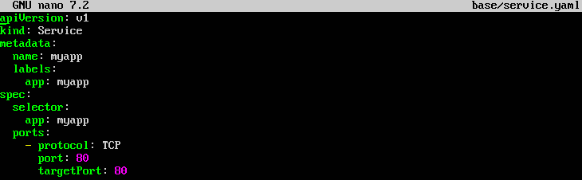

- **`metadata.name: myapp`:** This is the original name of the Service.

- **`spec.selector.app: myapp`:** This allows the Service to locate the Pods created by the Deployment.

- **`port: 80`:** This is the port exposed by the Service.

- **`targetPort: 80`:** This is the container port to which traffic will be sent.

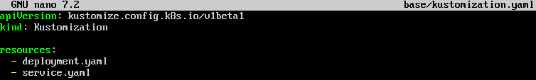

- **`kind: Kustomization`:** Indicates that this file will be processed by Kustomize.

- **`resources`:** Defines the YAML manifests that form part of the Base.


- **`resources: ../../base`:** Loads the common manifests from the Base.

- **`namePrefix: dev-`:** Adds the prefix `dev-` to the resource names.

- **`replicas.name: myapp`:** Selects the Deployment using its original name, before applying the prefix.

- **`count: 1`:** Changes the Deployment so that it has a single replica.

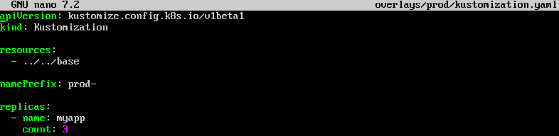

- **`resources: ../../base`:** Reuses the same Base as the Development environment.

- **`namePrefix: prod-`:** Adds the prefix prod- to the resources.

- **`count: 3`:** Configures the Production Deployment with three replicas.

### Exercise 2: Run `kubectl kustomize apps/miapp/overlays/prod` to see how the final combined YAML is generated on your screen.

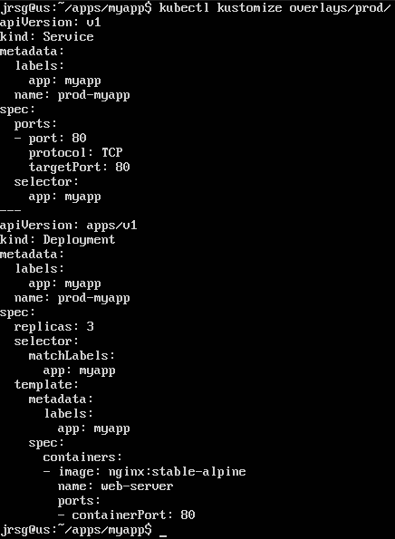

### Exercise 3: Register two separate applications in ArgoCD pointing to the overlay directories (dev and prod). ArgoCD will natively detect that you are using Kustomize and render the environments separately.
First, we define a variable for our repository:

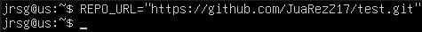

Now we register both applications:

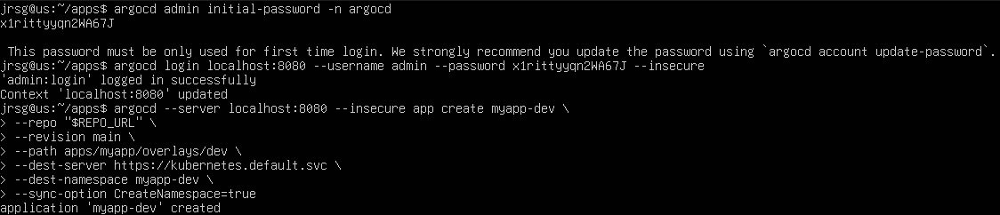

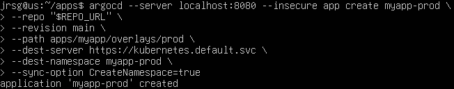

- **`myapp-dev`:** Name of the application within Argo CD.

- **`--repo`:** Git repository containing the manifests.

- **`--revision main`:** Branch that Argo CD should watch.

- **`--path apps/myapp/overlays/dev`:** Directory of the Development overlay.

- **`--dest-server`:** Target Kubernetes cluster.

- **`--dest-namespace myapp-dev`:** Namespace where the resources will be deployed.

- **`CreateNamespace=true`:** Allows Argo CD to create the namespace if it does not yet exist.

Now all that remains is to synchronise the environments and check the deployed resources:

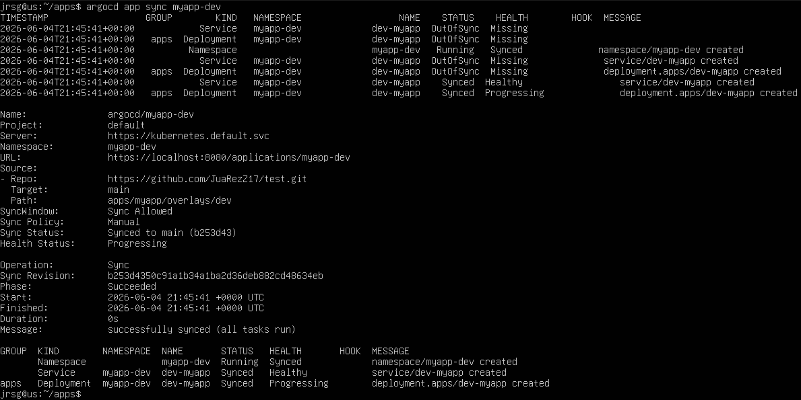

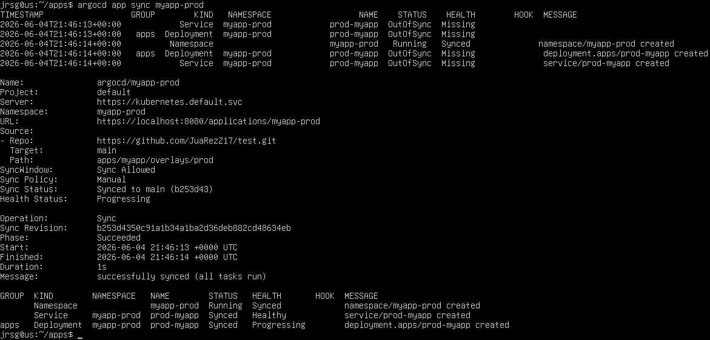

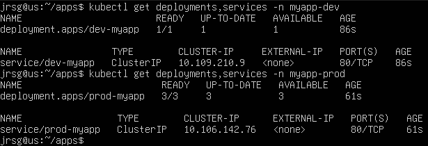