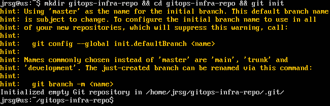
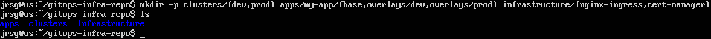
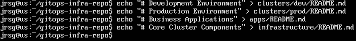
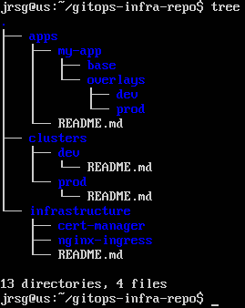

# The GitOps Manifesto

## Objective
Grasp the four fundamental principles of GitOps. Understand why tech companies are moving away from the ‘push’ model (traditional CI/CD) towards the ‘pull’ model (GitOps).

### The 4 Principles of OpenGitOps
These principles dictate how a system’s desired state should be managed in order for it to be considered truly “GitOps”:
1. **Declarative:** Instead of writing a set of step-by-step instructions to configure a system (an imperative approach), you describe the system’s desired end state. Infrastructure and applications are defined using configuration files (usually YAML or JSON). For example, in Kubernetes, you declare that you want “3 replicas of this pod”, rather than the exact commands to create each one.

2. **Versioned and Immutable:** The desired state is stored in a way that enforces immutability and version control, preserving a complete history of changes. Git is the single source of truth. If a change is not in Git, it must not exist in the system. This enables full auditability (knowing who did what and when) and facilitates immediate rollbacks simply by reverting to a previous commit.

3. **Pulled Automatically:** State declarations (YAML files) are automatically applied to the system by software agents, without the need for manual intervention or pushing changes from outside. Tools such as ArgoCD or Flux monitor the Git repository. As soon as they detect that a pull request has been merged, they ‘pull’ these new manifests and prepare them for deployment to the environment.

4. **Continuously Reconciled:** Software agents continuously monitor the current state of the system and compare it with the desired state declared in Git. It is an infinite control loop. If someone manually accesses the cluster and deletes a pod, or changes a configuration (known as Configuration Drift), the agent will immediately detect the discrepancy. Its job will be to “reconcile” reality with Git, recreating the pod or reverting the manual change so that the cluster returns to exactly what the repository dictates.

### Push vs Pull Model
When it comes to applying changes to a cluster, there are two main approaches:
- **The Push Model (Traditional CI/CD):** In this model, the external CI/CD system (such as GitHub Actions, Jenkins or GitLab CI) is responsible for executing the commands to deploy the application to the cluster.

Code -> Build (CI) -> The GHA Runner executes `kubectl apply` against the cluster.

    - Security Drawbacks:
        - Credential Exposure: The external server or runner requires administrator credentials (kubeconfig, tokens or certificates) to authenticate against the cluster.

        - Attack Surface: If the CI/CD server (e.g. GitHub Actions) is compromised or a secret is leaked, the attacker gains full access to the cluster.

        - Firewall Rules (Inbound Traffic): The cluster must have its API exposed in some way to receive incoming requests from the internet or from the CI network.

- **The Pull Model (GitOps):** In this model, the deployment agent (e.g. ArgoCD) resides within the cluster itself.

Code -> Build (CI updates the YAML in Git) -> The internal agent detects the change in Git and applies it internally.

    - Security Benefits:
        - No external credentials: The cluster does not share its access credentials with any external CI tool. GitHub Actions is not even aware that the cluster exists.

        - Outbound-only traffic: The agent within the cluster only needs to make outbound requests (to read the Git repository or the image registry). There is no need to open inbound ports in the firewall to the cluster, thereby isolating the network.

        - Security by design: Minimises the attack surface by limiting permissions solely to what the internal agent (via RBAC in Kubernetes) is permitted to do.

### Map out a mental workflow in your notes. What happens if a developer changes the number of replicas in the K8s web console from 3 to 5? How does GitOps respond?
1. **Manual Intervention (Drift):** The developer modifies the cluster directly.
    - Current cluster state: 5 replicas.

    - Desired state in Git: 3 replicas.

2. **Detection (The Agent Observes):** The GitOps agent (such as ArgoCD or Flux), which resides within the cluster, is running its infinite observation loop.
    - It detects that the cluster’s actual state (5) no longer matches the declaration in the Git repository (3).

3. **‘Out of Sync’ status:**
    - The agent immediately marks the application as ‘Out of Sync’ and records that a configuration drift has occurred.

4. **Reconciliation (Correction):** If ‘Auto-sync’ and ‘Self-heal’ are enabled: The agent acts decisively. It applies the Git state to the cluster. It automatically sends the command to scale down the replicas to 3, destroying the 2 pods that the developer created manually.
    - If only alerts are configured, the agent does not destroy the pods, but sends an alert (to Slack, Teams, etc.) notifying the team that someone has manually altered the cluster and that the actual state has deviated from the repository.

### Create a folder on your local machine called gitops-infra-repo. This structure will be your foundation for the rest of the week:
```
gitops-infra-repo/
├── apps/
└── clusters/
```

First, we create the root folder, navigate to it and create the Git repository:



Now we’re going to create the standard directory structure:



Let’s add some READMEs to these folders:



Let’s view the directory tree:

