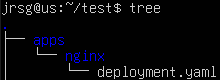
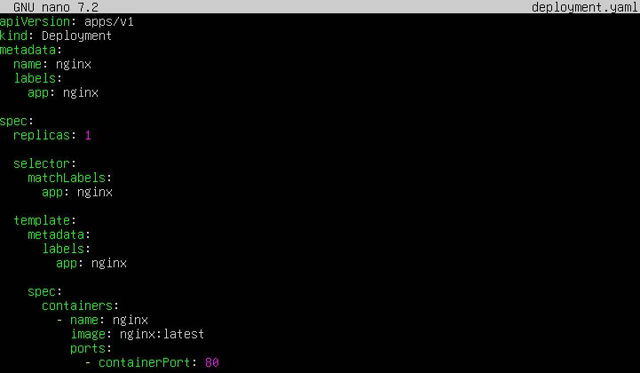
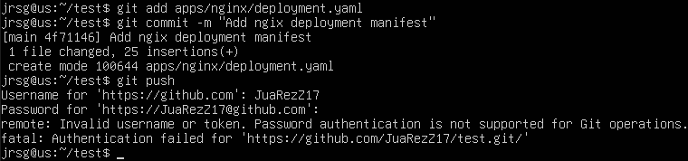
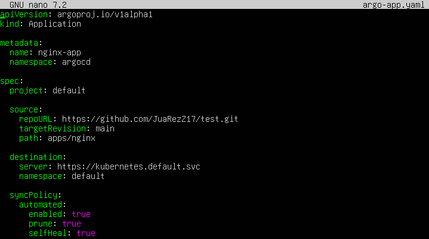
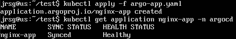
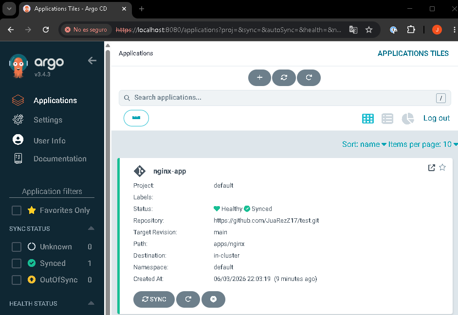
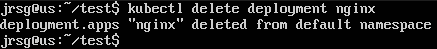
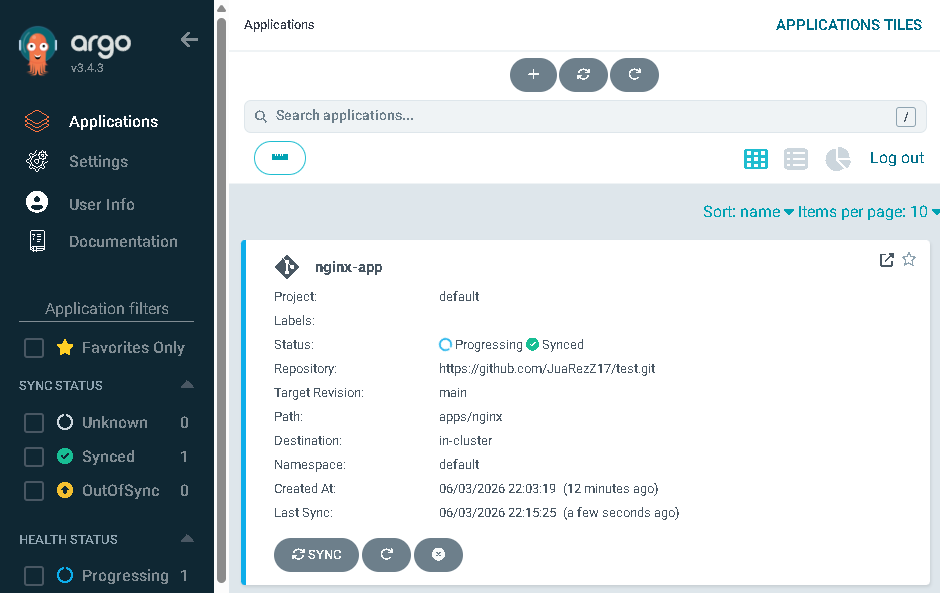

# Your First GitOps Application

## Objective
Automate synchronisation. Connect ArgoCD to your public GitHub repository and see how an app is deployed without touching the terminal.

### Sync Policies
A Sync Policy defines how Argo CD should behave when it detects that the state defined in Git does not match the actual state of the Kubernetes cluster. In GitOps, Git represents the desired state. Kubernetes represents the current state. Argo CD compares both states and decides whether or not to act based on the configured sync policy. There are two main types of synchronisation:
- **Manual synchronisation:** Manual synchronisation means that Argo CD detects differences between Git and the cluster, but does not apply the changes itself. In this case, Argo CD functions as a monitoring and control tool. It reports that the application is out of date or in an OutOfSync state, but waits for a person to decide when to apply the changes. It is a more conservative option, as it allows changes to be reviewed before deployment. For this reason, it is often used in environments where greater control is required, such as production.

- **Automatic synchronisation:** Automatic synchronisation allows Argo CD to automatically apply changes defined in Git when it detects that the cluster no longer matches them. In this mode, Argo CD not only observes but also acts. Its aim is to keep the cluster aligned with Git without human intervention. This option fits best with a strict GitOps philosophy, because any change approved and pushed to Git can go directly to the cluster. The main advantage is that it reduces manual tasks and prevents oversights. The risk is that an incorrect change in Git could be applied automatically.

The key difference lies in who takes the final action. In manual synchronisation, Argo CD detects the problem, but a person decides when to synchronise. In automatic synchronisation, Argo CD detects the problem and applies the solution directly.

### Pruning & Self-Heal
Prune is a property that allows Argo CD to remove resources from the cluster that no longer exist in Git. Its purpose is to keep the cluster clean and prevent old or unnecessary resources from remaining after they have been deleted from the repository. From a theoretical perspective, Prune reinforces the idea that Git not only defines which resources should exist, but also which should no longer exist. If Prune is not enabled, a resource deleted from Git may continue to exist in Kubernetes. This causes the cluster to retain elements that are no longer part of the desired state.

Self-Heal is a feature that allows Argo CD to automatically correct changes made directly to the cluster. Its aim is to prevent drift, i.e. the discrepancy between the desired state in Git and the actual state in Kubernetes. If someone manually modifies a cluster resource, that change is not reflected in Git. For Argo CD, this means that the cluster no longer adheres to the source of truth. With Self-Heal enabled, Argo CD reapplies the state defined in Git, overwriting the manual change.

### Exercise 1: In your Git repository, upload a YAML file for a super-simple Nginx deployment to a folder called apps/nginx/.
First, let’s clone a repository from our GitHub (in my case, `test`) and create the folder `apps` > `nginx` within it:



Inside the `nginx` folder, we create the `deployment.yaml` file



Finally, we push the changes to GitHub:



### Exercise 2: Write an argo-app.yaml file that defines the Application object, pointing to your GitHub repository, the apps/nginx/ path, and the local cluster.
We create the `argo-app.yaml` file in the root of the repository:



- **`kind: Application`:** Indicates that you are creating an Argo CD object called Application.

```
metadata:
  name: nginx-app
  namespace: argocd
```
  
Creates the application named nginx-app within the argocd namespace.

- **`project: default`:** Associates the application with the default Argo CD project.

- **`repoURL: https://github.com/JuaRezZ17/test.git`:** This is the URL of your GitHub repository.

- **`server: https://kubernetes.default.svc`:** Indicates that Argo CD should deploy to the local cluster where it is installed.

```
syncPolicy:
    automated:
      enabled: true
      prune: true
      selfHeal: true
```

Enables automatic synchronisation, allows Argo CD to delete resources from the cluster if they are removed from Git, and allows Argo CD to correct manual changes made directly in Kubernetes. This is the key property for the exercise test.

### Exercise 3: Apply the argo-app.yaml. You will see in the web interface how your Nginx appears and turns green (Synced). Now run kubectl delete deployment nginx in your terminal. Wait a few seconds and watch as ArgoCD instantly recreates it thanks to its Self-Heal feature.
We apply the Argo CD application:



We access Argo CD in our browser and, on the home page, we’ll see our app running:



Let’s try deleting the deployment and see what happens to our app:





When we delete the deployment, we are modifying the cluster manually, but Git still indicates that the nginx deployment must exist. Argo CD detects this discrepancy and, as we have the `selfHeal: true` option, the Git manifest is reapplied and the Deployment is recreated.