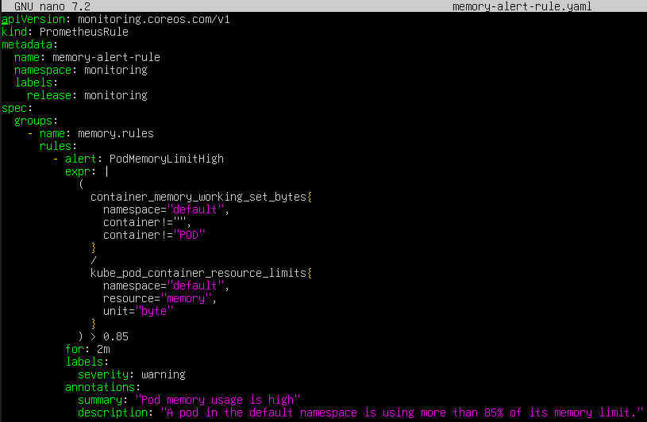
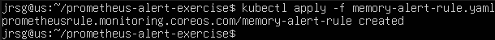
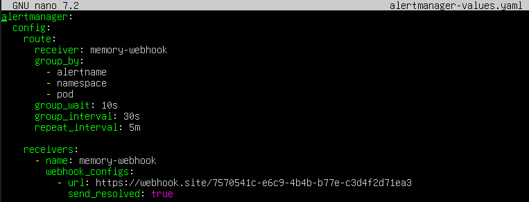
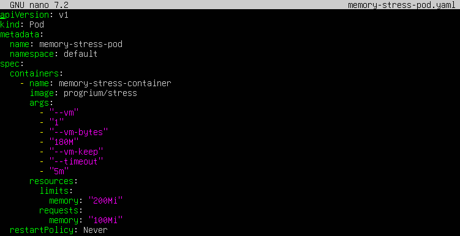
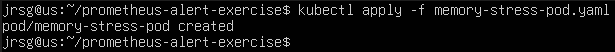
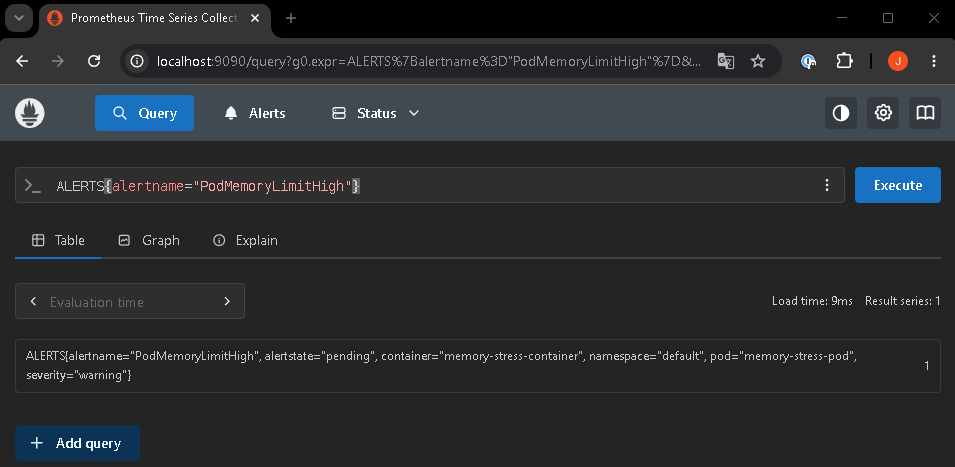

# Alertmanager

## Objective
Combating ‘alert fatigue’. Designing predictive rules to alert the operations team before servers crash, routing messages to modern channels such as Slack.

### Alertmanager Core
This is the component that receives alerts generated by Prometheus and decides how, when and to whom to notify them. Its main functions are: deduplicating, grouping, routing, silencing and suppressing alerts. To understand it better, you need to grasp certain concepts:
- **Routing:** Defines the path an alert follows until it reaches a specific recipient. Alertmanager uses a routing tree. Each route can filter alerts based on their labels. Thus, a critical production alert can go to the on-call team, whilst a warning alert can go only to Slack. Some typical routing concepts are:
    - **`receiver`:** Destination of the notification.
    - **`group_by`:** Labels used to group alerts.
    - **`group_wait`:** The time it waits before sending the first notification in the group.
    - **`group_interval`:** The time between new notifications from the same group.
    - **`repeat_interval`:** How often an alert that is still active is repeated.

- **Grouping:** This involves combining similar alerts into a single notification. This prevents the team from being overwhelmed by numerous repetitive notifications. Alertmanager allows alerts to be grouped by labels such as `alertname`, `cluster`, `namespace` or `service`. This means that Alertmanager groups alerts that have the same alert name and the same namespace.

- **Suppression / Inhibition:** Suppression is usually implemented using inhibition rules. Inhibition allows alerts to be silenced when a more important alert is already active. Alertmanager displays only the root cause and suppresses secondary alerts.

- **Silences:** Silences allow alerts to be manually silenced for a specific period. A silence is based on matchers, just like routes. If an alert matches those matchers, no notification is sent.

### PrometheusRules
It is a declarative Kubernetes resource used by the Prometheus Operator to define alert rules or ingestion rules. The Operator generates the rule files that Prometheus then uses. Instead of configuring alerts manually within Prometheus, they are defined as YAML manifests in Kubernetes. Prometheus considers an alert active when the PromQL expression returns results; with `for`, it waits for the condition to hold for that duration before marking it as firing. Some important parts are:
- **`apiVersion`:** CRD version.
- **`kind`:** Resource type, in this case `PrometheusRule`.
- **`metadata`:** Resource name, namespace and labels.
- **`spec.groups`:** Rule groups.
- **`rules`:** List of alerts or recording rules.
- **`alert`:** Name of the alert.
- **`expr`:** PromQL expression that evaluates the condition.
- **`for`:** Duration for which the condition must be met before triggering the alert.
- **`labels`:** Metadata useful for routing, priority or the team responsible.
- **`annotations`:** Descriptive information for the notification.

### Exercise 1: Create a custom Kubernetes file of type PrometheusRule. Configure a rule to trigger if the memory usage of any pod in your default namespace exceeds 85% of its limits for more than 2 minutes (e.g. container_memory_working_set_bytes > 0.85).
Now let’s create the PrometheusRule and apply the rule:





- **`kind: PrometheusRule`:** Indicates that we are creating a rule for Prometheus.

- **`namespace: monitoring`:** The rule is created in the same namespace as Prometheus.

- **`release: monitoring`:** This is important for Prometheus to detect the rule.

### Exercise 2: Modify the values in your Helm Chart from Tuesday (kube-prometheus-stack) to add a route in the Alertmanager block pointing to a simulated webhook (you can use a real Discord or Slack webhook if you have one).
We create the file `alertmanager-values.png` and apply the change to the Helm Chart:



- **`route`:** Defines where the alerts are sent.

- **`receiver: memory-webhook`:** Indicates that all alerts will be sent to the receiver named memory-webhook.

- **`webhook_configs`:** Indicates that Alertmanager will send the alert via HTTP.

- **`url`:** This is the URL to which Alertmanager will send the alert.

```
helm upgrade monitoring prometheus-community/kube-prometheus-stack \
  -n monitoring \
  --reuse-values \
  -f alertmanager-values.yaml
```

### Exercise 3: Deploy a test pod and perform a memory stress test using the stress command. Check how Prometheus detects the metric, sets the alert to Firing status, and Alertmanager sends the notification.
Now let’s create the memory-consuming pod and deploy it:



image: progrium/stress

We’re using an image that already includes the `stress` command.

- **`--vm-bytes 180M`:** The pod will attempt to consume around 180 MB of memory.

- **`limits:
  memory: ‘200Mi’`:** The pod’s limit is 200 MB. As 180 MB is more than 85% of 200 MB, this should trigger the alert.

- **`--timeout 5m`:** The stress test lasts 5 minutes, long enough for the `for: 2m` loop to complete.



We connect to the web and check if any alerts appear:

