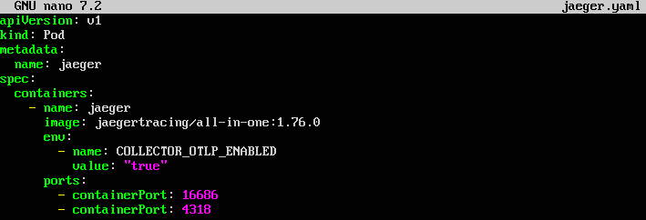
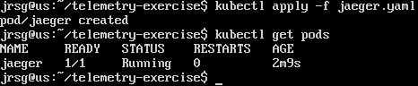
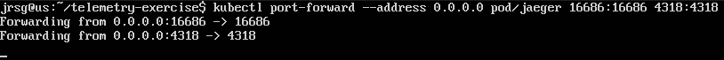
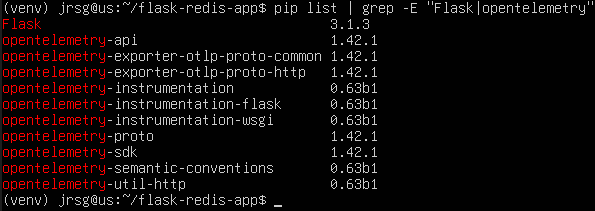
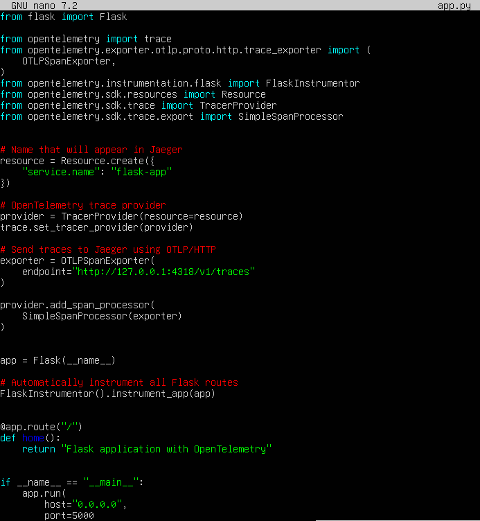
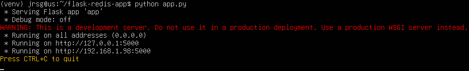
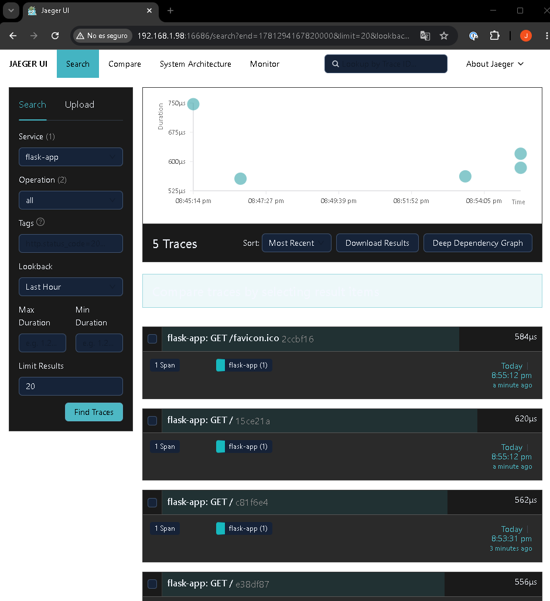

# Distributed traceability

## Objective
Understanding the performance of microservices architectures. When a user clicks a button on a website and it takes 5 seconds to respond, knowing exactly which intermediate service (authentication, payment gateway or database) is causing the latency.

### Traces vs Spans
- **Traces:** Represents the complete path of a request within a distributed system, from the moment it enters until a response is returned. For example, an HTTP request might pass through: Client > API Gateway > User Service > Order Service > Database. The entire path forms a single trace.

- **Span:** Represents a specific operation within that trace. It typically indicates the time the request spends within a microservice, a database query or an external call. Each span usually contains information such as: operation name, start and end times, duration, the service that generated it, errors or the operation’s status.

A trace is made up of several interrelated spans. Thanks to these, it is possible to identify which service is causing delays or errors.

### Context Propagation
It allows the relationship between all calls made by a single request to be maintained. When one microservice calls another, it sends special HTTP headers containing trace information. One of the most important of these is `traceparent`. This header contains identifiers such as the trace ID, the current span ID, and information on whether the request is being logged. The next microservice reads this header, creates a new span and links it to the same trace.

Without context propagation, each microservice would generate a different trace and it would not be possible to reconstruct the complete path of the request.

### OpenTelemetry (OTel)
Also known as OTel, it is an open standard from the CNCF for instrumenting applications and collecting observability data. The main advantage of OpenTelemetry is that it is not tied to any specific tool or company. It primarily allows the collection of:
- **Traces:** the path taken by requests.

- **Metrics:** CPU usage, memory usage, number of requests, response times, etc.

- **Logs:** messages and events generated by the application.

An application can use OpenTelemetry to generate the data and then send it to various platforms, such as Jaeger, Prometheus, Grafana, Datadog, Elastic and Zipkin. In this way, the application’s instrumentation can be maintained even if the tool used to visualise or store the data is changed.

### Exercise 1: Deploy a quick Jaeger instance in your cluster using Docker or a simple K8s manifest.
We create the `jaeger.yaml` file, apply the changes, and check that the pod has been created correctly:





Now we expose ports `16686` (Jaeger dashboard) and `4318` (receiving traces from Flask) by setting up a port forward:



### Exercise 2: Take the code from your Flask application (Week 2). Install the official OpenTelemetry libraries (`opentelemetry-api`, `opentelemetry-sdk`, `opentelemetry-instrumentation-flask`).
Navigate to the application directory, start the virtual environment, and run:
```
pip install flask \
opentelemetry-api \
opentelemetry-sdk \
opentelemetry-instrumentation-flask \
opentelemetry-exporter-otlp-proto-http
```



### Exercise 3: Add the OTel initialisation lines to your code, pointing to Jaeger’s IP address. Start the app, make a couple of calls in the browser, open the Jaeger dashboard at `localhost:16686` and analyse the waterfall chart of your HTTP requests.
Now we’ll edit the `app.py` file and adapt it to the exercise:



- **`Resource.create({‘service.name’: ‘flask-app’})`:** Sets the name under which the application will appear in Jaeger.

- **`TracerProvider(resource=resource)`:** Creates the provider responsible for generating traces.

- **`endpoint=‘http://127.0.0.1:4318/v1/traces’`:** Specifies where Jaeger is located. Port forwarding makes port 4318 available on the local IP 127.0.0.1.

- **`SimpleSpanProcessor(exporter)`:** Sends each span directly to the exporter.

- **`FlaskInstrumentor().instrument_app(app)`:** Automatically instruments the requests received by Flask.



Open a browser on your physical machine and access the IP address of your virtual machine via port `16686`. This allows you to access the Jaeger dashboard, where you can follow the traces of your app:

