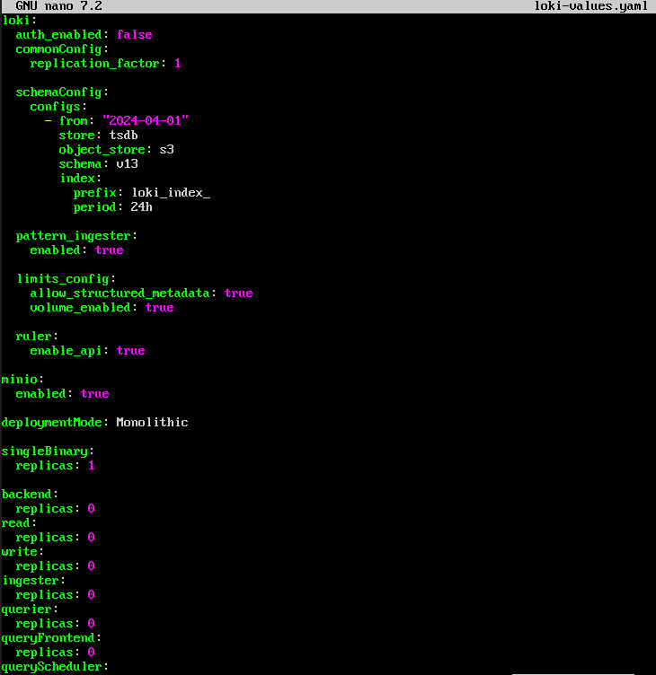
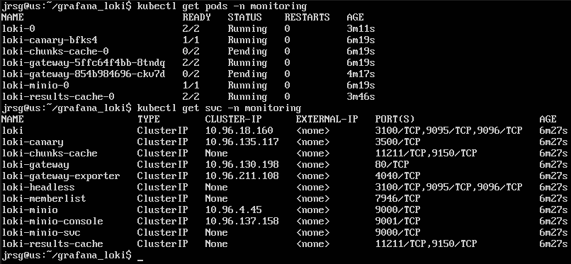
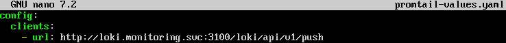
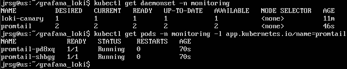
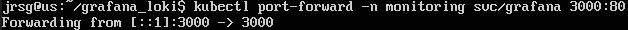
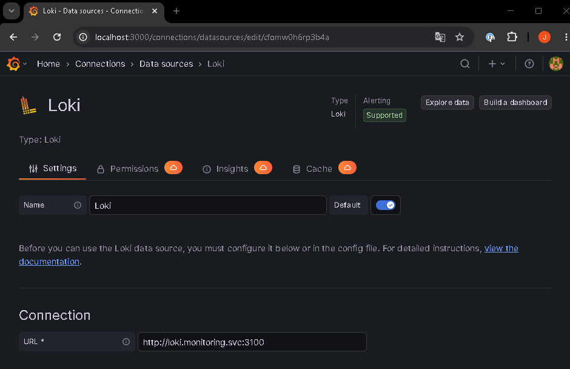
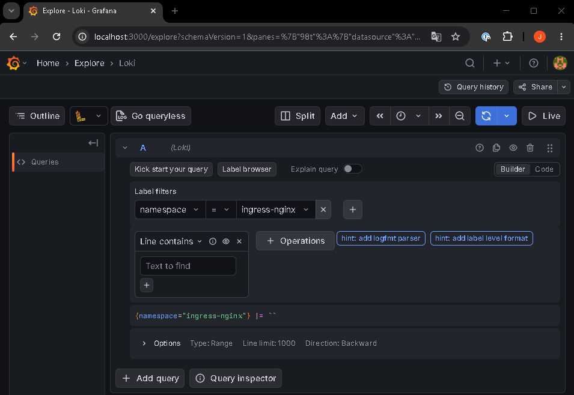

# Log Centralisation with Grafana Loki

## Objective
Troubleshooting without prior knowledge. Index log files from hundreds of containers simultaneously so they can be analysed from a single point using tags.

### Grafana Loki (The ‘Prometheus of logs’)
It is a log storage and query system designed to integrate seamlessly with Grafana and Kubernetes. It is often compared to Prometheus because it uses a similar approach: working with labels to identify data. The difference is that Prometheus stores metrics, whereas Loki stores logs. The key feature of Loki is that it does not index the full text of each log, but instead indexes it as metadata.

Loki is a traditional stack like ELK but much lighter. Elasticsearch usually indexes a huge amount of log content to enable very fast searches for any word. That is powerful, but it consumes quite a lot of resources. In contrast, Loki works in a simpler way: it indexes labels > stores the compressed logs > searches within the logs when you query them. That is why Loki is usually much lighter than ELK, especially in Kubernetes, where logs are already very well organised by labels such as pod, namespace, app or container.

### Collection Agents
For logs to reach Loki, a collector agent must be installed on the cluster nodes. Its role is to read logs from the node, add labels and send logs to Loki. In Kubernetes, pod logs are usually located in paths. The agent is typically deployed as a DaemonSet, meaning one pod per cluster node. This way, each node collects its own logs. 

**Promtail** was Loki’s classic agent. Its main job was to read logs, detect pods/containers, add labels and send logs to Loki.

**Fluent Bit** is another widely used agent. It is lightweight, fast and can send logs to Loki using the official Loki output plugin. Grafana documents it as a valid option for sending logs to Loki.

### LogQL
This is Loki’s query language. It is similar to PromQL, but designed for logs. Grafana documents LogQL as the language used to query logs in Loki. Some basic LogQL operators are:
- **`{app=‘my-flask-app’}`:** Displays all logs for the application.

- **`{app=‘my-flask-app’} |= “error”`:** Displays only lines containing ‘error’.

- **`{app=‘my-flask-app’} != “debug”`:** Excludes lines containing ‘debug’.

- **`{namespace=‘prod’, app="backend"} |= “timeout”`:** Searches for logs from the backend app in prod that contain ‘timeout’.

- **`{app=~‘api|backend’} |= “500”`:** Searches for logs from apps named api or backend that contain ‘500’.

### Exercise 1: Install Loki and Promtail in your monitoring namespace using Helm.
To carry out the installation, we will add the repositories to Helm by running the following commands:
```
helm repo add grafana-community https://grafana-community.github.io/helm-charts
helm repo add grafana https://grafana.github.io/helm-charts
helm repo update
```

Now we create the `loki-values.yaml` file:



- **`deploymentMode: Monolithic`:** Installs Loki in monolithic mode, which is simpler for practice. Grafana recommends this mode for testing or small installations.

- **`singleBinary:
  replicas: 1`:** Creates a single replica of Loki.

- **`loki:
  commonConfig:
    replication_factor: 1`:** Mandatory if you only have one replica. Otherwise, Loki may fail because it would attempt to replicate data across multiple instances.

- **`minio:
  enabled: true`:** Enables MinIO as object storage for this exercise.

- **`backend:
  replicas: 0
read:
  replicas: 0
write:
  replicas: 0`:** Disables the scalable/distributed mode components, as we are using monolithic mode here.

We install Loki:
```
helm upgrade --install loki grafana-community/loki \
  --version 16.0.0 \
  -n monitoring \
  -f loki-values.yaml
```



Now let’s create the `promtail-value.yaml` file:



- **`config:
  clients:`:** Defines where Promtail will send the logs.

- **`url: http://loki.monitoring.svc:3100/loki/api/v1/push`:** This is the internal Kubernetes URL to Loki.

We install Promtail:
```
helm upgrade --install promtail grafana/promtail \
  -n monitoring \
  -f promtail-values.yaml
```



### Exercise 2: Log in to the Grafana web interface, go to settings, add a new Loki data source, and configure it with the internal URL of your K8s service (http://loki.monitoring.svc:3100).
We set up the connection to Grafana using port forwarding:



Enter your credentials, then in the side menu, go to Connections > Data sources > Add new data source > Loki and complete the following configuration:



### Exercise 3: Go to the ‘Explore’ tab in Grafana, select Loki and run a query to view in real time the logs being output by the Nginx Ingress controller from Week 4.
Go to the side menu, select ‘Explore’, and choose the data source we created in the previous step. Once there, run the query to view the `ingress-nginx` logs:

