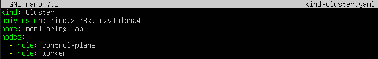
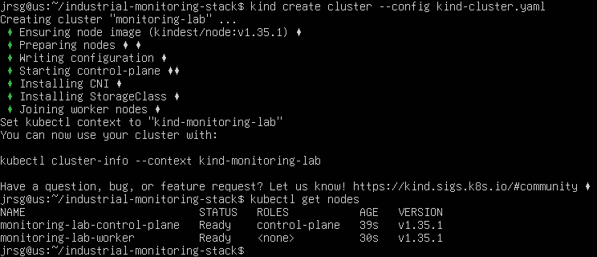
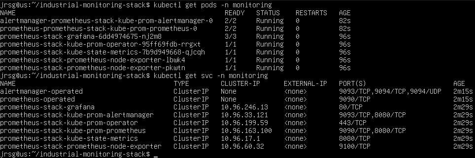
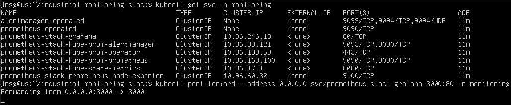
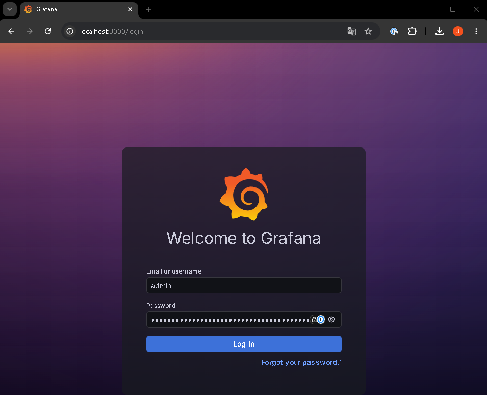
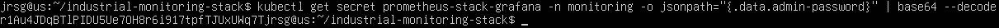
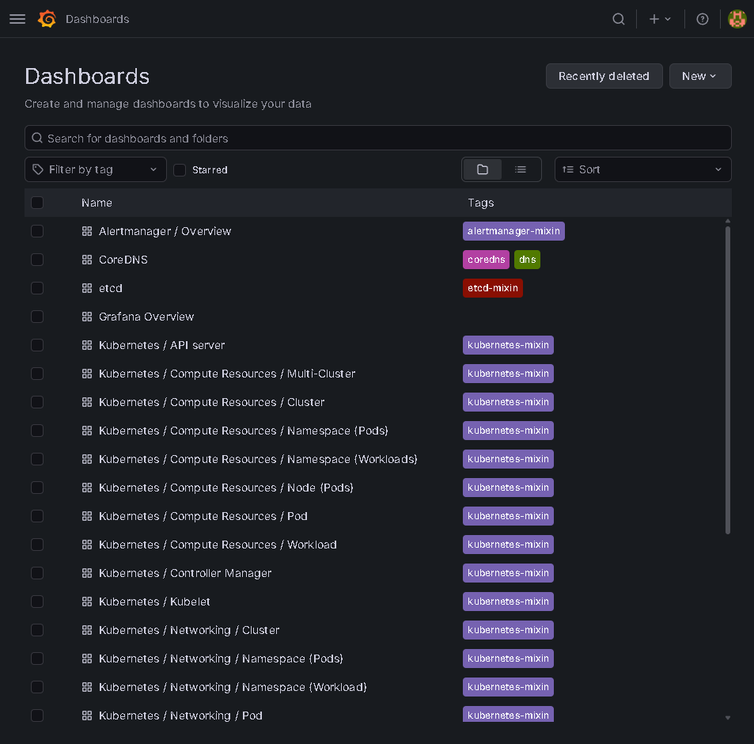
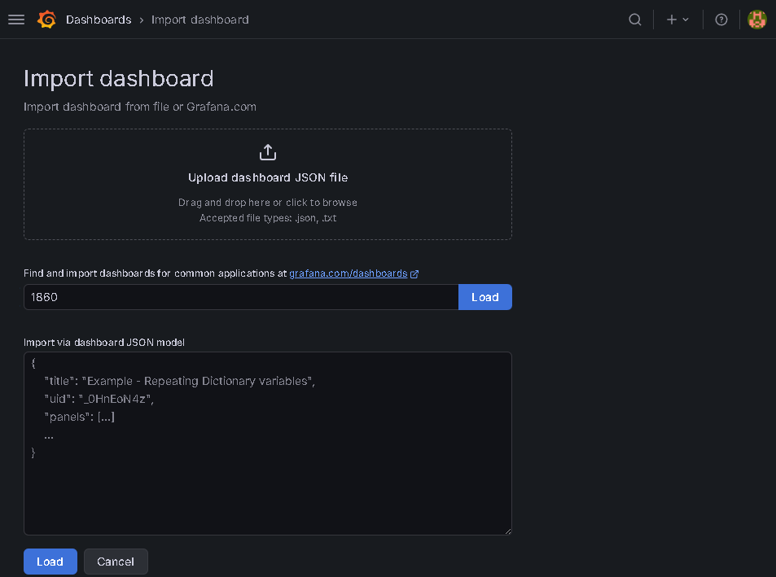
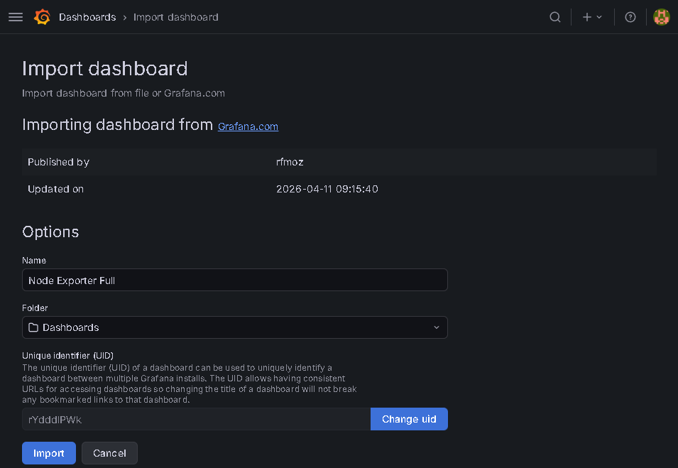
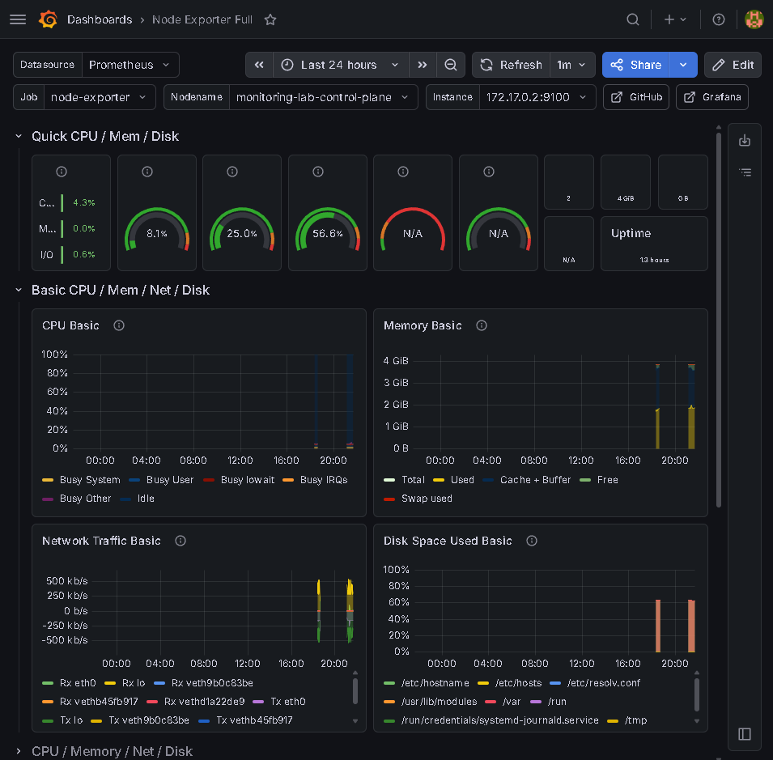

# Monitoring with Prometheus and Grafana

## Objective
Moving from reactive monitoring (checking with `top` when something is running slowly) to quantitative monitoring based on time series (Time-Series DB).

### Prometheus Architecture
Prometheus is a monitoring tool that collects metrics from applications, servers and services to store them for later reference. Its architecture is primarily based on the pull model:
- **Pull model:** Prometheus fetches the metrics. Services expose an HTTP endpoint, typically: `/metrics`. Prometheus queries this endpoint at regular intervals using HTTP scraping. This model makes it easy to check whether a service is available. If Prometheus cannot access the endpoint, it can detect that the service is down or unresponsive.

- **Push model:** In this model, the application sends its metrics directly to a central server. This model was more common in traditional systems. Prometheus prefers the Pull model, although it can use Pushgateway in special cases, such as batch jobs or short-lived processes.

The **TSDB** is Prometheus’s internal database. It stands for Time Series Database. It stores metrics associated with a specific point in time. A metric typically consists of: **`name + labels + value + timestamp`**

**Target scraping** is the process by which Prometheus collects metrics from services. A target is a service or endpoint that Prometheus monitors. Prometheus queries these targets at regular intervals, for example every 15 seconds.

**Service Discovery** allows Prometheus to automatically discover which services it needs to monitor. This is useful in dynamic environments such as Kubernetes, where services can constantly change IP addresses, be created or deleted. Without Service Discovery, the targets would have to be configured manually.

### Key Metrics
Prometheus works with various types of metrics. The most important ones are:
- **Counter:** This is a metric that can only increase. It is used to count cumulative events. A Counter is only reset if the application is restarted.

- **Gauge:** This is a metric that can increase or decrease. It is used to measure current values or system states.

- **Histogram:** This is used to measure the distribution of values across ranges. It is widely used to measure response times or latencies.

### Grafana
Grafana is a data visualisation tool. It is used to create dashboards featuring charts, tables, indicators and alerts. Grafana does not typically collect metrics directly. Instead, it usually retrieves data from other tools, such as Prometheus. Prometheus collects and stores metrics, whilst Grafana displays them visually.

A **Data Source** is a data source connected to Grafana. In this case, Prometheus acts as Grafana’s Data Source. Grafana queries Prometheus to retrieve the metrics and display them on dashboards.

**Panels** are the visual blocks that make up a dashboard.

### Exercise 1: Use Helm to deploy the industry-standard stack on your local Kubernetes (kind) cluster:
We create the `industrial-monitoring-stack` directory for this exercise and, within it, create `kind-cluster.yaml`:



- **`kind`:** Cluster: Indicates that a Kubernetes cluster is to be created using `kind`.

- **`name`:** monitoring-lab: Name of the cluster. It is in English, as you requested.

- **`nodes:
  - role: control-plane
  - role: worker`:** Creates a control plane node and a worker node. This allows you to view metrics from more than one node in Grafana.

We create the cluster with the specifications from the previous file:



Finally, we add the Prometheus Helm repository and install `kube-prometheus-stack`:
```
helm repo add prometheus-community https://prometheus-community.github.io/helm-charts
helm repo update
helm install prometheus-stack prometheus-community/kube-prometheus-stack -n monitoring --create-namespace
```

We verify the installation by checking that the pods and services are running:



### Exercise 2: Port-forward to the Grafana service that has been created. The stack comes pre-configured with dozens of automatic dashboards.
We locate the Grafana service and set up port forwarding:



We open a browser and enter the address of our localhost on port 3000:



We log in with the default username (`admin`) and the password obtained using the following command, and access the dashboard:





### Exercise 3: Import the official community dashboard for monitoring Kubernetes nodes using ID 315 or 1860. View the CPU, memory and disk usage charts for your local cluster.
To import a dashboard, go to ‘New’ > “Import”. In the new window, locate the import field and enter ‘1860’:



Click on ‘Load’ and, in the next window, on ‘Import’, and you will see the dashboard open automatically with data such as: CPU usage, memory usage, disk usage, disk saturation, network traffic and node load:



