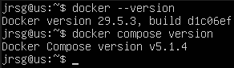
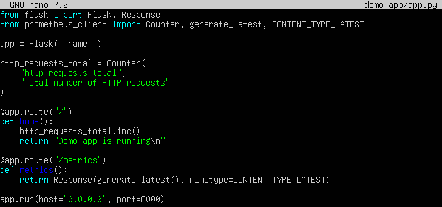
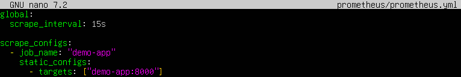
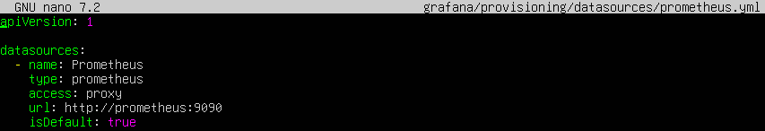
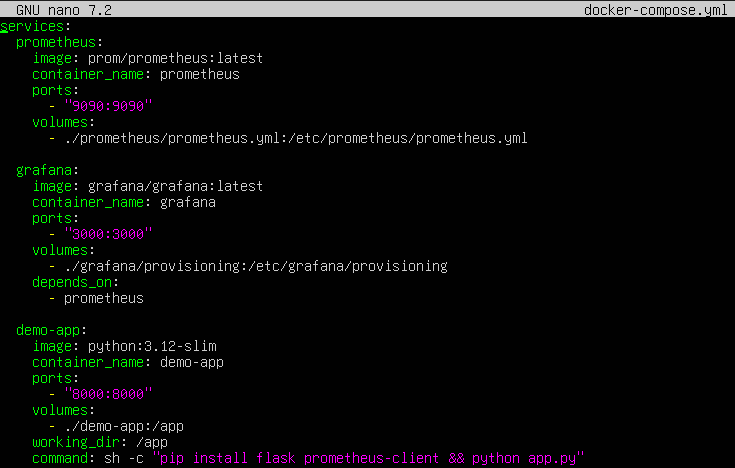
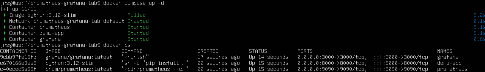
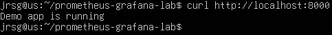
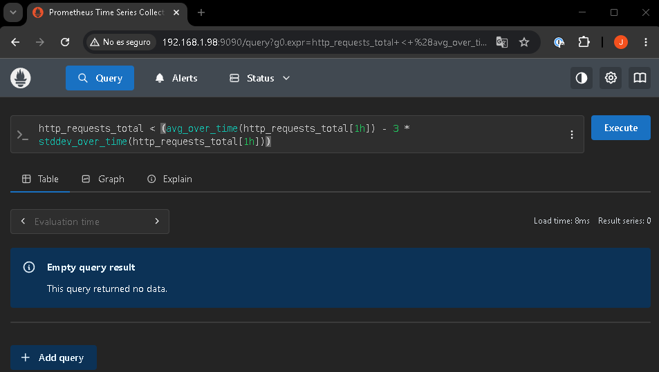
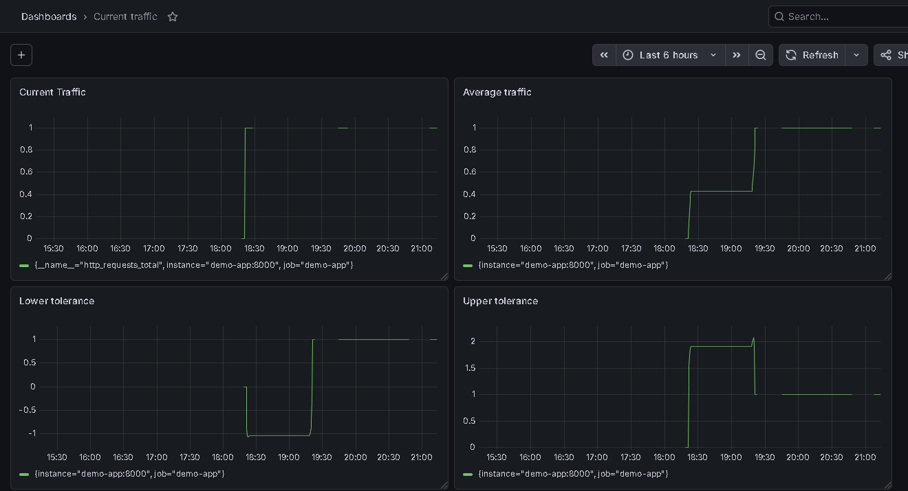

# AIOps – Dynamic Thresholds in Grafana

## Objective
Overcome the limitations of traditional static alerts. Use integrated machine learning algorithms to calculate standard deviations in real time and detect anomalies based on traffic seasonality.

### AIOps (Artificial Intelligence for IT Operations)
AIOps, or Artificial Intelligence for IT Operations, involves applying artificial intelligence, data analysis and machine learning techniques to the management of IT systems. In a modern IT environment, vast amounts of information are generated from logs, performance metrics, events, traces and alerts. Analysing all this data manually would be very time-consuming and inefficient, which is why AIOps enables this process to be automated and useful information to be extracted in real time.

Thanks to machine learning, an AIOps platform can identify normal operating patterns and detect when something deviates from the norm. This helps to anticipate problems before they affect the service, reduce false alarms and prioritise the most critical incidents. Furthermore, it can link seemingly unrelated events to find the root cause of an incident. For example, a drop in an application’s performance may be linked to an overloaded database or a network issue.

In short, AIOps enables operations teams to work more quickly, accurately and proactively. It is not only useful for detecting faults, but also for optimising resources, automating responses and improving the overall stability of systems.

### Seasonal Metrics
Seasonal metrics are those whose behaviour varies depending on the time of day, week, month or year. In IT systems, it is not always appropriate to apply alerts with fixed thresholds, such as ‘CPU usage above 90% indicates an error’. Whilst this rule may be useful in normal situations, it can fail during specific periods when the system load increases as expected.

A clear example would be Black Friday, a sales campaign or a night-time maintenance window. During these periods, it is normal for CPU, memory, network or database usage to be much higher than usual. If the system only uses a static alert, it will generate many false alarms even though the behaviour is expected. This can overwhelm the technical team and cause genuinely important alerts to go unnoticed.

Therefore, rather than using fixed thresholds, it is better to compare metrics against their historical behaviour. A CPU utilisation of 90% may be normal during a high-demand campaign, but abnormal in the early hours of a Tuesday morning when there is no traffic. Seasonal metrics allow us to understand the context and create smarter alerts, tailored to the system’s actual behaviour.

### Anomaly Detection
Anomaly detection involves identifying unusual behaviour within a system, even if the absolute values do not necessarily appear critical. Rather than simply checking whether a metric exceeds a fixed threshold, the analysis examines whether that value makes sense in relation to its usual behaviour. This allows problems to be detected more accurately and in a context-sensitive manner.

One of the simplest methods is the moving average, which calculates the average of a metric over a recent period of time. This smooths out one-off variations and provides a benchmark for normal behaviour. If a metric deviates significantly from that average, it may be considered a potential anomaly. For example, if an application usually receives 1,000 requests per minute and suddenly receives 5,000 for no apparent reason, the system can detect this change as unusual.

Another widely used method is the Z-score, which measures how far a value deviates from the mean, taking standard deviation into account. The greater this distance, the more anomalous the value will be. This technique is useful because it does not focus solely on the raw volume of data, but on the relationship between the current value and expected behaviour. It therefore allows for the detection of both unusual spikes and unexpected drops in metrics such as traffic, latency, errors, CPU usage or memory usage. 

In short, anomaly detection helps to uncover problems that might go unnoticed with traditional alerts. By combining moving averages, Z-scores and historical analysis, systems can identify unusual behaviour more intelligently and reduce the number of false alarms.

### Exercise 1: Log in to your Week 10 Prometheus and Grafana stack.
First, we check that Docker and Docker Compose are installed:



We will now create the directory structure and files required to complete the exercise:



- **`app = Flask(__name__)`:** Creates a very simple web application using Flask.

- **`http_requests_total = Counter(...)`:** Creates a metric called `http_requests_total`.

- **`http_requests_total.inc()`:** Increases the counter every time someone accesses the main route /.

- **`@app.route(‘/metrics’)`:** Creates the route /metrics, which is the one Prometheus will read.

- **`generate_latest()`:** Returns the metrics in a format compatible with Prometheus.

- **`app.run(host=‘0.0.0.0’, port=8000)`:** Makes the application listen on port 8000.



- **`scrape_interval: 15s`:** Prometheus will collect metrics every 15 seconds.

- **`job_name: ‘demo-app’`:** Name of the service that Prometheus will monitor.

- **`targets: [‘demo-app:8000’]`:** Indicates that Prometheus should read metrics from the `demo-app` application on port 8000.



- **`name: Prometheus`:** Name of the data source in Grafana.

- **`type: prometheus`:** Indicates that the data source will be Prometheus.

- **`url: http://prometheus:9090`:** Grafana will connect to the Prometheus container.

- **`isDefault: true`:** Sets Prometheus as the default data source.



- **`prometheus:`:** Defines the Prometheus service.

- **`grafana:`:** Defines the Grafana service.

- **`demo-app:`:** Defines the application that generates `http_requests_total`.

- **`ports: \ - ‘9090:9090’`:** Allows access to Prometheus via a web browser.

- **`ports: \ - ‘3000:3000’`:** Allows access to Grafana via a web browser.

- **`ports: \ - ‘8000:8000’`:** Allows access to the test application.

- **`command: sh -c ‘pip install flask prometheus-client && python app.py’`:** Installs the necessary dependencies and starts the application.

We start the container and check that everything is working correctly:





### Instead of creating a simple alert, write a PromQL query using built-in statistical functions:
```
# Alert if current traffic is less than the average over the last hour minus 3 times the standard deviation
http_requests_total < (avg_over_time(http_requests_total[1h]) - 3 * stddev_over_time(http_requests_total[1h]))
```
We open Prometheus in our browser and run the query:



If nothing appears, it does not necessarily mean there is a problem. It simply means that, at that moment, the anomaly condition is not being met. In other words, the current traffic is not below the mean minus three times the standard deviation.

### Observe in Grafana how an elastic tolerance band is plotted around your traffic metric.
We log in to Grafana and create a new dashboard with the following panels:
- **Current traffic (`http_requests_total`):** This row shows the current value of the metric.

- **Average traffic (`avg_over_time(http_requests_total[1h])`):** This row shows the average for the last hour.

- **Lower tolerance (`avg_over_time(http_requests_total[1h]) - 3 * stddev_over_time(http_requests_total[1h])`):** This line represents the lower limit of the tolerance band.

- **Upper tolerance (`avg_over_time(http_requests_total[1h]) + 3 * stddev_over_time(http_requests_total[1h])`):** This line represents the upper limit of the band.

