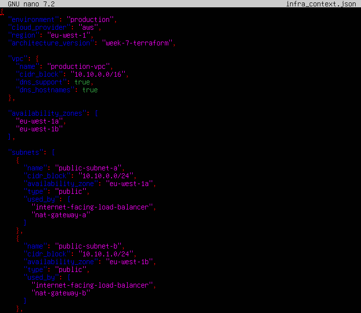
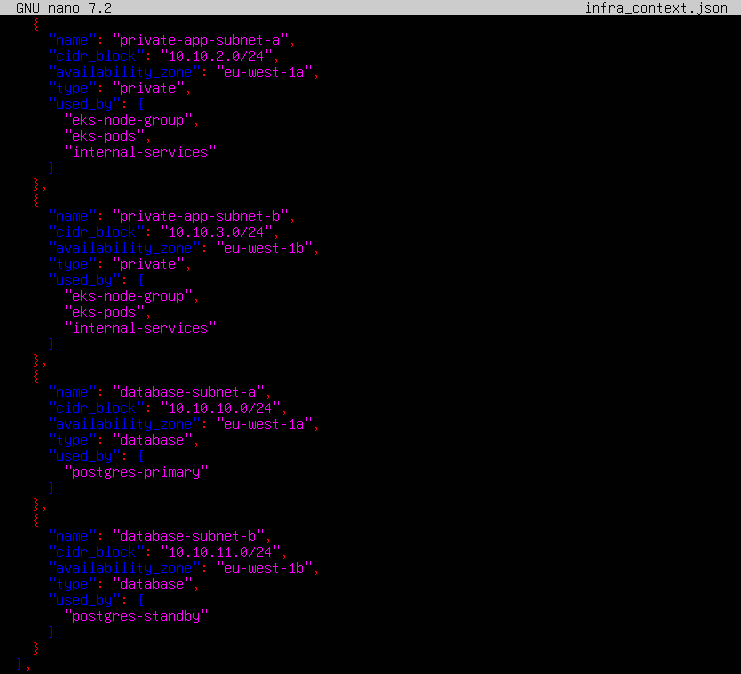
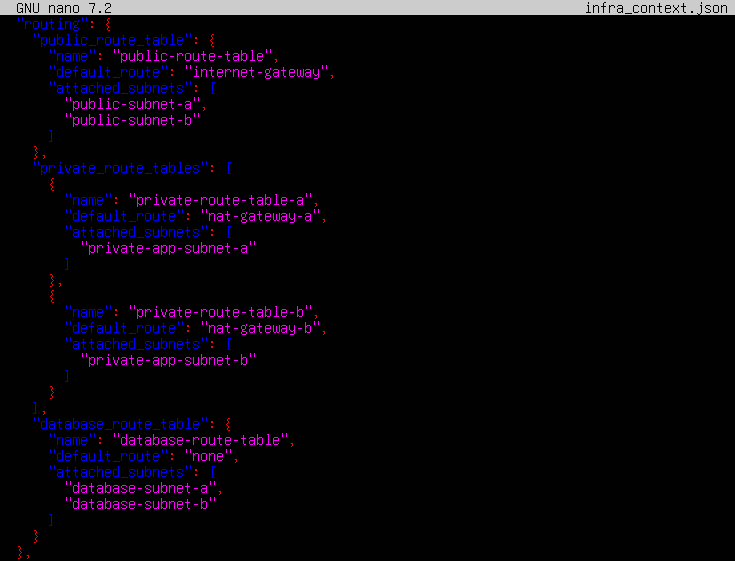
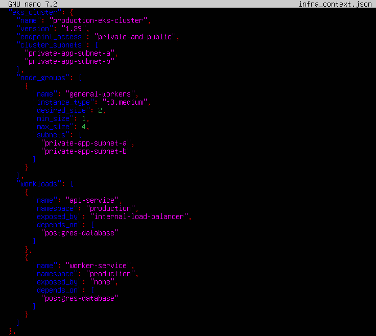
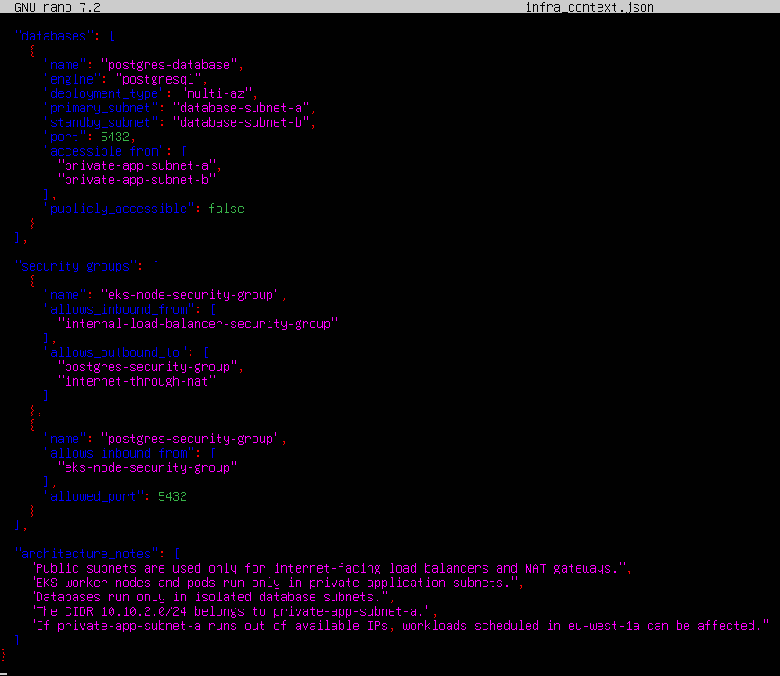

# Context Engineering for DevOps

## Objective
Solving the problem of AI hallucinations in corporate environments. Learn how to train language models using the topology, documentation and architectural secrets of your own private infrastructure through contextual techniques.

### Context Engineering vs Fine-Tuning
Context Engineering involves providing the AI with the relevant information within the context of the prompt, rather than modifying the model. In DevOps, this is extremely useful because documentation is constantly changing: services, versions, endpoints, known issues, runbooks or internal policies may be updated frequently. Therefore, retraining a model every time something changes would be slow, expensive and impractical.

A more efficient alternative is to use RAG, which allows you to retrieve up-to-date information from internal documents, tickets, repositories, logs or technical manuals, and feed it into the model’s query. In this way, the AI can respond with recent information without the need for fine-tuning. Fine-tuning can be useful for adjusting the style or format of the response, but it is not the best option for memorising changing technical documentation.

In summary, for Platform and SRE teams, it is usually better to use up-to-date context or RAG rather than retraining an entire model. This makes the solution cheaper, more flexible, more secure and easier to maintain.

### Structuring System Data
For an AI to fully understand a platform, the information must be organised and structured. Simply providing it with raw text is not enough, as it may misinterpret the relationships between services, dependencies or responsibilities. This is why diagrams created with Mermaid.js are useful, as they allow architectures to be represented using clear text that is easy to version.

With Mermaid, you can describe services, databases, queues, APIs, load balancers and dependencies between components. It is advisable to use clear names in English, such as `api-gateway`, `user-service` or `orders-database`, and to indicate the function each element performs within the system.

OpenAPI specifications are also very helpful as they describe endpoints, HTTP methods, parameters, responses, errors and authentication. By combining Mermaid and OpenAPI, AI can understand both the overall architecture and the technical contracts of the APIs. In short, the clearer and more structured the information is, the better the AI’s responses will be.

### Exercise 1: Generate a consolidated JSON file called `infra_context.json` that describes the entire VPC network, EKS cluster and databases that you coded in Terraform in Week 7.

- **`‘environment’: ‘production’`:** Indicates that this context represents the production environment.

- **`‘cidr_block’: ‘10.10.0.0/16’`:** Defines the full range of IP addresses for the VPC.

- **`‘name’: ‘private-app-subnet-a’, \ “cidr_block”: ‘10.10.2.0/24’`:** This is a key part of the exercise. It specifies that the CIDR 10.10.2.0/24 belongs to the private-app-subnet-a subnet.

- **`‘used_by’: [ \ ‘eks-node-group’, \ ‘eks-pods’, \ ‘internal-services’ \ ]`:** Explains which resources use that subnet. This allows the AI to know what is affected if the subnet runs out of IP addresses.

- **`‘cluster_subnets’: [ \ ‘private-app-subnet-a’, \ ‘private-app-subnet-b’ \ ]`:** Indicates that the EKS cluster operates on the private application subnets.

- **`‘accessible_from’: [ \ ‘private-app-subnet-a’, \ ‘private-app-subnet-b’ \ ]`:** Indicates that the PostgreSQL database is only accessible from the private subnets where EKS runs.

- **`‘architecture_notes’`:** Summarises important architecture rules so that the model has less room for interpretation.

### Exercise 2: Design a high-fidelity ‘System Prompt’ that loads this JSON as immutable context. Ask the model complex questions such as: ‘If the 10.10.2.0/24 CIDR runs out of IPs, which subnets are affected according to our architecture map?’. Document the responses to verify the accuracy of the context.
We create the prompt file (`master_system_prompt.md`) and a file for validation questions and answers (`validation_questions.md`).