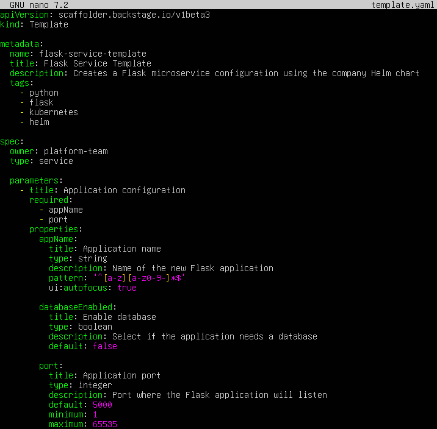
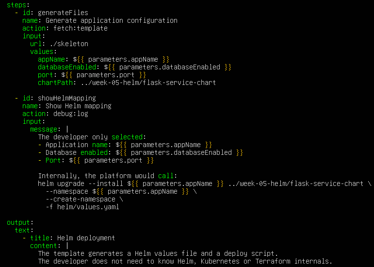
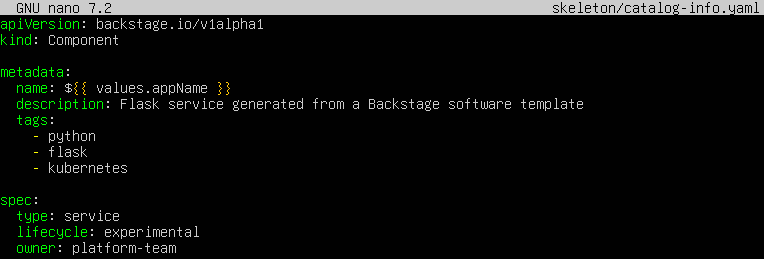
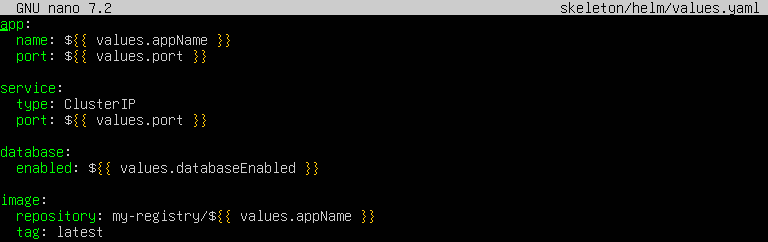
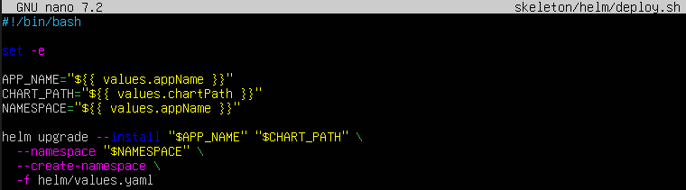
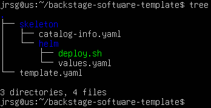

# Introduction to Platform Engineering

## Objective
Understanding the transition from traditional DevOps to Platform Engineering. Learning to treat infrastructure as an internal product, defining ‘Golden Paths’ to reduce friction for development teams.

### DevOps vs Platform Engineering
DevOps is a way of working that brings together development and operations so that both teams can collaborate more effectively. Its aim is to deliver software more quickly, securely and automatically. Thanks to DevOps, practices such as continuous integration, continuous deployment, automation, monitoring and cross-team collaboration are utilised.

The problem is that in some companies, DevOps has been implemented incorrectly. Instead of fostering collaboration, developers began to be expected to know how to do too many things: Docker, Kubernetes, Terraform, networking, security, CI/CD, logs and monitoring. This can create a heavy workload and cause developers to waste time on tasks that are not their core speciality.

Platform Engineering has emerged to solve this problem. Its aim is to create internal tools that make developers’ work easier. The platform team handles the infrastructure, security, automation and deployments, whilst developers use these tools in a straightforward manner. Therefore, DevOps is a culture of collaboration, and Platform Engineering is a practical way of applying that culture whilst reducing complexity.

### IDP (Internal Developer Platform)
An IDP, or Internal Developer Platform, is an internal platform for developers. It is a set of tools prepared by the platform team to enable developers to work on a self-service basis. This means they can carry out certain tasks without having to rely constantly on the systems team.

For example, an IDP can allow developers to create a new application, deploy it, view logs, check metrics, create a database or launch a test environment. Although it uses complex tools such as Kubernetes, Docker, Terraform, Helm, GitHub Actions, Prometheus or Grafana behind the scenes, the developer does not need to know all the technical details.

The main advantage of an IDP is that it saves time, reduces errors and standardises working practices. Developers have a simple and secure way of carrying out routine tasks, whilst the platform team retains control over the infrastructure, security and best practices.

### Golden Paths
Golden Paths are recommended, secure templates that have already been approved by the platform team. They enable developers to create applications or services without having to start from scratch or configure everything manually.

An example of a Golden Path would be: “create a Flask microservice with Docker, Kubernetes, CI/CD and monitoring”. That template could already include the project structure, the Dockerfile, the Kubernetes manifests, the pipeline, the log configuration, basic metrics and minimum security.

The advantage of Golden Paths is that they prevent errors and ensure all projects follow a common structure. The developer simply needs to fill in some details and use the template. This results in greater speed, improved security and reduced complexity, as the difficult parts have already been prepared by the platform team.

### Exercise 1: Design a Backstage-compatible YAML template configuration file (template.yaml). Define the inputs you would ask a developer for (app name, database yes/no, port) and map out how that abstraction would call your Week 5 Helm Charts underneath.
First, let’s create the main file that Backstage will read:

- **`apiVersion: scaffolder.backstage.io/v1beta3 \ kind: Template`:** Indicates that this is a Backstage template compatible with Scaffolder.

- **`metadata: \ name: flask-service-template`:** Internal name of the template.

- **`spec: \ owner: platform-team \ type: service`:** Indicates that the responsible team is platform-team and that the template creates a service.

- **`parameters:`:** This is where the data that Backstage would request from the developer is defined.

- **`appName: \ databaseEnabled: \ port:`:** These are the three inputs required by the specification.

- **`pattern: “^[a-z][a-z0-9-]*$”`:** Ensures the name is valid for Kubernetes, for example:

- **`my-flask-api \ orders-service \ users-api \ action: fetch:template`:** Generates files using the skeleton folder.

- **`chartPath: ../week-05-helm/flask-service-chart`:** Represents the Week 5 Helm Chart. In other words, the developer does not see Helm directly, but the template uses it behind the scenes.

Now we are going to create the `catalog-info.yaml` file, which will represent the component that will be registered in Backstage:

- **`name: ${{ values.appName }}`:** The name of the component will be the one entered by the developer in Backstage.

- **`kind: Component`:** Indicates that what is generated will be a software component.

- **`owner: platform-team`:** Identifies the team responsible for the component.

We create the `values.yaml` file that connects the Backstage abstraction with Helm:

- **`app: \ name: ${{ values.appName }} \ port: ${{ values.port }}`:** Passes the name and port chosen by the developer to Helm.

- **`database: \ enabled: ${{ values.databaseEnabled }}`:** Enables or disables the database according to the Backstage form.

- **`image: \ repository: my-registry/${{ values.appName }}`:** Defines a Docker image based on the application name.

Finally, we create the `deploy.sh` script, which shows how the platform would call the Helm Chart:

- **`set -e`:** Causes the script to stop if an error occurs.

- **`APP_NAME=‘${{ values.appName }}’`:** Uses the name entered by the developer.

- **`CHART_PATH=‘${{ values.chartPath }}’`:** Points to the Helm Chart from Week 5.

- **`helm upgrade --install`:** Installs the application if it does not exist, or updates it if it already exists.

- **`-f helm/values.yaml`:** Passes the values generated from Backstage to Helm.

